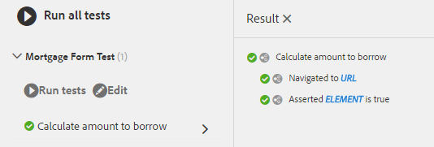

# AEM Adaptive Forms에서 자동화된 테스트 사용 {#using-automated-tests-with-aem-adaptive-forms}

Calvin SDK를 사용한 적응형 Forms 자동 테스트

Calvin SDK는 적응형 Forms 개발자를 위한 유틸리티 API로 Adaptive Forms을 테스트합니다. Calvin SDK는 [Hobes.js 테스트 프레임워크를 기반으로 구축되었습니다](https://docs.adobe.com/docs/en/aem/6-3/develop/ref/test-api/index.html). Calvin SDK는 AEM Forms 6.3부터 사용할 수 있습니다.

이 자습서에서는 다음을 만듭니다.

* 테스트 세트
* 테스트 제품군에 하나 이상의 테스트 케이스가 포함됩니다.
* 테스트 케이스에 하나 이상의 작업이 포함됩니다.

## 시작하기 {#getting-started}

[패키지 관리자를 사용하여 자산 다운로드 및](assets/testingadaptiveformsusingcalvinsdk1.zip)설치이 패키지에는 샘플 스크립트와 여러 개의 응용 Forms이 포함되어 있습니다.이러한 응용 Forms은 AEM Forms 6.3 버전을 사용하여 빌드됩니다. AEM Forms 6.4 이상에서 테스트하는 경우 자신의 AEM Forms 버전에 해당하는 새 양식을 만드는 것이 좋습니다. 샘플 스크립트는 적응형 Forms을 테스트하는 데 사용할 수 있는 다양한 Calvin SDK API를 보여줍니다. AEM Adaptive Forms을 테스트하는 일반적인 단계는 다음과 같습니다.

* 테스트해야 하는 양식으로 이동합니다.
* 필드 값 설정
* 응용 양식 제출
* 오류 메시지 확인

패키지의 샘플 스크립트는 위의 모든 작업을 보여 줍니다.
코드 `mortgageForm.js`

```javascript
var mortgageFormTS = new hobs.TestSuite("Mortgage Form Test", {
        path: '/etc/clientlibs/testingAFUsingCalvinSDK/mortgageForm.js',
        register: true
})
```

위의 코드는 새 테스트 세트를 만듭니다.

* 이 경우 TestSuite의 이름은 &#39; `Mortgage Form Test` &#39;입니다.
* 제공된 경로는 테스트 세트가 들어 있는 js 파일에 대한 AEM의 절대 경로입니다.
* register 매개 변수는 &#39; `true` &#39;로 설정하면 테스트 세트를 테스트 UI에서 사용할 수 있게 됩니다.

```javascript
.addTestCase(new hobs.TestCase("Calculate amount to borrow")
        // navigate to the mortgage form  which is to be tested
        .navigateTo("/content/forms/af/cal/mortgageform.html?wcmmode=disabled")
  .asserts.isTrue(function () {
            return calvin.isFormLoaded()
        })
```

>[!NOTE]
>
>AEM Forms 6.4 이상에서 이 기능을 테스트하는 경우 새 적응형 양식을 만들어 테스트용으로 사용하십시오.패키지와 함께 제공된 적응형 양식을 사용하지 않는 것이 좋습니다.

응용 양식에 대해 실행되도록 테스트 세트에 테스트 케이스를 추가할 수 있습니다.

* 테스트 세트에 테스트 케이스를 추가하려면 TestSuite 개체의 `addTestCase` 메서드를 사용합니다.
* 이 `addTestCase` 메서드는 TestCase 개체를 매개 변수로 사용합니다.
* TestCase를 만들려면 메서드를 `hobs.TestCase(..)` 사용합니다.
* 참고:첫 번째 매개 변수는 UI에 표시되는 테스트 케이스 이름입니다.
* 테스트 케이스를 만들면 테스트 케이스에 작업을 추가할 수 있습니다.
* 테스트 케이스 `navigateTo`에 작업으로 작업을 추가할 `asserts.isTrue` 수 있습니다.

## 자동화된 테스트 실행 {#running-the-automated-tests}

[Openthetestsuite](http://localhost:4502/libs/granite/testing/hobbes.html)테스트 세트를 확장하고 테스트를 실행합니다. 모든 것이 성공적으로 실행되면 다음 출력이 표시됩니다.



## 샘플 테스트 세트 보기 {#try-out-the-sample-test-suites}

샘플 패키지의 일부로 세 개의 추가 테스트 세트가 있습니다. 아래 표시된 대로 clientlibrary의 js.txt 파일에 해당 파일을 포함시켜 시험해 볼 수 있습니다.

```javascript
#base=.

scriptingTest.js
validationTest.js
prefillTest.js
mortgageForm.js
```
