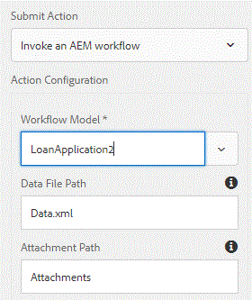

# 사용자 지정 프로세스 단계

이 자습서는 사용자 정의 프로세스 단계를 구현해야 하는 AEM Forms 고객을 위해 마련되었습니다. 프로세스 단계에서는 ECMA 스크립트를 실행하거나 사용자 지정 java 코드를 호출하여 작업을 수행할 수 있습니다. 이 자습서에서는 프로세스 단계에서 실행되는 WorkflowProcess를 구현하는 데 필요한 단계를 설명합니다.

사용자 지정 프로세스 단계를 구현하는 주된 이유는 AEM Workflow를 확장하는 것입니다. 예를 들어 워크플로우 모델에서 AEM Forms 구성 요소를 사용하는 경우 다음 작업을 수행할 수 있습니다

* 응용 양식 첨부 파일을 파일 시스템에 저장
* 제출된 데이터 조작

위의 사용 사례를 수행하려면 일반적으로 프로세스 단계에 따라 실행되는 OSGi 서비스를 작성합니다.

## 마스터 프로젝트 만들기

첫 번째 단계는 적절한 Adobe 마벤 원형형을 사용하여 전문적인 프로젝트를 만드는 것입니다. 자세한 단계는 이 [아티클](https://helpx.adobe.com/experience-manager/using/maven_arch13.html)에 나열되어 있습니다. 전문적인 프로젝트를 eclipse로 가져오면 프로세스 단계에서 사용할 수 있는 첫 번째 OSGi 구성 요소를 작성할 수 있습니다.


### WorkflowProcess를 구현하는 클래스 만들기

Eclipse IDE에서 전문적인 프로젝트를 열 수 있습니다. **projectname** > **core** 폴더를 확장합니다. src/main/java 폴더를 확장합니다. &quot;core&quot;로 끝나는 패키지가 표시됩니다. 이 패키지에서 WorkflowProcess를 구현하는 Java 클래스를 만듭니다. 실행 메서드를 재정의해야 합니다. 실행 메서드의 서명은 다음과 같습니다.
public void execute(WorkItem workItem, WorkflowSession, MetaDataMap processArguments)는 WorkflowException을 발생시킵니다.
execute 메서드는 다음 3개의 변수에 대한 액세스 권한을 제공합니다

**작업 항목**:workItem 변수는 워크플로와 관련된 데이터에 액세스할 수 있도록 합니다. 공개 API 설명서는 [여기에서 사용할 수 있습니다.](https://helpx.adobe.com/experience-manager/6-3/sites/developing/using/reference-materials/diff-previous/changes/com.adobe.granite.workflow.WorkflowSession.html)

**WorkflowSession**:이 workflowSession 변수를 사용하면 워크플로우를 제어할 수 있습니다. 공개 API 설명서는 [여기](https://helpx.adobe.com/experience-manager/6-3/sites/developing/using/reference-materials/diff-previous/changes/com.adobe.granite.workflow.WorkflowSession.html)에서 사용할 수 있습니다.

**MetaDataMap**:워크플로우와 연관된 모든 메타데이터. 프로세스 단계로 전달되는 모든 프로세스 인수는 MetaDataMap 객체를 사용하여 사용할 수 있습니다.[API 설명서](https://helpx.adobe.com/experience-manager/6-5/sites/developing/using/reference-materials/javadoc/com/adobe/granite/workflow/metadata/MetaDataMap.html)

이 자습서에서는 AEM Workflow의 일부로 응용 양식에 추가된 첨부 파일을 파일 시스템에 기록합니다.

이 사용 사례를 수행하려면 다음 java 클래스가 기록되었습니다.

이 코드를 살펴보겠습니다.

```
@Component(property = { Constants.SERVICE_DESCRIPTION + "=Write Adaptive Form Attachments to File System",
        Constants.SERVICE_VENDOR + "=Adobe Systems",
        "process.label" + "=Save Adaptive Form Attachments to File System" })
public class WriteFormAttachmentsToFileSystem implements WorkflowProcess {
     private static final Logger log = LoggerFactory.getLogger(WriteFormAttachmentsToFileSystem.class);
     @Override
    public void execute(WorkItem workItem, WorkflowSession workflowSession, MetaDataMap processArguments)
            throws WorkflowException {
        // TODO Auto-generated method stub
        log.debug("The string I got was ..." + processArguments.get("PROCESS_ARGS", "string").toString());
        String[] params = processArguments.get("PROCESS_ARGS", "string").toString().split(",");
        String attachmentsPath = params[0];
        String saveToLocation = params[1];
        log.debug("The seperator is" + File.separator);
        String payloadPath = workItem.getWorkflowData().getPayload().toString();
 
        String attachmentsFilePath = payloadPath + "/" + attachmentsPath + "/attachments";
        log.debug("The data file path is " + attachmentsFilePath);
 
        ResourceResolver resourceResolver = workflowSession.adaptTo(ResourceResolver.class);
 
        Resource attachmentsNode = resourceResolver.getResource(attachmentsFilePath);
        Iterator<Resource> attachments = attachmentsNode.listChildren();
        while (attachments.hasNext()) {
            Resource attachment = attachments.next();
            String attachmentPath = attachment.getPath();
            String attachmentName = attachment.getName();
 
            log.debug("The attachmentPath is " + attachmentPath + " and the attachmentname is " + attachmentName);
            com.adobe.aemfd.docmanager.Document attachmentDoc = new com.adobe.aemfd.docmanager.Document(attachmentPath,
                    attachment.getResourceResolver());
            try {
                File file = new File(saveToLocation + File.separator + workItem.getId());
                if (!file.exists()) {
                    file.mkdirs();
                }
 
                attachmentDoc.copyToFile(new File(file + File.separator + attachmentName));
 
                log.debug("Saved attachment" + attachmentName);
                attachmentDoc.close();
 
            } catch (IOException e) {
                // TODO Auto-generated catch block
                e.printStackTrace();
            }
 
        }
 
    }
```

1행 - 구성 요소의 속성을 정의합니다. process.label 속성은 아래 스크린샷 중 하나에 표시된 대로 OSGi 구성 요소를 프로세스 단계에 연결할 때 표시되는 정보입니다.

13-15행 - 이 OSGi 구성 요소에 전달된 프로세스 인수는 &quot;,&quot; 구분 기호를 사용하여 분할됩니다. 그런 다음 attachmentPath 및 saveToLocation에 대한 값을 문자열 배열에서 추출합니다.

* attachmentPath - 응용 양식의 전송 작업을 구성하여 AEM Workflow를 호출할 때 적응형 양식에 지정한 위치와 동일합니다. 워크플로우의 페이로드와 관련하여 첨부 파일을 AEM에 저장할 폴더의 이름입니다.

* saveToLocation - AEM 서버의 파일 시스템에 첨부 파일을 저장할 위치입니다.

이 두 값은 아래 스크린샷에 표시된 것처럼 프로세스 인수로 전달됩니다.


19행:그런 다음 attachmentFilePath를 구성합니다. 첨부 파일 경로가

    /var/fd/dashboard/payload/server0/2018-11-19/3EF6ENASOQTHCPLNDYVNAM7OKA_7/첨부 파일

* &quot;첨부 파일&quot;은 적응형 양식의 제출 옵션을 구성할 때 지정된 워크플로우의 페이로드를 기준으로 한 폴더 이름입니다.

   

24-26행 - ResourceResolver를 가져온 다음 attachmentFilePath를 가리키는 리소스를 가져옵니다.

나머지 코드는 API를 사용하여 attachmentFilePath를 가리키는 리소스의 자식 객체를 반복함으로써 Document 객체를 만듭니다. 이 문서 개체는 AEM Forms에만 적용됩니다. 그런 다음 문서 객체의 copyToFile 메서드를 사용하여 문서 객체를 저장합니다.

>[!NOTE]
>
>Adobe는 AEM Forms 전용 Document 개체를 사용하고 있으므로, 마스터 프로젝트에 aemfd-client-sdk 종속성을 포함해야 합니다. 그룹 ID는 com.adobe.aemfd이며 artifact id는 aemfd-client-sdk입니다.

#### 구축 및 배포

[여기에 설명된 대로 번들 ](https://helpx.adobe.com/experience-manager/using/maven_arch13.html#BuildtheOSGibundleusingMaven)
[빌드번들 배포 상태 및 활성 상태 확인](http://localhost:4502/system/console/bundles)

워크플로우 모델을 만듭니다. 워크플로우 모델에서 프로세스 단계를 드래그하여 놓습니다. 프로세스 단계를 &quot;파일 시스템에 적응형 양식 첨부 저장&quot;과 연결합니다.

필수 프로세스 인수를 쉼표로 구분하여 입력합니다. 첨부 파일(예: c:\\scrappp\\) 첫 번째 인수는 워크플로 페이로드를 기준으로 응용 양식 첨부 파일이 저장되는 폴더입니다. 적응형 양식의 제출 작업을 구성할 때 지정한 값과 동일한 값이 되어야 합니다. 두 번째 인수는 첨부 파일을 저장할 위치입니다.

적응형 양식 만들기를 참조하십시오. 첨부 파일 구성 요소를 양식에 드래그하여 놓습니다. 양식의 제출 작업을 구성하여 이전 단계에서 만든 워크플로우를 호출합니다. 적절한 첨부 경로를 제공합니다.

설정을 저장합니다.

양식을 미리 봅니다. 첨부 파일을 두 개 추가하고 양식을 제출합니다. 첨부 파일은 워크플로우에서 사용자가 지정한 위치의 파일 시스템에 저장해야 합니다.

