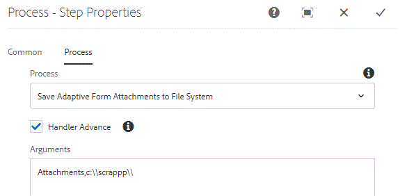

# 사용자 지정 프로세스 단계

이 자습서는 사용자 지정 프로세스 단계를 구현해야 하는 AEM Forms 고객을 위한 것입니다. 프로세스 단계에서는 ECMA 스크립트를 실행하거나 사용자 지정 Java 코드를 호출하여 작업을 수행할 수 있습니다. 이 자습서에서는 프로세스 단계에서 실행되는 WorkflowProcess를 구현하는 데 필요한 단계를 설명합니다.

사용자 지정 프로세스 단계를 구현하는 주요 이유는 AEM Workflow를 확장하는 것입니다. 예를 들어 워크플로우 모델에서 AEM Forms 구성 요소를 사용하는 경우 다음 작업을 수행할 수 있습니다

* 적응형 양식 첨부 파일을 파일 시스템에 저장합니다
* 제출된 데이터 조작

위의 사용 사례를 수행하기 위해 일반적으로 프로세스 단계에서 실행되는 OSGi 서비스를 작성합니다.

## Maven 프로젝트 만들기

첫 번째 단계는 적절한 Adobe Maven Archetype을 사용하여 maven 프로젝트를 만드는 것입니다. 자세한 단계는 이 [article](https://experienceleague.adobe.com/docs/experience-manager-learn/forms/create-your-first-osgi-bundle.html?lang=en)에 나열되어 있습니다. maven 프로젝트를 eclipse로 가져온 후에는 프로세스 단계에서 사용할 수 있는 첫 번째 OSGi 구성 요소 작성을 시작할 준비가 되었습니다.


### WorkflowProcess를 구현하는 클래스 만들기

Eclipse IDE에서 maven 프로젝트를 엽니다. **projectname** > **core** 폴더를 확장합니다. src/main/java 폴더를 확장합니다. &quot;core&quot;로 끝나는 패키지가 표시됩니다. 이 패키지에서 WorkflowProcess를 구현하는 Java 클래스를 만듭니다. 실행 메서드를 재정의해야 합니다. execute 메서드의 서명은 다음과 같습니다
public void execute(WorkItem, WorkflowSession workflowSession, MetaDataMap processArguments)는 WorkflowException을 발생합니다
execute 메서드는 다음 3개 변수에 대한 액세스 권한을 제공합니다

**작업 항목**:workItem 변수는 워크플로우와 관련된 데이터에 액세스할 수 있도록 합니다. 공용 API 설명서는 [여기에서 사용할 수 있습니다.](https://helpx.adobe.com/experience-manager/6-3/sites/developing/using/reference-materials/diff-previous/changes/com.adobe.granite.workflow.WorkflowSession.html)

**WorkflowSession**:이 workflowSession 변수를 사용하면 워크플로우를 제어할 수 있습니다. 공개 API 설명서는 [여기](https://helpx.adobe.com/experience-manager/6-3/sites/developing/using/reference-materials/diff-previous/changes/com.adobe.granite.workflow.WorkflowSession.html)에서 사용할 수 있습니다

**MetaDataMap**:워크플로우와 연관된 모든 메타데이터. 프로세스 단계로 전달되는 모든 프로세스 인수는 MetaDataMap 개체를 사용하여 사용할 수 있습니다.[API 설명서](https://helpx.adobe.com/experience-manager/6-5/sites/developing/using/reference-materials/javadoc/com/adobe/granite/workflow/metadata/MetaDataMap.html)

이 자습서에서는 AEM Workflow의 일부로 적응형 양식에 추가된 첨부 파일을 파일 시스템에 작성하려고 합니다.

이 사용 사례를 수행하기 위해 다음 java 클래스가 작성됩니다

이 코드를 살펴보겠습니다

```java
package com.learningaemforms.adobe.core;

import java.io.File;
import java.io.InputStream;
import java.util.HashMap;
import java.util.Map;

import javax.jcr.Node;
import javax.jcr.Session;

import org.osgi.framework.Constants;
import org.osgi.service.component.annotations.Component;
import org.osgi.service.component.annotations.Reference;
import org.slf4j.Logger;
import org.slf4j.LoggerFactory;

import com.adobe.aemfd.docmanager.Document;
import com.adobe.granite.workflow.WorkflowException;
import com.adobe.granite.workflow.WorkflowSession;
import com.adobe.granite.workflow.exec.WorkItem;
import com.adobe.granite.workflow.exec.WorkflowProcess;
import com.adobe.granite.workflow.metadata.MetaDataMap;
import com.day.cq.search.PredicateGroup;
import com.day.cq.search.Query;
import com.day.cq.search.QueryBuilder;
import com.day.cq.search.result.Hit;
import com.day.cq.search.result.SearchResult;

@Component(property = {
	Constants.SERVICE_DESCRIPTION + "=Write Adaptive Form Attachments to File System",
	Constants.SERVICE_VENDOR + "=Adobe Systems",
	"process.label" + "=Save Adaptive Form Attachments to File System"
})
public class WriteFormAttachmentsToFileSystem implements WorkflowProcess {

	private static final Logger log = LoggerFactory.getLogger(WriteFormAttachmentsToFileSystem.class);
	@Reference
	QueryBuilder queryBuilder;

	@Override
	public void execute(WorkItem workItem, WorkflowSession workflowSession, MetaDataMap processArguments)
	throws WorkflowException {
		// TODO Auto-generated method stub
		log.debug("The string I got was ..." + processArguments.get("PROCESS_ARGS", "string").toString());
		String[] params = processArguments.get("PROCESS_ARGS", "string").toString().split(",");
		String attachmentsPath = params[0];
		String saveToLocation = params[1];
		log.debug("The seperator is" + File.separator);
		String payloadPath = workItem.getWorkflowData().getPayload().toString();
		Map<String, String> map = new HashMap<String, String> ();
		map.put("path", payloadPath + "/" + attachmentsPath);
		File saveLocationFolder = new File(saveToLocation);
		if (!saveLocationFolder.exists()) {
			saveLocationFolder.mkdirs();
		}

		map.put("type", "nt:file");
		Query query = queryBuilder.createQuery(PredicateGroup.create(map), workflowSession.adaptTo(Session.class));
		query.setStart(0);
		query.setHitsPerPage(20);

		SearchResult result = query.getResult();
		log.debug("Got  " + result.getHits().size() + " attachments ");
		Node attachmentNode = null;
		for (Hit hit: result.getHits()) {
			try {
				String path = hit.getPath();
				log.debug("The attachment title is  " + hit.getTitle() + " and the attachment path is  " + path);
				attachmentNode = workflowSession.adaptTo(Session.class).getNode(path + "/jcr:content");
				InputStream documentStream = attachmentNode.getProperty("jcr:data").getBinary().getStream();
				Document attachmentDoc = new Document(documentStream);
				attachmentDoc.copyToFile(new File(saveLocationFolder + File.separator + hit.getTitle()));
				attachmentDoc.close();
			} catch (Exception e) {
				log.debug("Error saving file " + e.getMessage());
			}
```

1행 - 구성 요소의 속성을 정의합니다. process.label 속성은 아래 스크린샷 중 하나에 표시된 대로 OSGi 구성 요소를 프로세스 단계에 연결할 때 표시되는 것입니다.

13-15행 - 이 OSGi 구성 요소에 전달된 프로세스 인수는 &quot;,&quot; 구분자를 사용하여 분할됩니다. 그런 다음 attachmentPath 및 saveToLocation의 값이 문자열 배열에서 추출됩니다.

* attachmentPath - AEM Workflow를 호출하기 위해 적응형 양식의 제출 작업을 구성할 때 적응형 양식에 지정한 위치와 동일합니다. 워크플로우의 페이로드와 관련하여 첨부 파일을 AEM에 저장할 폴더의 이름입니다.

* saveToLocation - 첨부 파일을 AEM 서버의 파일 시스템에 저장할 위치입니다.

이 두 값은 아래 스크린샷에 표시된 대로 프로세스 인수로 전달됩니다.



QueryBuilder 서비스는 attachmentsPath 폴더 아래에 있는 nt:file 유형의 노드를 쿼리하는 데 사용됩니다. 나머지 코드는 검색 결과를 반복하여 Document 개체를 만들고 파일 시스템에 저장합니다


>[!NOTE]
>
>AEM Forms에만 사용되는 Document 개체를 사용하고 있으므로 maven 프로젝트에 aemfd-client-sdk 종속성을 포함해야 합니다. 그룹 ID는 com.adobe.aemfd이고 객체 ID는 aemfd-client-sdk입니다.

#### 빌드 및 배포

[여기에 설명된 대로 ](https://experienceleague.adobe.com/docs/experience-manager-learn/forms/create-your-first-osgi-bundle.html?lang=en#build-your-project)
[번들을 빌드번들이 배포되어 있고 활성 상태인지 확인합니다](http://localhost:4502/system/console/bundles)

워크플로우 모델을 만듭니다. 워크플로우 모델에서 프로세스 단계를 끌어서 놓습니다. 프로세스 단계를 &quot;파일 시스템에 적응형 양식 첨부 저장&quot;과 연관시킵니다.

필요한 프로세스 인수를 쉼표로 구분하여 제공합니다. 첨부 파일(예: c:\\scrappp\\) 첫 번째 인수는 워크플로우 페이로드와 관련하여 적응형 양식 첨부 파일이 저장되는 폴더입니다. 적응형 양식의 제출 작업을 구성할 때 지정한 값과 같아야 합니다. 두 번째 인수는 첨부 파일을 저장할 위치입니다.

적응형 양식을 만듭니다. 첨부 파일 구성 요소를 양식에 드래그하여 놓습니다. 이전 단계에서 만든 워크플로우를 호출하도록 양식의 제출 작업을 구성합니다. 적절한 첨부 경로를 제공합니다.

설정을 저장합니다.

양식을 미리 봅니다. 첨부 파일 두 개를 추가하고 양식을 제출합니다. 첨부 파일은 워크플로우에서 지정한 위치의 파일 시스템에 저장해야 합니다.

