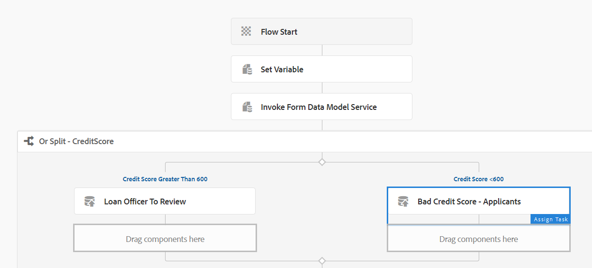

# AEM 6.5 작업 과정에서 양식 데이터 모델 서비스를 단계로 사용 {#using-form-data-model-service-as-step-in-workflow}

AEM Forms 6.4부터 이제 AEM Workflow의 일부로 양식 데이터 모델 서비스를 사용할 수 있습니다. 다음 비디오는 AEM Workflow에서 양식 데이터 모델 단계를 구성하는 데 필요한 단계에 따라 안내합니다

>!![NOTE]이 비디오에서 설명하는 기능을 사용하려면 AEM Forms 6.5.1 필요

>[!VIDEO](https://video.tv.adobe.com/v/28145?quality=9&learn=on)

서버에서 이 기능을 테스트하려면 아래 지침을 따르십시오

* [여기](https://helpx.adobe.com/experience-manager/kt/forms/using/preparing-datasource-for-form-data-model-tutorial-use.html)에 설명된 대로 SampleRest.war 파일을 사용하여 설정합니다.Tomcat에 배포된 전쟁 파일은 신청자의 신용 점수를 반환하기 위한 코드를 가집니다.신용 점수는 200에서 800 사이의 무작위 번호입니다

* [ 패키지 관리자를 사용하여 AEM으로 에셋 가져오기](assets/aem65-loanapplication.zip)
* 패키지에는 다음 내용이 들어 있습니다.

   * FDM 단계를 사용하는 워크플로우 모델입니다.
   * FDM 단계에서 사용되는 양식 데이터 모델.
   * 제출 시 워크플로우를 트리거하는 적응형 양식입니다.
* [MortgageApplicationForm](http://localhost:4502/content/dam/formsanddocuments/loanapplication/jcr:content?wcmmode=disabled)을 엽니다. 세부 사항을 입력하고 제출합니다. 양식 제출 시 [응용 프로그램 워크플로](http://http://localhost:4502/editor.html/conf/global/settings/workflow/models/LoanApplication2.html)이(가) 트리거됩니다.

.
워크플로우는 신용 점수가 500점 이상인 경우 Or Split 구성 요소를 사용하여 애플리케이션을 관리자에게 전달합니다. 신용 점수가 500점 미만인 경우, 응용 프로그램은 할당으로 라우팅됩니다.
