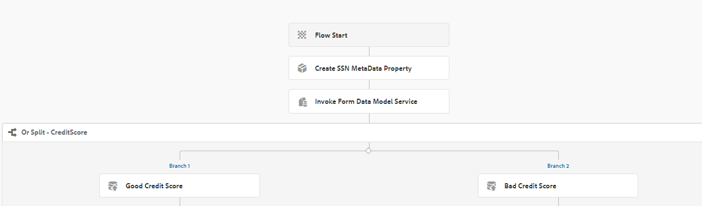

# 양식 데이터 모델 서비스를 워크플로우의 단계로 사용 {#using-form-data-model-service-as-step-in-workflow}

AEM Forms 6.4부터 이제 양식 데이터 모델을 AEM Workflow의 일부로 사용할 수 있습니다. 다음 비디오에서는 AEM Workflow에서 양식 데이터 모델 단계를 구성하는 데 필요한 단계를 안내합니다

>[!VIDEO](https://video.tv.adobe.com/v/21719/?quality=9&learn=on)

서버에서 이 기능을 테스트하려면 아래 지침을 따르십시오
* [setvalue 번들 다운로드 및 배포](/help/forms/assets/common-osgi-bundles/SetValueApp.core-1.0-SNAPSHOT.jar). 메타데이터 속성을 설정하는 사용자 지정 OSGI 번들입니다.
>!![NOTE]AEM Forms 6.5 이상에서는 이 기능을 다음과 같이 즉시 사용할 수 있습니다. [여기에 설명](form-data-model-service-as-step-in-aem65-workflow-video-use.md)

* 설명된 대로 SampleRest.war 파일로 tomcat을 설정합니다. [여기](https://experienceleague.adobe.com/docs/experience-manager-learn/forms/ic-print-channel-tutorial/introduction.html).Tomcat에 배포된 전쟁 파일에는 신청자의 신용 점수를 반환하는 코드가 있습니다. 신용 점수는 200에서 800 사이의 난수입니다

* [패키지 관리자를 사용하여 AEM에 자산 가져오기](assets/invoke-fdm-as-service-step.zip).이 패키지에는 다음 항목이 들어 있습니다.

   * FDM 단계를 사용하는 워크플로우 모델.
   * FDM 단계에서 사용되는 양식 데이터 모델.
   * 제출 시 워크플로우를 트리거하는 적응형 양식입니다.
* 를 엽니다. [MortgageApplicationForm](http://localhost:4502/content/dam/formsanddocuments/loanapplication/jcr:content?wcmmode=disabled). 세부 사항을 입력하고 제출하십시오. 양식 제출에서 [응용 프로그램 워크플로우](http://http://localhost:4502/editor.html/conf/global/settings/workflow/models/LoanApplication2.html) 가 트리거됩니다.

.
워크플로우는 신용 점수가 500을 초과하는 경우 애플리케이션을 관리자에게 라우팅하기 위해 또는 분할 구성 요소를 사용합니다. 신용 점수가 500점 미만인 경우, 응용 프로그램이 게시에 라우팅됩니다
