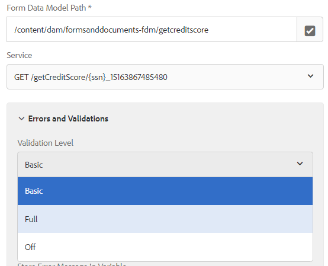

# 호출 양식 데이터 모델 서비스 단계에서 오류 메시지 캡처

이제 AEM Forms 6.5.1부터 오류 메시지를 캡처하고 유효성 검사 옵션을 지정할 수 있습니다. 양식 데이터 모델 서비스 호출 단계가 다음과 같은 기능을 제공하도록 개선되었습니다.

* 양식 데이터 모델 서비스 호출 시 발생하는 예외를 처리하기 위해 3계층 유효성 검사(&quot;OFF&quot;, &quot;BASIC&quot; 및 &quot;FULL&quot;)에 대한 옵션을 제공합니다. 세 가지 옵션은 데이터베이스별 요구 사항을 확인하는 더 엄격한 버전을 의미합니다.
   

* 워크플로우 실행을 사용자 정의하는 확인란을 제공합니다. 따라서 사용자는 양식 데이터 모델 호출 단계에서 예외가 발생하더라도 워크플로우 실행을 진행할 수 있는 유연성을 갖게 됩니다.

* 유효성 검사 예외로 인해 발생하는 오류에 대한 중요 정보를 저장합니다. ErrorCode(String), ErrorMessage(String) 및 ErrorDetails(JSON)를 저장할 관련 변수를 선택하기 위해 3개의 Autocomplete-type 변수 선택기가 통합되어 있습니다. 하지만 예외가 DermisValidationException이 아닌 경우 ErrorDetails가 null로 설정됩니다.
   

이러한 변경 사항이 적용되면 양식 데이터 모델 서비스 호출 단계를 통해 입력 값이 Swagger 파일에 제공된 데이터 제약 조건을 준수하도록 합니다. 예를 들어 accountId 및 균형 값이 swagger 파일에 지정된 데이터 제약 조건을 준수하지 않으면 다음 오류 메시지가 발생합니다.

```json
{

"errorCode": "AEM-FDM-001-049"

"errorMessage": "Input validations failed during operation execution"

"violations": {

"/accountId": ["numeric instance is greater than the required maximum (maximum: 20, found: 97)"],

"/newAccount/balance": ["instance type (string) does not match any allowed primitive type (allowed: [\"integer\",\"number\"])"]

}

}
```


