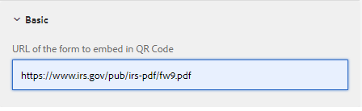

# 샘플 QR 코드 구성 요소

QR 코드를 적응형 양식에 포함하면 사용자가 해당 양식과 관련된 추가 정보에 액세스할 수 있는 편의성과 효율성을 크게 향상시킬 수 있습니다.

샘플 구성 요소는 [QRCode.js](https://davidshimjs.github.io/qrcodejs/)을(를) 사용합니다.

QRCode.js는 QRCode를 만들기 위한 JavaScript 라이브러리이며, DOM에서 HTML5 캔버스 및 테이블 태그가 있는 크로스 브라우저를 지원합니다.

구성 요소는 구성 요소의 구성 속성에 지정된 값에 따라 QR 코드를 생성합니다.


다음 코드는 qr-code-generator 구성 요소의 body.jsp에 사용되었습니다.

url은 qr 코드에 포함되어야 하는 url입니다. 이 URL은 QR 코드 구성 요소의 구성 속성에 지정됩니다.

```java
<%@include file="/libs/foundation/global.jsp"%>
<body>
    <h2>Scan the QR Code for more information related to this form</h2>
    <div data-url="<%=properties.get("url")%>">
    </div>
    <div id="qrcode">
    </div>
</body>
```


다음 코드는 qr-code-generator 구성 요소의 클라이언트 라이브러리에 있는 QRCode.js 라이브러리의 makeCode 메서드를 사용합니다. 생성된 QR 코드는 id **&quot;qrcode&quot;**&#x200B;로 식별된 div에 추가됩니다.

```javascript
$(document).ready(function()
  {
      var qrcode = new QRCode("qrcode");
      qrcode.makeCode(document.querySelector("[data-url]").getAttribute("data-url"));
      
 });
```

## 로컬 서버에 자산 배포

* [패키지 관리자를 사용하여 QR 코드 구성 요소를 다운로드하고 설치합니다.](assets/qrcode.zip)
* [패키지 관리자를 사용하여 샘플 적응형 양식을 다운로드하여 설치합니다.](assets/form-with-qr-code.zip)
* [양식을 미리 봅니다](http://localhost:4502/content/dam/formsanddocuments/qrcode/w9form/jcr:content?wcmmode=disabled). 양식의 도움말 섹션에는 QR 코드가 있습니다.
