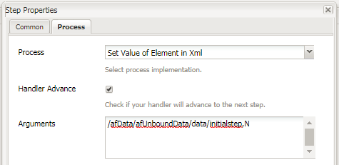

# AEM Forms 워크플로우에서 setvalue 사용

적응형 Forms에서 XML 요소의 값 설정이 AEM Forms OSGI 작업 과정에서 데이터를 제출했습니다.

XML 요소의 값을 설정할 수 있는 값 설정 구성 요소가 있는 데 사용되는 LiveCycle

이 값을 기반으로, 양식이 XML로 채워질 때 양식의 특정 필드나 패널을 숨기거나 비활성화할 수 있습니다.

AEM Forms OSGI에서는 XML에서 값을 설정하려면 사용자 정의 OSGi 번들을 작성해야 합니다. 이 자습서의 일부로 번들이 제공됩니다.
AEM 워크플로우에서는 프로세스 단계를 사용합니다. &quot;XML에서 요소의 값 설정&quot; OSGi 번들을 이 프로세스 단계에 연결합니다.
설정된 값 번들에 두 개의 인수를 전달해야 합니다. 첫 번째 인수는 값을 설정해야 하는 XML 요소의 XPath입니다. 두 번째 인수는 설정해야 하는 값입니다.
예를 들어 위의 스크린샷에서는 intimelstep 요소의 값을 &quot;N&quot;으로 설정합니다.
이 값을 기준으로 응용 Forms의 특정 패널이 숨겨지거나 표시됩니다.
이 예에서는 간단한 휴가 요청 양식이 있습니다. 이 양식의 개시자는 자신의 이름과 사용 후 날짜를 입력합니다. 제출 시 이 양식은 검토를 위해 &quot;admin&quot;으로 이동합니다. 관리자가 양식을 열면 첫 번째 패널의 필드가 비활성화됩니다. XML의 초기 단계 요소의 값을 &quot;N&quot;으로 설정했기 때문입니다.

초기 단계 필드 값에 따라 &quot;관리자&quot;가 요청을 승인하거나 거부할 수 있는 두 번째 패널이 표시됩니다

규칙 편집기를 사용하여 &quot;요청 시간 해제&quot; 필드에 설정된 규칙을 확인하십시오.

로컬 시스템에 자산을 배포하려면 아래 절차를 따르십시오.

* [Developingserviceuser 번들 배포](/help/forms/assets/common-osgi-bundles/DevelopingWithServiceUser.jar)

* [샘플 번들을 배포합니다](/help/forms/assets/common-osgi-bundles/SetValueApp.core-1.0-SNAPSHOT.jar). 전송된 xml 데이터에서 요소의 값을 설정할 수 있는 사용자 정의 OSGI 번들입니다

* [zip 파일의 콘텐트를 다운로드하고 추출합니다.](assets/setvalueassets.zip)
* 브라우저를 [패키지 관리자](http://localhost:4502/crx/packmgr/index.jsp)로 지정합니다.
* setValueWorkflow.zip을 가져와 설치합니다. 여기에는 샘플 워크플로우 모델이 있습니다.
* 브라우저를 [Forms 및 문서](http://localhost:4502/aem/forms.html/content/dam/formsanddocuments)로 지정합니다.
* 만들기를 클릭합니다 | 파일 업로드
* TimeOfRequestForm.zip 업로드
* [TimeOffRequestform](http://localhost:4502/content/dam/formsanddocuments/timeoffapplication/jcr:content?wcmmode=disabled) 열기
* 3개의 필수 필드를 입력하고 제출
* AEM에 &#39;admin&#39;으로 로그인(아직 로그인하지 않은 경우)
* [&quot;AEM 받은 편지함&quot;](http://localhost:4502/aem/inbox)으로 이동
* &quot;검토 시간 초과 요청&quot; 양식 열기
* 첫 번째 패널의 필드가 비활성화됩니다. 검토자가 양식을 열었기 때문입니다. 또한 이제 요청을 승인하거나 거절하는 패널이 표시됩니다

>[!NOTE]
>
>로거를
>com.aemforms.setvalue.core.SetValueinXml
>브라우저를 http://localhost:4502/system/console/slinglog으로 가리키면

>[!NOTE]
>
>응용 양식의 제출 옵션에 있는 데이터 파일 경로가 &quot;Data.xml&quot;로 설정되어 있는지 확인합니다. 프로세스 단계에서 페이로드 폴더 아래의 Data.xml 파일을 찾기 때문입니다
