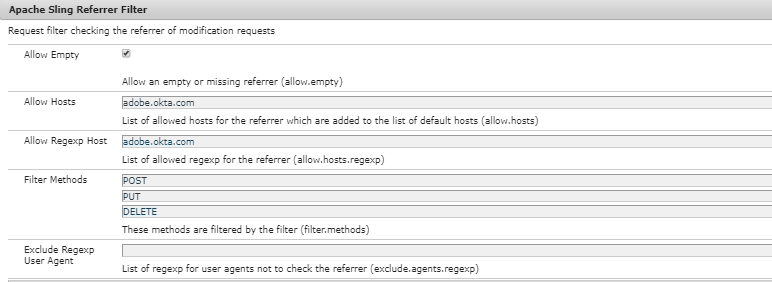

# OKTA를 사용하여 AEM 작성자 인증

첫 번째 단계는 OKTA 포털에서 앱을 구성하는 것입니다. OKTA 관리자가 앱을 승인하면 IdP 인증서 및 단일 사인온 URL에 액세스할 수 있습니다. 다음은 일반적으로 새 응용 프로그램을 등록하는 데 사용되는 설정입니다.

* **애플리케이션 이름:** 애플리케이션 이름입니다. 애플리케이션에 고유한 이름을 지정해야 합니다.
* **SAML 수신자:**  OKTA에서 인증 후 SAML 응답을 사용하여 AEM 인스턴스에서 적중되는 URL입니다. SAML 인증 처리기는 일반적으로 / saml_login을 사용하여 모든 URL을 가로채지만 애플리케이션 루트 뒤에 추가하는 것이 좋습니다.
* **SAML 대상**: 애플리케이션의 도메인 URL입니다. 도메인 URL에서 프로토콜(http, https)을 사용하지 마십시오.
* **SAML 이름 ID:**  드롭다운 목록에서 이메일을 선택합니다.
* **환경**: 적절한 환경을 선택하십시오.
* **속성**: 이는 SAML 응답에서 사용자에 대해 얻는 속성입니다. 필요에 따라 지정합니다.

## AEM Trust Store에 OKTA(IdP) 인증서 추가

SAML 어설션이 암호화되어 있으므로 OKTA와 AEM 간의 보안 통신을 허용하려면 AEM 트러스트 저장소에 OKTA(IdP) 인증서를 추가해야 합니다.
[아직 초기화되지 않은 경우 트러스트 저장소를 초기화합니다](http://localhost:4502/libs/granite/security/content/truststore.html).
트러스트 저장소 암호를 기억하십시오. 이 암호는 나중에 이 과정에서 사용해야 합니다.

* [글로벌 트러스트 저장소](http://localhost:4502/libs/granite/security/content/truststore.html)로 이동합니다.
* &quot;CER 파일에서 인증서 추가&quot;를 클릭합니다. OKTA에서 제공한 IdP 인증서를 추가하고 제출을 클릭합니다.

   >[!NOTE]
   >
   >인증서를 사용자에게 매핑하지 마십시오

보안 저장소에 인증서를 추가할 때 아래 스크린샷에 표시된 대로 인증서 별칭을 가져와야 합니다. 별칭 이름은 대/소문자를 달리할 수 있습니다.

**인증서 별칭을 기록합니다. 이 작업은 이후 단계에 필요합니다.**

### SAML 인증 핸들러 구성

[configMgr](http://localhost:4502/system/console/configMgr)로 이동합니다.
&quot;Granite SAML 2.0 인증 핸들러 Adobe&quot;을 검색하고 엽니다.
아래에 지정된 대로 다음 속성을 제공합니다
다음은 지정해야 하는 주요 속성입니다.

* **경로**  - 인증 핸들러가 트리거되는 경로입니다
* **IdP Url**: OKTA에서 제공하는 IdP URL입니다
* **IDP 인증서 별칭**: IdP 인증서를 AEM 트러스트 저장소에 추가할 때 가져온 별칭입니다
* **서비스 공급자 엔티티 Id**: AEM 서버의 이름입니다
* **키 저장소의 암호**: 사용한 보안 저장소 암호입니다
* **기본 리디렉션**: 성공적인 인증 시 리디렉션할 URL입니다
* **UserID 속성**:uid
* **암호화 사용**:false
* **CRX 사용자 자동 생성**:true
* **그룹에 추가**: true
* **기본 그룹**: oktausers(사용자를 추가할 그룹입니다.) AEM 내의 기존 그룹을 제공할 수 있습니다.)
* **NamedIDPolicy**: 요청된 제목을 나타내는 데 사용할 이름 식별자에 대한 제한을 지정합니다. 강조 표시된 문자열 **urn:oasis:names:tc:SAML:2.0:nameidformat:emailAddress**&#x200B;를 복사하여 붙여 넣습니다.
* **동기화된 속성**  - AEM 프로필에서 SAML 검증에서 저장되는 속성입니다

### Apache Sling 레퍼러 필터 구성

[configMgr](http://localhost:4502/system/console/configMgr)로 이동합니다.
&quot;Apache Sling Referrer Filter&quot;를 검색하고 엽니다. 아래에 지정된 대로 다음 속성을 설정합니다.

* **비어 있음**: true
* **호스트 허용**: IdP의 호스트 이름(경우에 따라 다름)
* **Regexp 호스트 허용**: IdP의 호스트 이름(경우에 따라 다름) Sling Referrer 필터 레퍼러 속성 스크린샷

#### OKTA 통합에 대한 DEBUG 로깅 구성

AEM에서 OKTA 통합을 설정할 때 AEM SAML 인증 핸들러의 DEBUG 로그를 검토하는 것이 도움이 될 수 있습니다. 로그 레벨을 DEBUG로 설정하려면 AEM OSGi 웹 콘솔을 통해 새 Sling 로거 구성을 만드십시오.

로그 노이즈를 줄이려면 스테이지 및 프로덕션에서 이 로거를 제거하거나 비활성화해야 합니다.

AEM에서 OKTA 통합을 설정할 때 AEM SAML 인증 핸들러의 DEBUG 로그를 검토하는 것이 도움이 될 수 있습니다. 로그 레벨을 DEBUG로 설정하려면 AEM OSGi 웹 콘솔을 통해 새 Sling 로거 구성을 만드십시오.
**로그 노이즈를 줄이려면 스테이지 및 프로덕션에서 이 로거를 제거하거나 비활성화해야 합니다.**
* [configMgr](http://localhost:4502/system/console/configMgr) 로 이동합니다.

* &quot;Apache Sling Logging Configuration&quot;을 검색하고 엽니다.
* 다음 구성으로 로거를 만듭니다.
   * **로그 수준**: 디버그
   * **로그 파일**: logs/saml.log
   * **로거**: com.adobe.granite.auth.saml
* 설정을 저장하려면 저장 을 클릭합니다

#### OKTA 구성 테스트

AEM 인스턴스에서 로그아웃합니다. 링크에 액세스해 보십시오. OKTA SSO가 작동 중임을 확인해야 합니다.
