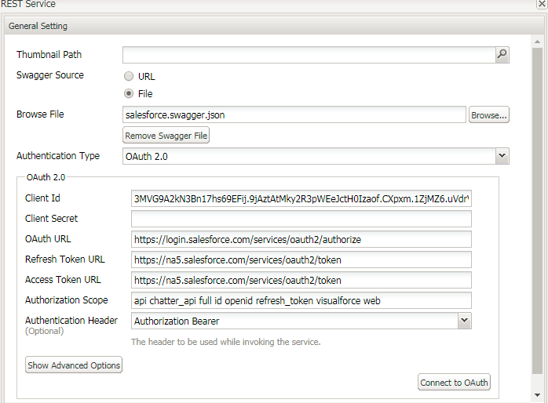

# AEM Forms 6.3 및 6.4에서 Salesforce를 사용하여 DataSource 구성{#configuring-datasource-with-salesforce-in-aem-forms-and}

## 전제 조건 {#prerequisites}

이 문서에서는 Salesforce를 통해 데이터 소스 생성 과정을 살펴봅니다

이 자습서를 위한 사전 요구 사항:

* 이 페이지 아래쪽으로 스크롤하여 swagger 파일을 다운로드하고 하드 드라이브에 저장합니다.
* SSL이 활성화된 AEM Forms

   * [AEM 6.3에서 SSL 활성화를 위한 공식 문서](https://helpx.adobe.com/experience-manager/6-3/sites/administering/using/ssl-by-default.html)
   * [AEM 6.4에서 SSL 활성화를 위한 공식 문서](https://helpx.adobe.com/experience-manager/6-4/sites/administering/using/ssl-by-default.html)

* Salesforce 계정이 필요합니다.
* 연결된 앱을 만들어야 합니다. Salesforce에서 앱을 만드는 공식 문서는 [여기에 나와 있습니다](https://help.salesforce.com/articleView?id=connected_app_create.htm&amp;type=0).
* 앱에 적합한 OAuth 범위 제공(테스트 목적으로 사용 가능한 모든 OAuth 범위를 선택함)
* 콜백 URL을 제공합니다. 내 케이스의 콜백 URL은

   * **AEM Forms 6.3을**&#x200B;사용하는 경우 콜백 URL은 https://gbedekar-w7-1:6443/etc/cloudservices/fdm/createlead.html입니다. 이 URL 만들기 광고는 내 양식 데이터 모델의 이름입니다.

   * *** AEM Forms 6.4**를 사용하는 경우 콜백 URL은 https://gbedekar-w7-:6443/libs/fd/fdm/gui/components/admin/fdmcloudservice/createcloudconfigwizard/cloudservices.html [입니다.](https://gbedekar-w7-1:6443/libs/fd/fdm/gui/components/admin/fdmcloudservice/createcloudconfigwizard/cloudservices.html)

이 예에서 gbedekar -w7-1:6443은 내 서버 이름과 AEM이 실행 중인 포트입니다.

연결된 앱을 만들었으면 **소비자 키와 비밀 키를 메모해 두십시오**. AEM Forms에서 데이터 소스를 만들 때 이러한 데이터가 필요합니다.

연결된 앱을 만들었으므로 salesforce에서 수행해야 하는 작업을 위해 Swagger 파일을 만들어야 합니다. 샘플 스웨거 파일은 다운로드 가능한 에셋의 일부로 포함되어 있습니다. 이 Swagger 파일을 사용하면 응용 양식 제출 시 &quot;리드&quot; 개체를 만들 수 있습니다. 이 스웨거 파일을 살펴보십시오.

다음 단계는 AEM Forms에서 데이터 소스를 만드는 것입니다. AEM Forms 버전에 따라 다음 단계를 수행하십시오

## AEM Forms 6.3 {#aem-forms}

* https 프로토콜을 사용하여 AEM Forms에 로그인
* https://&lt;servername>:&lt;serverport> /etc/cloudservices.html을 입력하여 클라우드 서비스로 이동합니다(예: https://gbedekar-w7-1:6443/etc/cloudservices.html).
* 아래로 스크롤하여 &quot;양식 데이터 모델&quot;로 이동합니다.
* &quot;구성 표시&quot;를 클릭합니다.
* 새 구성을 추가하려면 &quot;+&quot;를 클릭합니다.
* &quot;Rest Full Service&quot;를 선택합니다. 구성에 의미 있는 제목과 이름을 제공합니다. 예,

   * 이름:CreateLeadInSalesForce
   * 제목:CreateLeadInSalesForce

* &quot;만들기&quot;를 클릭합니다.

**다음 화면에서 **

* Swagger 소스 파일에 대한 옵션으로 &quot;파일&quot;을 선택합니다. 이전에 다운로드한 파일을 찾습니다.
* 인증 유형을 OAuth2.0으로 선택
* ClientID 및 Client Secret 값 제공
* OAuth URL - **https://login.salesforce.com/services/oauth2/authorize**
* 토큰 Url 새로 고침 - **https://na5.salesforce.com/services/oauth2/token**
* **액세스 도구 Url - https://na5.salesforce.com/services/oauth2/token**
* 인증 범위:** api chatter_api full id openid refresh_token visualforce web**
* 인증 처리기:인증 전달자
* &quot;OAUTH에 연결&quot;을 클릭합니다.모든 것이 제대로 작동하면 오류가 표시되지 않습니다

Salesforce를 사용하여 양식 데이터 모델을 만들면 방금 만든 데이터 소스를 사용하여 양식 데이터 통합을 만들 수 있습니다. 양식 데이터 통합 만들기에 대한 공식 설명서가 [여기에 있습니다](https://helpx.adobe.com/aem-forms/6-3/data-integration.html).

SFDC에서 리드 개체를 만들기 위해 POST 서비스를 포함하도록 양식 데이터 모델을 구성해야 합니다.

또한 리드 개체에 대한 읽기 및 쓰기 서비스를 구성해야 합니다. 이 페이지 하단에 있는 스크린샷을 참조하십시오.

양식 데이터 모델을 생성한 후 이 모델을 기반으로 적응형 Forms을 생성하고 양식 데이터 모델 제출 방법을 사용하여 SFDC에서 리드를 생성할 수 있습니다.

## AEM Forms 6.4 {#aem-forms-1}

* 데이터 소스 만들기

   * [데이터 소스로 이동](http://localhost:4502/libs/fd/fdm/gui/components/admin/fdmcloudservice/fdm.html/conf/global)

   * &quot;만들기&quot; 버튼을 클릭합니다.
   * 의미 있는 값 제공

      * 이름:CreateLeadInSalesForce
      * 제목:CreateLeadInSalesForce
      * 서비스 유형:RESTful 서비스
   * 다음을 클릭합니다
   * Swagger 소스:파일
   * 이전 단계에서 다운로드한 Swagger 파일을 찾아 선택합니다
   * 인증 유형:OAuth 2.0. 다음 값을 지정합니다.
   * ClientID 및 Client Secret 값 제공
   * OAuth URL - **https://login.salesforce.com/services/oauth2/authorize**
   * 토큰 Url 새로 고침 - **https://na5.salesforce.com/services/oauth2/token**
   * 액세스 토큰&#x200B;**Url - https://na5.salesforce.com/services/oauth2/token**
   * 인증 범위:** api chatter_api full id openid refresh_token visualforce web**
   * 인증 처리기:인증 전달자
   * &quot;OAuth에 연결&quot; 단추를 클릭합니다. 오류가 표시되면 위의 단계를 검토하여 모든 정보가 정확하게 입력되었는지 확인하십시오.

SalesForce를 사용하여 데이터 소스를 만들고 나면 방금 만든 데이터 소스를 사용하여 양식 데이터 통합을 만들 수 있습니다. 해당 문서의 설명서 링크가 [여기에 있습니다.](https://helpx.adobe.com/experience-manager/6-4/forms/using/create-form-data-models.html)

SFDC에서 리드 개체를 만들기 위해 POST 서비스를 포함하도록 양식 데이터 모델을 구성해야 합니다.

또한 리드 개체에 대한 읽기 및 쓰기 서비스를 구성해야 합니다. 이 페이지 하단에 있는 스크린샷을 참조하십시오.

양식 데이터 모델을 생성한 후 이 모델을 기반으로 적응형 Forms을 생성하고 양식 데이터 모델 제출 방법을 사용하여 SFDC에서 리드를 생성할 수 있습니다.

>[!NOTE]
>
>스웨거 파일의 URL이 해당 지역에 해당하는지 확인합니다. 예를 들어 샘플 스웨거 파일의 url은 북미 지역에서 계정을 만들기 때문에 &quot;na46.salesforce.com&quot;입니다. 가장 쉬운 방법은 Salesforce 계정에 로그인하여 URL을 확인하는 것입니다.

[SampleSwaggerFile](assets/swagger-sales-force-lead.json)
