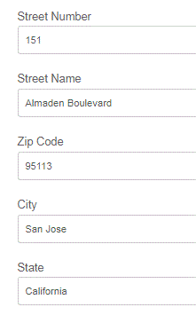

# 응용 Forms에서 위치 정보 API 사용{#using-geolocation-api-s-in-adaptive-forms}

이 기능의 실시간 데모를 보려면 [AEM Forms 샘플](https://forms.enablementadobe.com/content/samples/samples.html?query=0) 페이지를 방문하십시오.

이 문서에서는 Google의 지리적 위치 API를 사용하여 적응형 양식의 필드를 채우는 방법을 살펴봅니다. 이 사용 사례는 양식의 현재 주소 필드를 채울 때 일반적으로 사용됩니다.

응용 Forms에서 지리적 위치 API를 사용하기 위해 다음 단계가 수행되었습니다.

1. [Google Maps ](https://developers.google.com/maps/documentation/javascript/get-api-key) 플랫폼을 사용하려면 Google에서 API Keyword를 가져옵니다. 1년 동안 유효한 시험버전을 이용할 수 있습니다.

1. 적응형 양식 조각이 현재 주소를 저장할 필드로 생성되었습니다.

1. Geolocation API는 응용 양식의 이미지 개체의 클릭 이벤트에 대해 호출되었습니다.

1. API 호출에서 반환되는 JSON 데이터를 구문 분석하여 이에 따라 적응형 양식 필드 값이 설정되었습니다.

```javascript
navigator.geolocation.getCurrentPosition(showPosition);
function showPosition(position) 
{
console.log(" I am inside the showPosition in fragment");
console.log("Latitude: " + position.coords.latitude + "Longitude " + position.coords.longitude);
var url = "https://maps.googleapis.com/maps/api/geocode/json?latlng="+position.coords.latitude+","+position.coords.longitude+"&key=<your_api_key>";
  console.log(url);
  
  $.getJSON(url,function (data, textStatus){
    
    var location=data.results[0].formatted_address;
    console.log(location);
    
    for(i=0;i<data.results[0].address_components.length;i++)
        {
          if(data.results[0].address_components[i].types[0] == "street_number")
            {
              streetNumber.value = data.results[0].address_components[i].long_name;
            }
          if(data.results[0].address_components[i].types[0] == "route")
            {
              streetName.value = data.results[0].address_components[i].long_name;
            }
            if(data.results[0].address_components[i].types[0] == "postal_code")
            {
              
              zipCode.value = data.results[0].address_components[i].long_name;
            }
            if(data.results[0].address_components[i].types[0] == "locality")
            {
              
              city.value = data.results[0].address_components[i].long_name;
            }
          if(data.results[0].address_components[i].types[0] == "administrative_area_level_1")
            {
              
              state.value = data.results[0].address_components[i].long_name;
            }
        }
    
  });
}
```



1행에서 HTML 지리적 위치 API를 사용하여 현재 위치를 가져옵니다. 현재 위치를 얻으면 현재 위치를 showPosition 함수로 전달합니다.

showPosition 함수에서 Google API를 사용하여 지정된 위도 및 경도의 주소 세부 정보를 가져옵니다.

그런 다음 API에서 반환되는 JSON을 구문 분석하여 적응형 양식 필드를 설정합니다.

>[!NOTE]
>
>테스트를 위해 URL에서 localhost와 함께 HTTP 프로토콜을 사용할 수 있습니다.
>
>프로덕션 서버의 경우 이 기능을 사용하려면 AEM 서버에 대해 SSL을 활성화해야 합니다.
>
>이 문서와 관련된 샘플은 미국 주소로 테스트되었습니다. 다른 지리적 위치에서 이 기능을 사용하려면 JSON 구문 분석을 수정해야 할 수 있습니다.

이 기능을 서버에 사용하려면 다음 단계를 수행하십시오

* AEM Forms 서버를 설치하고 시작합니다.

>!![NOTE] 이 기능은 AEM Forms 6.3 이상에서 테스트되었습니다.
* [Google API 키 가져오기를 참조하십시오](https://developers.google.com/maps/documentation/javascript/get-api-key).
* [이 아티클과 관련된 에셋을 AEM으로 가져옵니다.](assets/geolocationapi.zip)
* [편집 모드에서 응용 양식 조각을 엽니다.](http://localhost:4502/editor.html/content/forms/af/currentaddressfragment.html)
* 이미지 선택 구성 요소에 대한 규칙 편집기를 엽니다.
* &lt;your_api_key>를 Google API 키로 바꿉니다.
* 변경 내용을 저장합니다.
* [양식을 미리 봅니다](http://localhost:4502/content/dam/formsanddocuments/currentaddressfragment/jcr:content?wcmmode=disabled).
* &quot;지리적 위치&quot; 아이콘을 클릭합니다.
* 양식을 현재 위치로 채워야 합니다.
