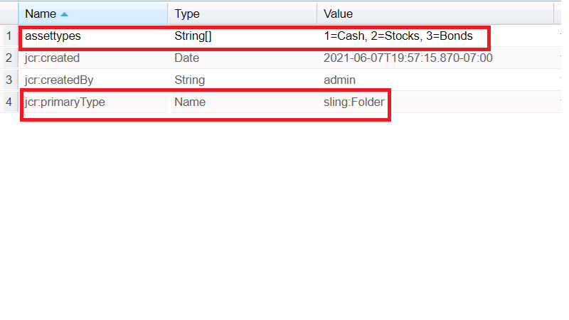

# AEM Forms의 항목 로드 속성

항목 로드 경로 속성을 사용하여 드롭다운 목록을 구성하고 채웁니다.
작성자는 항목 로드 경로 필드를 사용하여 드롭다운 목록에서 사용할 수 있는 옵션을 로드할 수 있는 URL을 제공할 수 있습니다.
crx에서 이러한 노드를 만들려면 아래에 설명된 단계를 수행하십시오.
* crx에 로그인
* assets라는 노드를 만듭니다(요구 사항에 따라 이 노드의 이름을 지정할 수 있음). content 아래에 sling:folder를 입력합니다.
* 저장
* 새로 만든 에셋 노드를 클릭하고 속성을 아래와 같이 설정합니다
* assettypes라는 String 형식의 속성을 만들어야 합니다(요구 사항에 따라 이름을 지정할 수 있음). 속성이 다중 값인지 확인하십시오. 원하는 값을 입력하고 저장합니다.
  

드롭다운 목록에서 이러한 값을 로드하려면 항목 로드 경로 속성 **/content/assets/assettypes**&#x200B;에 다음 경로를 제공하십시오.

샘플 패키지는 [여기에서 다운로드](assets/item-load-path-package.zip)할 수 있습니다.
