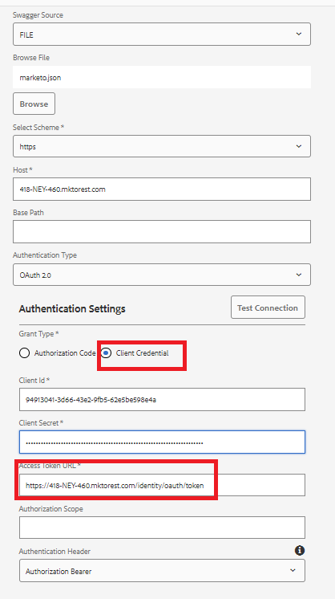

# 데이터 Source 만들기

Marketo의 REST API는 2개의 레그 OAuth 2.0으로 인증됩니다. 이전 단계에서 다운로드한 Swagger 파일을 사용하여 데이터 소스를 쉽게 만들 수 있습니다

## 구성 컨테이너 만들기

* AEM에 로그인합니다.
* 도구 메뉴를 클릭한 다음 아래와 같이 **구성 브라우저**&#x200B;를 클릭합니다.

* 

* **만들기**&#x200B;를 클릭하고 아래와 같이 의미 있는 이름을 제공하십시오. 아래와 같이 클라우드 구성 옵션을 선택해야 합니다

* 

## 클라우드 서비스 만들기

* 도구 메뉴로 이동한 다음 클라우드 서비스 -> 데이터 소스 를 클릭합니다.

* 

* 이전 단계에서 만든 구성 컨테이너를 선택하고 **만들기**&#x200B;를 클릭하여 새 데이터 원본을 만드십시오.의미 있는 이름을 입력하고 서비스 유형 드롭다운 목록에서 RESTful 서비스를 선택한 후 **다음**&#x200B;을 클릭하십시오.
* 

* Swagger 파일을 업로드하고 아래 스크린샷과 같이 Marketo 인스턴스와 관련된 부여 유형, 클라이언트 ID, 클라이언트 암호 및 액세스 토큰 URL을 지정합니다.

* 연결을 테스트하고 연결이 성공하면 파란색 **만들기** 단추를 클릭하여 데이터 원본 만들기 프로세스를 완료하십시오.

* 

## 다음 단계

[RESTful 서비스 기반 데이터 소스 만들기](./part3.md)
