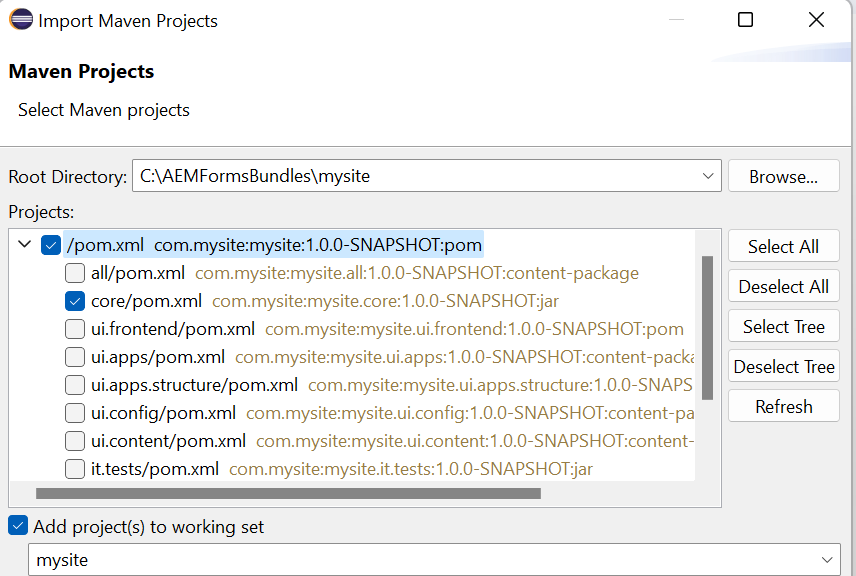

# 첫 번째 OSGi 번들 만들기

OSGi 번들은 Java 코드, 리소스 및 번들과 그 의존성을 설명하는 매니페스트가 포함된 Java™ 아카이브 파일입니다. 번들은 응용 프로그램의 배포 단위입니다. 이 문서는 AEM Forms 6.4 또는 6.5를 사용하여 OSGi 서비스 또는 서블릿을 만들려는 개발자를 위한 것입니다. 첫 번째 OSGi 번들을 빌드하려면 다음 단계를 따르십시오.


## JDK 설치

지원되는 버전의 JDK를 설치합니다. JDK1.8을 사용한 적이 있습니다. 를 추가했는지 확인하십시오. **JAVA_HOME** 에서 는 JDK 설치의 루트 폴더를 가리키고 있습니다.
경로에 %JAVA_HOME%/bin 추가


>[!NOTE]
> JDK 15는 사용하지 마십시오. AEM에서는 지원되지 않습니다.

### JDK 버전 테스트

새 명령 프롬프트 창을 열고 다음을 입력합니다. `java -version`. 로 식별된 JDK 버전을 다시 가져와야 합니다. `JAVA_HOME` 변수


## Maven 설치

Maven은 주로 Java 프로젝트에 사용되는 빌드 자동화 도구입니다. 다음 단계에 따라 로컬 시스템에 maven을 설치하십시오.

* 라는 폴더 만들기 `maven` C 드라이브에서
* 다운로드 [이진 zip 아카이브](https://maven.apache.org/download.cgi)
* zip 아카이브의 내용을에 추출 `c:\maven`
* 이라는 환경 변수 만들기 `M2_HOME` (값: `C:\maven\apache-maven-3.6.0`. 내 경우에는 **mvn** 버전은 3.6.0입니다. 이 기사를 쓸 때 최신 Maven 버전은 3.6.3입니다.
* 추가 `%M2_HOME%\bin` 경로에
* 변경 사항 저장
* 새 명령 프롬프트를 열고 을 입력합니다. `mvn -version`. 다음이 표시됩니다. **mvn** 아래 스크린샷에 표시된 대로 나열된 버전


## Eclipse 설치

최신 버전의 설치 [일식](https://www.eclipse.org/downloads/)

## 첫 번째 프로젝트 만들기

Archetype은 Maven 프로젝트 템플릿 툴킷입니다. 원형(archetype)은 동일한 종류의 다른 모든 것들이 만들어지는 원래의 패턴 또는 모델로 정의된다. 이 이름은 Maven 프로젝트를 일관된 방식으로 생성할 수 있는 시스템을 제공하려는 경우에 적합합니다. Archetype은 작성자가 사용자를 위한 Maven 프로젝트 템플릿을 만들 수 있도록 지원하고, 사용자에게 이러한 프로젝트 템플릿의 매개 변수가 있는 버전을 생성할 수 있는 수단을 제공합니다.
첫 번째 Maven 프로젝트를 만들려면 다음 단계를 수행하십시오.

* (이)라는 이름의 새 폴더 만들기 `aemformsbundles` C 드라이브에서
* 명령 프롬프트를 열고 다음으로 이동 `c:\aemformsbundles`
* 명령 프롬프트에서 다음 명령을 실행합니다

```java
mvn -B org.apache.maven.plugins:maven-archetype-plugin:3.2.1:generate -D archetypeGroupId=com.adobe.aem -D archetypeArtifactId=aem-project-archetype -D archetypeVersion=36 -D appTitle="My Site" -D appId="mysite" -D groupId="com.mysite" -D aemVersion=6.5.13
```

완료되면 명령 창에 빌드 성공 메시지가 표시됩니다

## Maven 프로젝트에서 eclipse 프로젝트 만들기

* 작업 디렉터리를 다음으로 변경 `mysite`
* 실행 `mvn eclipse:eclipse` 명령줄에서 을 클릭합니다. 명령은 pom 파일을 읽고 Eclipse가 프로젝트 유형, 관계, 클래스 경로 등을 이해할 수 있도록 올바른 메타데이터로 Eclipse 프로젝트를 만듭니다.

## 프로젝트를 eclipse로 가져오기

시작 **Eclipse**

다음으로 이동 **파일 -> 가져오기** 및 선택 **기존 Maven 프로젝트** 아래와 같이


다음 을 클릭합니다

다음을 클릭하여 c:\aemformsbundles\mysite를 선택합니다. **찾아보기** 단추



>[!NOTE]
>필요에 따라 적절한 모듈을 가져오도록 선택할 수 있습니다. 프로젝트에서 Java 코드만 생성하려는 경우 코어 모듈만 선택하고 가져옵니다.

클릭 **완료** 가져오기 프로세스를 시작하려면

프로젝트를 Eclipse로 가져오면 다음과 같은 항목이 표시됩니다. `mysite.xxxx` 폴더

확장 `src/main/java` 다음 아래에 `mysite.core` 폴더를 삭제합니다. 이는 대부분의 코드를 작성하는 폴더입니다.


## AEMFD 클라이언트 SDK 포함

AEM Forms과 함께 제공되는 다양한 서비스를 이용하려면 프로젝트에 AEMFD 클라이언트 sdk를 포함해야 합니다. 다음을 참조하십시오. [AEMFD 클라이언트 SDK](https://mvnrepository.com/artifact/com.adobe.aemfd/aemfd-client-sdk) Maven 프로젝트에 적절한 클라이언트 SDK를 포함하기 위해 의 종속성 섹션에 AEM FD 클라이언트 SDK를 포함해야 합니다. `pom.xml` 아래에 표시된 대로 핵심 프로젝트의

```xml
<dependency>
    <groupId>com.adobe.aemfd</groupId>
    <artifactId>aemfd-client-sdk</artifactId>
    <version>6.0.122</version>
</dependency>
```

프로젝트를 빌드하려면 다음 단계를 따르십시오.

* 열기 **명령 프롬프트 창**
* 다음으로 이동 `c:\aemformsbundles\mysite\core`
* 명령 실행 `mvn clean install -PautoInstallBundle`
위의 명령은에서 실행 중인 AEM 서버에 번들을 빌드하고 설치합니다. `http://localhost:4502`. 번들은 다음 파일 시스템에서도 사용할 수 있습니다.
  `C:\AEMFormsBundles\mysite\core\target` 및 를 사용하여 배포할 수 있습니다. [Felix 웹 콘솔](http://localhost:4502/system/console/bundles)

## 다음 단계

[OSGi 서비스 만들기](./create-osgi-service.md)

