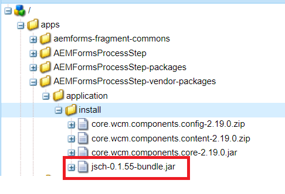

# AEM 프로젝트에 타사 번들 포함

이 문서에서는 AEM 프로젝트에 타사 OSGi 번들을 포함하는 것과 관련된 단계를 안내합니다. 이 문서의 목적은 [jsch-0.1.55.jar](https://repo1.maven.org/maven2/com/jcraft/jsch/0.1.55/jsch-0.1.55.jar) AEM 프로젝트에서 확인하십시오.  OSGi를 전문 저장소에서 사용할 수 있는 경우 프로젝트의 POM.xml 파일에 번들의 종속성이 포함됩니다.

>[!NOTE]
> 타사 jar가 OSGi 번들이라고 가정합니다

```java
<!-- https://mvnrepository.com/artifact/com.jcraft/jsch -->
<dependency>
    <groupId>com.jcraft</groupId>
    <artifactId>jsch</artifactId>
    <version>0.1.55</version>
</dependency>
```

OSGi 번들이 파일 시스템에 있는 경우 **localjar** 프로젝트의 기본 디렉토리(C:\aemformsbundles\AEMFormsProcessStep\localjar) 아래에 있는 종속성은 다음과 같습니다

```java
<dependency>
    <groupId>jsch</groupId>
    <artifactId>jsch</artifactId>
    <version>1.0</version>
    <scope>system</scope>
    <systemPath>${project.basedir}/localjar/jsch-0.1.55-bundle.jar</systemPath>
</dependency>
```

## 폴더 구조 만들기

이 번들을 AEM 프로젝트에 추가하고 있습니다 **AEMFormsProcessStep** 에 **c:\aemformsbundles** 폴더

* 를 엽니다. **filter.xml** C:\aemformsbundles\AEMFormsProcessStep\all\src\main\content\META-INF\vault folder of your project Make a note of the root attribute of the filter element에서 다운로드할 수 있습니다.

* 다음 폴더 구조 만들기 C:\aemformsbundles\AEMFormsProcessStep\all\src\main\content\jcr_root\apps\AEMFormsProcessStep-vendor-packages\application\install
* 다음 **apps/AEMFormsProcessStep-vendor-packages** 은 filter.xml의 루트 속성 값입니다.
* 프로젝트 POM.xml의 종속성 섹션을 업데이트합니다
* 명령 프롬프트를 엽니다. 내 경우 프로젝트의 폴더(c:\aemformsbundles\AEMFormsProcessStep)으로 이동합니다. 다음 명령을 실행합니다

```java
mvn clean install -pAutoInstallSinglePackage
```

모든 것이 제대로 작동하면 패키지가 타사 번들과 함께 AEM 인스턴스에 설치됩니다. 을 사용하여 번들을 확인할 수 있습니다 [felix web console](http://localhost:4502/system/console/bundles). 타사 번들은 의 /apps 폴더에서 사용할 수 있습니다 `crx` 아래와 같이 저장소



