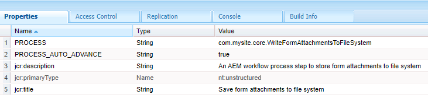

# 사용자 지정 워크플로 구성 요소

이 튜토리얼은 사용자 지정 워크플로우 구성 요소를 만들어야 하는 AEM Forms 고객을 위한 것입니다. 워크플로우 구성 요소는 이전 단계에서 작성된 코드를 실행하도록 구성됩니다. 워크플로 구성 요소는 코드에 프로세스 인수를 지정할 수 있습니다. 이 문서에서는 코드와 관련된 워크플로우 구성 요소를 살펴봅니다.

[사용자 지정 워크플로우 구성 요소 다운로드](assets/saveFiles.zip)
워크플로우 구성 요소 가져오기 [패키지 관리자 사용](http://localhost:4502/crx/packmgr/index.jsp)

사용자 지정 워크플로 구성 요소는 /apps/AEMFormsDemoListings/workflowcomponent/SaveFiles에 있습니다.

SaveFiles 노드를 선택하고 해당 속성을 검사합니다.

**구성 요소 그룹** - 이 속성의 값은 워크플로 구성 요소의 범주를 결정합니다.

**jcr:Title** - 워크플로 구성 요소의 제목입니다.

**sling:resourceSuperType** 이 속성의 값은 이 구성 요소의 상속을 결정합니다. 이 경우 프로세스 구성 요소에서 상속합니다.

## cq:dialog

대화 상자는 작성자가 구성 요소와 상호 작용할 수 있도록 하는 데 사용됩니다. cq:dialog는 SaveFiles 노드 아래에 있습니다

항목 노드 아래의 노드는 작성자가 구성 요소와 상호 작용하는 구성 요소의 탭을 나타냅니다. 공통 및 프로세스 탭이 숨겨져 있습니다. 공통 및 인수 탭이 표시됩니다.

프로세스에 대한 프로세스 인수는 processargs 노드 아래에 있습니다

작성자는 아래 스크린샷에 표시된 대로 인수를 지정합니다

값은 메타데이터 노드의 속성으로 저장됩니다. 예를 들어 값 **c:\formsattachments** 메타데이터 노드의 saveToLocation 속성에 저장됩니다.

## cq:editConfig

cq:EditConfig 는 단순히 기본 유형 cq:EditConfig 를 가진 노드이며 구성 요소 루트 아래에 cq:editConfig 라는 이름이 있습니다. 구성 요소의 편집 동작은 구성 요소 노드(cq:Component 유형) 아래에 cq:EditConfig 유형의 cq:editConfig 노드를 추가하여 구성됩니다.

cq:formParameters(노드 유형 nt:unstructured): 대화 상자 양식에 추가되는 추가 매개 변수를 정의합니다.

cq:formParameters 노드의 속성

PROCESS 속성의 값은 워크플로우 구성 요소와 연결할 Java 코드를 나타냅니다.
