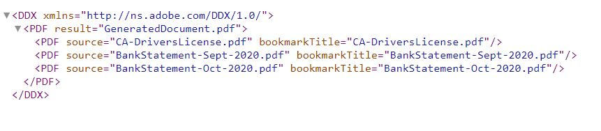

# 양식 첨부 파일 조합

이 문서에서는 지정된 순서로 적응형 양식 첨부 파일을 조합하는 자산을 제공합니다. 이 샘플 코드가 작동하려면 양식 첨부 파일이 pdf 형식이어야 합니다. 활용 사례는 다음과 같습니다.
적응형 양식을 작성한 사용자가 양식에 하나 이상의 pdf 문서를 첨부합니다.
양식 제출 시 첨부 파일을 결합하여 하나의 pdf를 생성합니다. 최종 pdf를 생성하기 위해 첨부 파일을 조합하는 순서를 지정할 수 있습니다.

## WorkflowProcess 인터페이스를 구현하는 OSGi 구성 요소 만들기

com.adobe.granite.workflow.exec.WorkflowProcess 인터페이스를 구현하는 [OSGi 구성 요소를 만듭니다](https://helpx.adobe.com/experience-manager/6-5/sites/developing/using/reference-materials/javadoc/com/adobe/granite/workflow/exec/WorkflowProcess.html). 이 구성 요소의 코드는 AEM 작업 과정의 프로세스 단계 구성 요소와 연결할 수 있습니다. 인터페이스 com.adobe.granite.workflow.exec.WorkflowProcess의 실행 방법이 이 구성 요소에서 구현됩니다.

AEM 워크플로우를 트리거하기 위해 적응형 양식이 제출되면 제출된 데이터가 페이로드 폴더 아래의 지정된 파일에 저장됩니다. 예를 들어 제출된 데이터 파일입니다. 카드 및 은행 거래 명세서 태그 아래에 지정된 첨부 파일을 조합해야 합니다.
.

### 태그 이름 가져오기

첨부 파일의 순서는 아래 스크린샷과 같이 워크플로우의 프로세스 단계 인수로 지정됩니다. 여기 필드 카드에 추가된 첨부 파일을 조합하고 있습니다


다음 코드 조각은 프로세스 인수에서 첨부 파일 이름을 추출합니다

```java
String  []attachmentNames  = arg2.get("PROCESS_ARGS","string").toString().split(",");
```

### 첨부 파일에서 DCX 만들기

그런 다음 문서를 취합하는 데 Assembler 서비스에서 사용하는 [DDX(문서 설명 XML)](https://helpx.adobe.com/pdf/aem-forms/6-2/ddxRef.pdf) 문서를 만들어야 합니다. 다음은 프로세스 인수에서 생성된 DDX입니다. 프로세스 인수에 지정된 대로 PDF 소스 요소가 올바른 순서로 표시됩니다.



### 문서 맵 만들기

그런 다음 첨부 이름이 있는 문서 맵을 키로 만들고, 첨부 파일이 값으로 만들어집니다. 쿼리 빌더 서비스는 페이로드 경로 아래의 첨부 파일을 쿼리하고 문서 맵을 작성하는 데 사용되었습니다. 이 문서 맵은 어셈블러 서비스가 최종 pdf를 조합하는 데 필요합니다.

```java
public Map<String, Object> createMapOfDocuments(String payloadPath,WorkflowSession workflowSession )
{
  Map<String, String> queryMap = new HashMap<String, String>();
  Map<String,Object>mapOfDocuments = new HashMap<String,Object>();
  queryMap.put("type", "nt:file");
  queryMap.put("path",payloadPath);
  Query query = queryBuilder.createQuery(PredicateGroup.create(queryMap),workflowSession.adaptTo(Session.class));
  query.setStart(0);
  query.setHitsPerPage(30);
  SearchResult result = query.getResult();
  log.debug("Get result hits "+result.getHits().size());
  for (Hit hit : result.getHits()) {
    try {
          String path = hit.getPath();
          log.debug("The title "+hit.getTitle()+" path "+path);
          if(hit.getTitle().endsWith("pdf"))
           {
             com.adobe.aemfd.docmanager.Document attachmentDocument = new com.adobe.aemfd.docmanager.Document(path);
             mapOfDocuments.put(hit.getTitle(),attachmentDocument);
             log.debug("@@@@Added to map@@@@@ "+hit.getTitle());
           }
        }
    catch (Exception e)
       {
          log.debug(e.getMessage());
       }

}
return mapOfDocuments;
}
```

### AssemblerService를 사용하여 문서 조합

DCX와 문서 맵이 만들어지면 다음 단계로 AssemblerService를 사용하여 문서를 어셈블합니다.
다음 코드는 어셈블된 pdf를 취하여 반환합니다.

```java
private com.adobe.aemfd.docmanager.Document assembleDocuments(Map<String, Object> mapOfDocuments, com.adobe.aemfd.docmanager.Document ddxDocument)
{
    AssemblerOptionSpec aoSpec = new AssemblerOptionSpec();
    aoSpec.setFailOnError(true);
    AssemblerResult ar = null;
    try
    {
        ar = assemblerService.invoke(ddxDocument, mapOfDocuments, aoSpec);
        return (com.adobe.aemfd.docmanager.Document) ar.getDocuments().get("GeneratedDocument.pdf");
    }
    catch (OperationException e)
    {
        log.debug(e.getMessage());
    }
    return null;
    
}
```

### 결합된 pdf를 페이로드 폴더 아래에 저장

마지막 단계는 결합된 pdf를 페이로드 폴더 아래에 저장하는 것입니다. 그런 다음 추가 처리를 위해 워크플로우의 후속 단계에서 이 pdf에 액세스할 수 있습니다.
다음 코드 조각을 사용하여 페이로드 폴더 아래에 파일을 저장했습니다

```java
Session session = workflowSession.adaptTo(Session.class);
javax.jcr.Node payloadNode =  workflowSession.adaptTo(Session.class).getNode(workItem.getWorkflowData().getPayload().toString());
log.debug("The payload Path is "+payloadNode.getPath());
javax.jcr.Node assembledPDFNode = payloadNode.addNode("assembled-pdf.pdf", "nt:file"); 
javax.jcr.Node jcrContentNode =  assembledPDFNode.addNode("jcr:content", "nt:resource");
Binary binary =  session.getValueFactory().createBinary(assembledDocument.getInputStream());
jcrContentNode.setProperty("jcr:data", binary);
log.debug("Saved !!!!!!"); 
session.save();
```

다음은 양식 첨부 파일을 조합하여 저장한 후의 페이로드 폴더 구조입니다.


### AEM 서버에서 이 기능을 사용하려면

* 로컬 시스템에 [양식 첨부 파일](assets/assemble-form-attachments-af.zip) 조합 양식을 다운로드합니다.
* 양식 및 문서 페이지[에서 양식을](http://localhost:4502/aem/forms.html/content/dam/formsanddocuments) 가져옵니다.
* 워크플로우 [를](assets/assemble-form-attachments.zip) 다운로드하고 패키지 관리자를 사용하여 AEM으로 가져옵니다.
* 사용자 [정의 번들 다운로드](assets/assembletaskattachments.assembletaskattachments.core-1.0-SNAPSHOT.jar)
* [웹 콘솔을 사용하여 번들 배포 및 시작](http://localhost:4502/system/console/bundles)
* 브라우저에서 첨부 파일 [양식을 가리킵니다.](http://localhost:4502/content/dam/formsanddocuments/assembleattachments/jcr:content?wcmmode=disabled)
* ID 문서에 첨부 파일을 추가하고 은행 명세서 섹션에 두 개의 pdf 문서를 추가합니다.
* 양식 제출을 통해 워크플로우 트리거
* crx에 있는 워크플로우의 [페이로드 폴더에서 조합된](http://localhost:4502/crx/de/index.jsp#/var/fd/dashboard/payload) pdf를 확인합니다.

>[!NOTE]
> 사용자 정의 번들에 대해 로거를 활성화한 경우 DDX와 어셈블된 파일이 AEM 설치 폴더에 기록됩니다.

