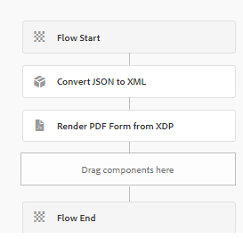

# 핵심 구성 요소 기반 양식 제출의 데이터로 PDF 생성

다음은 대문자로 표시된 &quot;핵심 구성 요소&quot;로 수정된 텍스트입니다.

일반적인 시나리오에는 핵심 구성 요소 기반 적응형 양식을 통해 제출된 데이터에서 PDF을 생성하는 작업이 포함됩니다. 이 데이터는 항상 JSON 형식입니다. 렌더링 PDF API를 사용하여 PDF을 생성하려면 JSON 데이터를 XML 형식으로 변환해야 합니다. 이 변환에는 `org.json.XML`의 `toString` 메서드가 사용됩니다. 자세한 내용은 `org.json.XML.toString` 메서드의 [설명서](https://www.javadoc.io/doc/org.json/json/20171018/org/json/XML.html#toString-java.lang.Object-)를 참조하세요.

## JSON 스키마 기반 적응형 양식

다음 단계에 따라 적응형 양식에 대한 JSON 스키마를 만드십시오.

### XDP에 대한 샘플 데이터 생성

프로세스를 간소화하려면 다음과 같이 세분화된 단계를 수행합니다.

1. AEM Forms Designer에서 XDP 파일을 엽니다.
1. &quot;파일&quot; > &quot;양식 속성&quot; > &quot;미리 보기&quot;로 이동합니다.
1. &quot;미리보기 데이터 생성&quot;을 선택합니다.
1. &quot;생성&quot;을 클릭합니다.
1. `form-data.xml`과(와) 같은 의미 있는 파일 이름을 지정하십시오.

### XML 데이터에서 JSON 스키마 생성

이전 단계에서 생성된 XML 데이터를 사용하여 무료 온라인 도구를 사용하여 [XML을 JSON으로 변환](https://jsonformatter.org/xml-to-jsonschema)할 수 있습니다.

### JSON을 XML로 변환하는 사용자 지정 워크플로우 프로세스

제공된 코드는 JSON을 XML로 변환하여 워크플로 프로세스 변수 `dataXml`에 결과 XML을 저장합니다.

```java
import org.slf4j.LoggerFactory;
import com.adobe.granite.workflow.WorkflowException;
import java.io.InputStream;
import java.io.BufferedReader;
import java.io.InputStreamReader;
import javax.jcr.Node;
import javax.jcr.Session;
import org.json.JSONObject;
import org.json.XML;
import org.slf4j.Logger;
import org.osgi.service.component.annotations.Component;
import com.adobe.granite.workflow.WorkflowSession;
import com.adobe.granite.workflow.exec.WorkItem;
import com.adobe.granite.workflow.exec.WorkflowProcess;
import com.adobe.granite.workflow.metadata.MetaDataMap;

@Component(property = {
    "service.description=Convert JSON to XML",
    "process.label=Convert JSON to XML"
})
public class ConvertJSONToXML implements WorkflowProcess {

    private static final Logger log = LoggerFactory.getLogger(ConvertJSONToXML.class);

    @Override
    public void execute(final WorkItem workItem, final WorkflowSession workflowSession, final MetaDataMap arg2) throws WorkflowException {
        String processArgs = arg2.get("PROCESS_ARGS", "string");
        log.debug("The process argument I got was " + processArgs);
        
        String submittedDataFile = processArgs;
        String payloadPath = workItem.getWorkflowData().getPayload().toString();
        log.debug("The payload in convert json to xml " + payloadPath);
        
        String dataFilePath = payloadPath + "/" + submittedDataFile + "/jcr:content";
        try {
            Session session = workflowSession.adaptTo(Session.class);
            Node submittedJsonDataNode = session.getNode(dataFilePath);
            InputStream jsonDataStream = submittedJsonDataNode.getProperty("jcr:data").getBinary().getStream();
            BufferedReader streamReader = new BufferedReader(new InputStreamReader(jsonDataStream, "UTF-8"));
            StringBuilder stringBuilder = new StringBuilder();
            String inputStr;
            while ((inputStr = streamReader.readLine()) != null) {
                stringBuilder.append(inputStr);
            }
            JSONObject submittedJson = new JSONObject(stringBuilder.toString());
            log.debug(submittedJson.toString());
            
            String xmlString = XML.toString(submittedJson);
            log.debug("The json converted to XML " + xmlString);
            
            MetaDataMap metaDataMap = workItem.getWorkflow().getWorkflowData().getMetaDataMap();
            metaDataMap.put("xmlData", xmlString);
        } catch (Exception e) {
            log.error("Error converting JSON to XML: " + e.getMessage(), e);
        }
    }
}
```

### 워크플로우 만들기

양식 제출을 처리하려면 다음 두 단계를 포함하는 워크플로우를 만듭니다.

1. 초기 단계에서는 사용자 지정 프로세스를 사용하여 제출된 JSON 데이터를 XML로 변환합니다.
1. 다음 단계에서는 XML 데이터를 XDP 템플릿과 결합하여 PDF을 생성합니다.




## 예제 코드 배포

로컬 서버에서 이를 테스트하려면 다음 간소화된 단계를 따르십시오.

1. [AEM OSGi 웹 콘솔을 통해 사용자 지정 번들을 다운로드하여 설치하십시오](assets/convertJsonToXML.core-1.0.0-SNAPSHOT.jar).
1. [워크플로 패키지를 가져옵니다](assets/workflow_to_render_pdf.zip).
1. [샘플 적응형 양식 및 XDP 템플릿 가져오기](assets/adaptive_form_and_xdp_template.zip).
1. [적응형 양식을 미리 봅니다](http://localhost:4502/content/dam/formsanddocuments/f23/jcr:content?wcmmode=disabled).
1. 몇 가지 양식 필드를 작성합니다.
1. 양식을 제출하여 AEM 워크플로우를 시작합니다.
1. 워크플로의 페이로드 폴더에서 렌더링된 PDF을 찾습니다.
