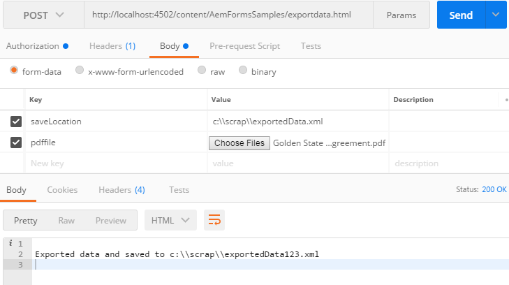

# AEM Forms에서 출력 및 Forms 서비스를 사용하여 개발{#developing-with-output-and-forms-services-in-aem-forms}

AEM Forms에서 출력 및 Forms 서비스 API 사용

이 문서에서 다음 사항을 살펴보겠습니다

* 출력 서비스 - 일반적으로 이 서비스는 xml 데이터를 xdp 템플릿 또는 pdf와 병합하여 병합된 pdf를 생성하는 데 사용됩니다. 자세한 내용은 출력 서비스의[javadoc](https://helpx.adobe.com/experience-manager/6-5/forms/javadocs/index.html?com/adobe/fd/output/api/OutputService.html)을 참조하십시오.
* FormsService - PDF 파일에서 데이터를 가져오거나 내보낼 수 있는 매우 다양한 서비스입니다. 자세한 내용은 Forms 서비스의 [javadoc](https://helpx.adobe.com/experience-manager/6-5/forms/javadocs/index.html?com/adobe/fd/forms/api/class-use/FormsService.html)을 참조하십시오.


다음 코드 조각은 PDF 파일에서 데이터를 내보냅니다

```java
javax.servlet.http.Part pdfPart = request.getPart("pdffile");
String filePath = request.getParameter("saveLocation");
java.io.InputStream pdfIS = pdfPart.getInputStream();
com.adobe.aemfd.docmanager.Document pdfDocument = new com.adobe.aemfd.docmanager.Document(pdfIS);
com.adobe.fd.forms.api.FormsService formsservice = sling.getService(com.adobe.fd.forms.api.FormsService.class);
com.adobe.aemfd.docmanager.Document xmlDocument = formsservice.exportData(pdfDocument,com.adobe.fd.forms.api.DataFormat.Auto);
```

1라인은 요청에서 파일을 추출합니다

Line2는 요청에서 saveLocation을 추출합니다

5줄에 FormsService가 있습니다.

6줄에서는 PDF 파일에서 xmlData를 내보냅니다

**시스템에서 샘플 패키지를 테스트하려면**

[AEM 패키지 관리자를 사용하여 패키지를 다운로드하여 설치합니다](assets/outputandformsservice.zip)


**패키지를 설치한 후에는 Granite CSRF 필터허용 목록에 추가하다에 다음 URL을 배치해야 합니다.**

1. 위에 언급된 경로를 추적하려면 허용 목록에 추가하다 아래 단계를 따르십시오.
1. [configMgr에 로그인](http://localhost:4502/system/console/configMgr)
1. Granite CSRF 필터 Adobe 검색
1. 제외된 섹션에 다음 3개의 경로를 추가하고 저장합니다
1. /content/AemFormsSamples/mergedata
1. /content/AemFormsSamples/exportdata
1. /content/AemFormsSamples/outputservice
1. Sling 레퍼러 필터 검색
1. &quot;Allow Empty&quot; 확인란을 선택합니다. (이 설정은 테스트용으로만 사용해야 합니다.)
샘플 코드를 테스트하는 방법에는 여러 가지가 있습니다. 가장 빠르고 가장 쉬운 것은 Postman 앱을 사용하는 것입니다. Postman을 사용하면 서버에 POST 요청을 수행할 수 있습니다. 시스템에 Postman 앱을 설치합니다.
앱을 실행하고 다음 URL을 입력하여 데이터 내보내기 API를 테스트합니다

드롭다운 목록에서 &quot;POST&quot;을 선택했는지 확인합니다
http://localhost:4502/content/AemFormsSamples/exportdata.html
&quot;Authorization&quot;을 &quot;Basic Auth&quot;로 지정해야 합니다. AEM 서버 사용자 이름 및 암호를 지정합니다
&quot;Body&quot; 탭으로 이동하여 아래 이미지에 표시된 대로 요청 매개 변수를 지정합니다

그런 다음 보내기 단추를 클릭합니다

그 패키지에는 3개의 샘플이 들어 있다. 다음 단원에서는 출력 서비스 또는 Forms 서비스, 서비스 URL을 사용할 시점, 각 서비스에서 필요로 하는 입력 매개 변수에 대해 설명합니다

**데이터 병합 및 병합 출력:**

* 출력 서비스를 사용하여 데이터를 xdp 또는 pdf 문서와 병합하여 병합된 pdf 생성
* **POST URL**:http://localhost:4502/content/AemFormsSamples/outputservice.html
* **요청 매개 변수 -**

   * xdp_or_pdf_file :데이터를 병합할 xdp 또는 pdf 파일
   * xmlfile:xdp_or_pdf_file과 병합되는 xml 데이터 파일입니다
   * saveLocation:렌더링된 문서를 파일 시스템에 저장할 위치입니다

**데이터를 PDF 파일로 가져오기:**
* FormsService를 사용하여 데이터를 PDF 파일로 가져오기
* **POST URL**  - http://localhost:4502/content/AemFormsSamples/mergedata.html
* **요청 매개 변수:**

   * pdfile :데이터를 병합할 pdf 파일
   * xmlfile:pdf 파일과 병합될 xml 데이터 파일
   * saveLocation:렌더링된 문서를 파일 시스템에 저장할 위치입니다. 예: c:\\\outputsample.pdf

**PDF 파일에서 데이터 내보내기**
* FormsService를 사용하여 PDF 파일에서 데이터를 내보냅니다
* **POST** URL - http://localhost:4502/content/AemFormsSamples/exportdata.html
* **요청 매개 변수:**

   * pdfile :데이터를 내보낼 pdf 파일
   * saveLocation:내보낸 데이터를 파일 시스템에 저장할 위치입니다

[이 postman 컬렉션을 가져와서 API를 테스트할 수 있습니다](assets/document-services-postman-collection.json)

