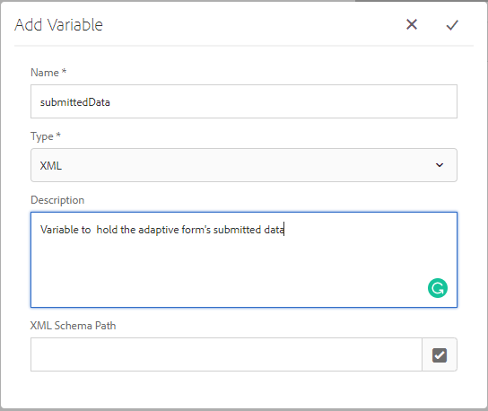

# 제출된 데이터를 검토할 워크플로우 만들기

워크플로우는 일반적으로 검토 및 승인을 위해 제출된 데이터를 전송하는 데 사용됩니다. 워크플로우는 AEM의 워크플로우 편집기를 사용하여 만들어집니다. 응용 양식 제출 시 워크플로우를 트리거할 수 있습니다. 다음 단계에서는 첫 번째 워크플로우를 만드는 과정을 안내합니다.

## 전제 조건

AEM Forms의 작업 인스턴스가 있는지 확인하십시오. AEM Forms을 설치 및 구성하려면 [설치](https://docs.adobe.com/content/help/en/experience-manager-65/forms/install-aem-forms/osgi-installation/installing-configuring-aem-forms-osgi.html) 가이드를 따르십시오.

## 워크플로우 모델 만들기

* [개방적인 워크플로우 모델](http://localhost:4502/libs/cq/workflow/admin/console/content/models.html)
* 만들기 -> 모델 만들기를 클릭합니다.
* 제출된 데이터 검토와 같은 의미 있는 제목 및 _이름을 제공합니다_.
* 새로 만든 워크플로우를 부드럽게 누르고 _편집_ 아이콘을 클릭합니다.
* 워크플로가 편집 모드에서 열립니다. 기본적으로 워크플로우에는 _1단계라는 구성 요소가 있습니다_. 이 구성 요소를 선택하고 삭제 아이콘을 클릭하여 구성 요소를 삭제합니다.
* 왼쪽에 나열된 다양한 워크플로우 구성 요소는 워크플로우를 구성하는 데 사용할 수 있습니다. 구성 요소를 _Forms Workflow_ 유형별로 필터링할 수 있습니다.

## 변수 만들기

* 변수 아이콘을 클릭하여 새 변수를 만듭니다. 변수는 값을 저장하는 데 사용됩니다. AEM Forms은 만들 수 있는 다양한 변수 유형을 제공합니다. 오늘 적응형 양식의 제출된 데이터를 저장할 XML 유형의 변수를 만듭니다. 아래 이미지에 표시된 대로 XML 형식의 _submittedData라는_ 새 변수를 만듭니다.

   >[!NOTE]
양식이 양식 데이터 모델을 기반으로 하는 경우 제출된 데이터가 JSON 형식이며 이 경우 JSON 유형의 변수를 만들어 제출된 데이터를 보유하게 됩니다.

* 왼쪽의 _단계_ 아이콘을 클릭하여 다양한 워크플로우 구성 요소를 나열합니다. 오른쪽 워크플로우에 _변수_ 설정 구성 요소를 드래그하여 놓습니다. 흐름 시작 아래에 변수 _설정_ 구성 요소를 배치해야 합니다.
   * 변수 _설정_ 구성 요소를 _클릭한 다음 렌치_ 아이콘을 클릭하여 구성 요소의 속성 시트를 엽니다.
   * 매핑 탭->매핑 추가->맵 변수를 클릭합니다. 아래 스크린샷에 표시된 대로 값을 설정합니다.
      

## 워크플로우 구성 요소 추가

* 작업 _지정_ 구성 요소를 드래그하여 오른쪽, 변수 _설정 구성 요소_ 아래에 놓습니다.
   * 작업 _지정_ 구성 요소를 클릭한 다음 렌치 __ 아이콘을 클릭하여 속성 시트를 엽니다.
   * 작업 지정 구성 요소에 의미 있는 제목을 제공합니다.
   * Forms 및 문서 탭을 클릭하고 스크린샷에 표시된 대로 다음 속성을 설정합니다
      

   * _1 이 옵션을 선택하면 워크플로우가 특정 응용 양식과 연결되지 않습니다._
   * _2 워크플로 엔진은 저장소의 페이로드를 기준으로 Data.xml이라는 파일을 찾습니다_

   * 할당자 탭을 클릭합니다. 조직의 사용자에게 작업을 할당할 수 있습니다. 이 사용 사례의 경우 아래 스크린샷에 나와 있는 것처럼 관리 사용자에게 작업을 할당할 예정입니다.
      
   * 구성 요소의 _완료_ 아이콘을 클릭하여 변경 내용을 저장합니다
* Sync _를_ 클릭하여 워크플로우의 런타임 모델을 생성합니다.
이제 워크플로우 모델이 준비되었으며 적응형 양식의 전송 작업과 연결할 수 있습니다.

