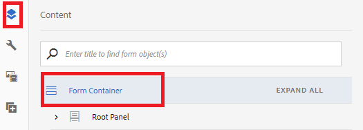

# AEM 워크플로우를 트리거하는 응용 양식 구성

* 응용 [양식 다운로드](assets/time-off-application.zip)
* 양식 및 [문서 찾아보기](http://localhost:4502/aem/forms.html/content/dam/formsanddocuments)
* 만들기 -> 파일 업로드를 클릭합니다. 1단계에서 다운로드한 양식 선택
* 편집 [모드에서 적응형 양식을 엽니다](http://localhost:4502/editor.html/content/forms/af/timeofapplication.html).
* 콘텐트 탐색기 열기
   
* 양식 컨테이너 노드를 선택하고 해당 구성 속성을 엽니다.
   
* 제출 패널 확장
* 위의 스크린샷에 지정된 대로 양식의 제출 작업을 설정합니다.
   _데이터 파일 경로 필드에 지정된 값을 기록해 두십시오. 이 값은 워크플로우의 작업 지정 구성 요소의 사전 채우기 섹션에서 지정한 값과 일치해야 합니다._

이제 적응형 양식을 채우고 제출하면 양식의 제출 작업과 관련된 워크플로우가 트리거됩니다.
