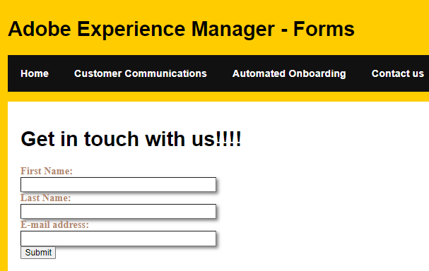

# Headless 적응형 양식 포함

이 [튜토리얼에서는 다양한 headless API를 다룹니다](https://opensource.adobe.com/aem-forms-af-runtime/api/#section/Introduction) 이렇게 하면 양식을 나열, 표시 및 제출할 수 있습니다.

이 문서에서는 Headless 방식으로 적응형 양식을 나열, 표시 및 제출할 수 있도록 제공되는 다양한 Headless API를 다룹니다.

이 문서에서는 기존 단일 페이지 앱이 SPA 웹 사이트에 Headless 적응형 양식을 나열하고 표시하려고 한다고 가정합니다.

다음 스크린샷은 contact us 양식이 SPA에 임베드되는 것을 보여 줍니다

## 사전 요구 사항

* React 경험

* AEM Forms 6.5.16 인스턴스 실행 중

* [작성자 및 게시 인스턴스에서 Headless 양식 활성화](https://experienceleague.adobe.com/docs/experience-manager-headless-adaptive-forms/using/quick-setup/enable-headless-adaptive-forms-and-core-components.html?lang=en)

## 다음 단계

[종속성 설치](./install-af-react-libraries.md)
