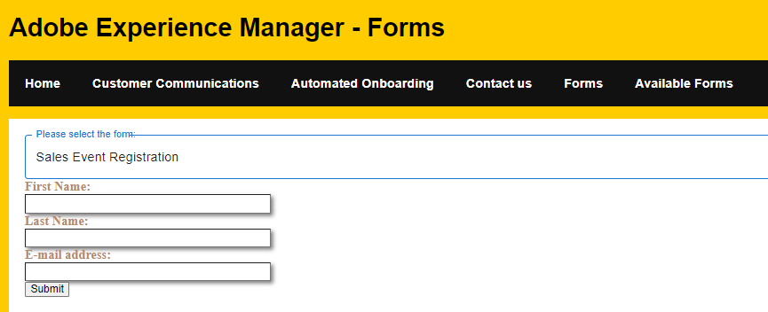

# 드롭다운 목록에서 채울 양식 선택

드롭다운 목록은 옵션 목록을 사용자에게 표시하는 작고 정리된 방법을 제공합니다. 드롭다운 목록의 항목이 의 결과로 채워집니다. [listforms API](https://opensource.adobe.com/aem-forms-af-runtime/api/#tag/List-Forms/operation/listForms)



## 드롭다운 목록

다음 코드를 사용하여 드롭다운 목록을 listforms API 호출 결과로 채웠습니다. 사용자 선택에 따라 사용자가 작성하여 제출할 수 있도록 적응형 양식이 표시됩니다. [자료 UI 구성 요소](https://mui.com/) 이 인터페이스를 만드는 데 사용되었습니다.

```javascript
import * as React from 'react';
import Form from './components/Form';
import PlainText from './components/plainText';
import TextField from './components/TextField';
import Button from './components/Button';
import Box from '@mui/material/Box';
import InputLabel from '@mui/material/InputLabel';
import MenuItem from '@mui/material/MenuItem';
import FormControl from '@mui/material/FormControl';
import Select, { SelectChangeEvent } from '@mui/material/Select';
import { AdaptiveForm } from "@aemforms/af-react-renderer";

import { useState,useEffect } from "react";
export default function SelectFormFromDropDownList()
 {
    const extendMappings =
    {
        'plain-text' : PlainText,
        'text-input' : TextField,
        'button' : Button,
        'form': Form
    };

const[formID, setFormID] = useState('');
const[afForms,SetOptions] = useState([]);
const [selectedForm, setForm] = useState('');
const HandleChange = (event) =>
     {
        console.log("The form id is "+event.target.value) 
    
        setFormID(event.target.value)
        
     };
const getForm = async () =>
     {
        
        console.log("The formID in getForm"+ formID);
        const resp = await fetch(`/adobe/forms/af/${formID}`);
        let formJSON = await resp.json();
        console.log(formJSON.afModelDefinition);
        setForm(formJSON.afModelDefinition);
     }
const getAFForms =async()=>
     {
        const response = await fetch("/adobe/forms/af/listforms")
        //let myresp = await response.status;
        let myForms = await response.json();
        console.log("Got response"+myForms.items[0].title);
        console.log(myForms.items)
        
        //setFormID('test');
        SetOptions(myForms.items)

        
     }
     useEffect( ()=>{
        getAFForms()
        

    },[]);
    useEffect( ()=>{
        getForm()
        

    },[formID]);

  return (
    <Box sx={{ minWidth: 120 }}>
      <FormControl fullWidth>
        <InputLabel id="demo-simple-select-label">Please select the form</InputLabel>
        <Select
          labelId="demo-simple-select-label"
          id="demo-simple-select"
          value={formID}
          label="Please select a form"
          onChange={HandleChange}
          
        >
       {afForms.map((afForm,index) => (
    
        
          <MenuItem  key={index} value={afForm.id}>{afForm.title}</MenuItem>
        ))}
        
       
        </Select>
      </FormControl>
      <div><AdaptiveForm mappings={extendMappings} formJson={selectedForm}/></div>
    </Box>
    

  );
  

}
```

이 사용자 인터페이스를 만드는 데 사용된 API 호출은 다음과 같습니다

* [ListForm](https://opensource.adobe.com/aem-forms-af-runtime/api/#tag/List-Forms/operation/listForms). 구성 요소가 렌더링될 때 양식 가져오기 호출이 한 번만 수행됩니다. API 호출 결과는 afForms 변수에 저장됩니다.
위의 코드에서는 map 함수를 사용하여 afForms를 반복하고 afForms 배열의 모든 항목에 대해 MenuItem 구성 요소가 생성되어 Select 구성 요소에 추가됩니다.

* 양식 가져오기 - 에 대한 get 호출이 수행됨 [getForm](https://opensource.adobe.com/aem-forms-af-runtime/api/#tag/Get-Form-Definition): 여기서 id는 드롭다운 목록에서 사용자가 선택한 적응형 양식의 id입니다. 이 GET 호출의 결과는 selectedForm에 저장됩니다.

```
const resp = await fetch(`/adobe/forms/af/${formID}`);
let formJSON = await resp.json();
console.log(formJSON.afModelDefinition);
setForm(formJSON.afModelDefinition);
```

* 선택한 양식을 표시합니다. 다음 코드를 사용하여 선택한 양식을 표시했습니다. AdaptiveForm 요소는 aemforms/af-react-renderer npm 패키지에 제공되며 매핑 및 formJson을 그 속성으로 사용합니다

```
<div><AdaptiveForm mappings={extendMappings} formJson={selectedForm}/></div>
```

## 다음 단계

[카드 레이아웃으로 양식 표시](./display-forms-card-view.md)
