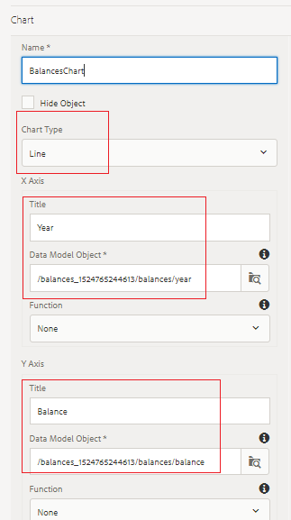

# 첫 번째 대화형 통신 문서에 대한 라인 차트 구성

이 부분에서는 계정 진행률 패널에 선 차트를 추가합니다.

AEM Forms에 로그인하고 Adobe Experience Manager > Forms > Forms 및 문서로 이동합니다.

401KStutement 폴더를 엽니다.

편집 모드에서 401KStutement를 엽니다.

AEM Forms 6.4에서는 다양한 유형의 차트를 사용하여 데이터를 표시하는 것이 매우 간단해졌습니다. 라인 차트를 사용하여 연도별 잔액을 표시할 것입니다.

오른쪽의 **계정 진행률** 대상 영역을 탭하고 &quot;+&quot; 아이콘을 클릭하여 구성 요소 삽입 대화 상자를 표시합니다.

차트 구성 요소를 삽입하려면 차트 를 선택합니다.

아래 스크린샷의 설정에 따라 차트 구성 요소를 구성하고 파란색 확인 표시 아이콘을 클릭하여 설정을 저장합니다.

x축과 y축에 올바른 양식 데이터 모델 요소를 선택해야 합니다.

**AEM Forms 6.4의 라인 차트 설정**

**AEM Forms 6.5의 선 차트 설정**

