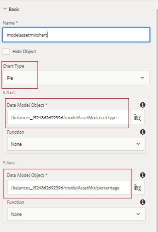

# 투자 혼합 패널 구성

이 부분에서는 현재 및 모델 투자 조합을 표시하는 파이 차트를 추가할 것입니다.

* AEM Forms에 로그인하고 Adobe Experience Manager > Forms > Forms 및 문서로 이동합니다.

* 401KStutement 폴더를 엽니다.

* 편집 모드에서 401KStatement를 엽니다.

* 계정 소유자의 현재 및 모델 투자 조합을 나타내는 2개의 파이 차트를 추가할 예정입니다.

## 현재 자산 혼합 {#current-asset-mix}

* 오른쪽의 &quot;CurrentAssetMix&quot; 패널을 누르고 &quot;+&quot; 아이콘을 선택하고 텍스트 구성 요소를 삽입합니다. 기본 텍스트를 &quot;현재 에셋 혼합&quot;으로 변경합니다.

* &quot;CurrentAssetMix&quot; 패널을 누르고 &quot;+&quot; 아이콘을 선택하고 차트 구성 요소를 삽입합니다. 새로 삽입된 차트 구성 요소를 누르고 &quot;렌치&quot; 아이콘을 클릭하여 차트에 대한 구성 속성 시트를 엽니다.

* 아래 이미지에 표시된 대로 속성을 설정합니다. 차트 유형이 파이 차트인지 확인합니다.

* X 축과 Y 축에 바인딩된 데이터 모델 개체를 주목하십시오. 양식 데이터 모델의 루트 요소를 선택한 다음 드릴다운하여 해당 요소를 선택해야 합니다.

* 

## 모델 자산 혼합 {#model-asset-mix}

* 오른쪽의 &quot;RecommendedAssetMix&quot; 패널을 누르고 &quot;+&quot; 아이콘을 선택하고 텍스트 구성 요소를 삽입합니다. 기본 텍스트를 &quot;모델 에셋 믹스&quot;로 변경합니다.

* &quot;RecommendedAssetMix&quot; 패널을 누르고 &quot;+&quot; 아이콘을 선택하고 차트 구성 요소를 삽입합니다. 새로 삽입된 차트 구성 요소를 누르고 &quot;렌치&quot; 아이콘을 클릭하여 차트에 대한 구성 속성 시트를 엽니다.

* 아래 이미지에 표시된 대로 속성을 설정합니다. 차트 유형이 파이 차트인지 확인합니다.

* X 축과 Y 축에 바인딩된 데이터 모델 개체를 주목하십시오. 양식 데이터 모델의 루트 요소를 선택한 다음 드릴다운하여 해당 요소를 선택해야 합니다.

* 

