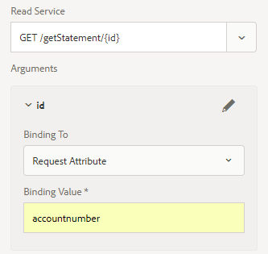

# 웹 채널 문서의 이메일 전달

웹 채널 인터랙티브 커뮤니케이션 문서를 정의하고 테스트했다면 웹 채널 문서를 수신자에게 전달하는 전달 메커니즘이 필요합니다.

이 문서에서는 이메일을 웹 채널 문서의 전달 메커니즘으로 살펴봅니다. 수신자는 이메일을 통해 웹 채널 문서에 대한 링크를 받게 됩니다.이 링크를 클릭하면 사용자에게 인증을 요청되고 웹 채널 문서는 로그인한 사용자와 관련된 데이터로 채워집니다.

다음 코드 조각을 살펴보겠습니다. 이 코드는 사용자가 웹 채널 문서를 보기 위해 이메일의 링크를 클릭할 때 트리거되는 GET.jsp의 일부입니다. Jackrabbit UserManager를 사용하여 로그인한 사용자가 표시됩니다. 로그인한 사용자가 표시되면 사용자의 프로필과 연결된 accountNumber 속성의 값을 받습니다.

그런 다음 accountNumber 값을 맵의 accountnumber라는 키와 연결합니다. 키 **계정 번호는** 양식 데이터 모달에서 요청 속성으로 정의됩니다. 이 속성의 값은 입력 매개 변수로 양식 데이터 양식 읽기 서비스 메서드에 전달됩니다.

7호선:Interactive Communication Document URL로 식별된 리소스 유형을 기반으로 수신한 요청을 다른 서블릿으로 보냅니다. 이 두 번째 서블릿에서 반환되는 응답은 첫 번째 서블릿의 응답에 포함됩니다.

```java
org.apache.jackrabbit.api.security.user.UserManager um = ((org.apache.jackrabbit.api.JackrabbitSession) session).getUserManager();
org.apache.jackrabbit.api.security.user.Authorizable loggedinUser = um.getAuthorizable(session.getUserID());
String accountNumber = loggedinUser.getProperty("profile/accountNumber")[0].getString();
map.put("accountnumber",accountNumber);
slingRequest.setAttribute("paramMap",map);
CustomParameterRequest wrapperRequest = new CustomParameterRequest(slingRequest,"GET");
wrapperRequest.getRequestDispatcher("/content/forms/af/401kstatement/irastatement/channels/web.html").include(wrapperRequest, response);
```


7행 코드의 시각적 표현



양식 데이터 모달의 읽기 서비스에 대해 정의된 요청 속성


[샘플 AEM 패키지](assets/webchanneldelivery.zip).
