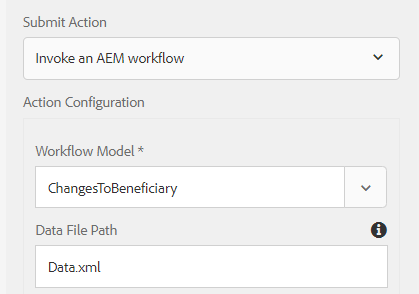

# 제출된 데이터를 사용하여 인쇄 채널 문서 생성

인쇄 채널 문서는 일반적으로 양식 데이터 모델의 get 서비스를 통해 백엔드 데이터 소스에서 데이터를 가져와 생성됩니다. 경우에 따라 제공된 데이터로 인쇄 채널 문서를 생성해야 합니다. 예를 들어, 고객이 수익자 양식의 변경 사항을 기입하고 제출된 양식의 데이터가 있는 인쇄 채널 문서를 생성할 수 있습니다. 이 사용 사례를 수행하려면 다음 단계를 수행해야 합니다

## 미리 채우기 서비스 만들기

서비스 이름 &quot;ccm-print-test&quot;가 이 서비스에 액세스하는 데 사용됩니다. 이 사전 채우기 서비스가 정의되면 서블릿 또는 워크플로우 프로세스 단계 구현에서 이 서비스에 액세스하여 인쇄 채널 문서를 생성할 수 있습니다.

```java
import java.io.InputStream;
import org.osgi.service.component.annotations.Component;

import com.adobe.forms.common.service.ContentType;
import com.adobe.forms.common.service.DataOptions;
import com.adobe.forms.common.service.DataProvider;
import com.adobe.forms.common.service.FormsException;
import com.adobe.forms.common.service.PrefillData;

@Component(immediate = true, service = {DataProvider.class})
public class ICPrefillService implements DataProvider {

@Override
public String getServiceDescription() {
    // TODO Auto-generated method stub
    return "Prefill Service for IC Print Channel";
}

@Override
public String getServiceName() {
    // TODO Auto-generated method stub
    return "ccm-print-test";
}

@Override
public PrefillData getPrefillData(DataOptions options) throws FormsException {
    // TODO Auto-generated method stub
        PrefillData data = null;
        if (options != null && options.getExtras() != null && options.getExtras().get("data") != null) {
            InputStream is = (InputStream) options.getExtras().get("data");
            data = new PrefillData(is, options.getContentType() != null ? options.getContentType() : ContentType.JSON);
        }
        return data;
    }
}
```

### WorkflowProcess 구현 만들기

workflowProcess 구현 코드 조각은 아래에 표시되어 있습니다. 이 코드는 AEM Workflow의 프로세스 단계가 이 구현과 연결되면 실행됩니다. 이 구현에서는 아래에 설명된 3개의 프로세스 인수가 필요합니다.

* 적응형 양식을 구성할 때 지정된 데이터 파일 경로의 이름입니다
* 인쇄 채널 템플릿의 이름입니다
* 생성된 인쇄 채널 문서의 이름

라인 98 - 적응형 양식은 양식 데이터 모델을 기반으로 하므로 afBoundData의 데이터 노드에 있는 데이터가 추출됩니다.
128행 - 데이터 옵션 서비스 이름이 설정되었습니다. 서비스 이름을 확인합니다. 이전 코드 목록의 45행에 반환되는 이름과 일치해야 합니다.
135행 - PrintChannel 객체의 렌더링 방법을 사용하여 문서가 생성됩니다


```java
String params = arg2.get("PROCESS_ARGS","string").toString();
    String payloadPath = workItem.getWorkflowData().getPayload().toString();
    String dataFile = params.split(",")[0];
    final String icFileName = params.split(",")[1];
    String dataFilePath = payloadPath + "/"+dataFile+"/jcr:content";
    Session session = workflowSession.adaptTo(Session.class);
    Node xmlDataNode = null;
    try {
        xmlDataNode = session.getNode(dataFilePath);
        InputStream xmlDataStream = xmlDataNode.getProperty("jcr:data").getBinary().getStream();
        JsonParser jsonParser = new JsonParser();
        BufferedReader streamReader = null;
        try {
            streamReader = new BufferedReader(new InputStreamReader(xmlDataStream, "UTF-8"));
        } catch (UnsupportedEncodingException e) {
            // TODO Auto-generated catch block
            e.printStackTrace();
        }
        StringBuilder responseStrBuilder = new StringBuilder();
        String inputStr;
        try {
            while ((inputStr = streamReader.readLine()) != null)
                responseStrBuilder.append(inputStr);
        } catch (IOException e) {
            // TODO Auto-generated catch block
            e.printStackTrace();
        }
        String submittedDataXml = responseStrBuilder.toString();
        JsonObject jsonObject = jsonParser.parse(submittedDataXml).getAsJsonObject().get("afData").getAsJsonObject()
                .get("afBoundData").getAsJsonObject().get("data").getAsJsonObject();
        logger.info("Successfully Parsed gson" + jsonObject.toString());
        InputStream targetStream = IOUtils.toInputStream(jsonObject.toString());
        //InputStream targetStream = new ByteArrayInputStream(jsonObject.toString().getBytes());
        
        // Node dataNode = session.getNode(formName);
        logger.info("Got resource using resource resolver"
                );
        resHelper.callWith(getResolver.getFormsServiceResolver(), new Callable<Void>() {
            @Override
            public Void call() throws Exception {
                System.out.println("The target stream is "+targetStream.available());
                // TODO Auto-generated method stub
                com.adobe.fd.ccm.channels.print.api.model.PrintChannel printChannel = null;
                String formName = params.split(",")[2];
                logger.info("The form name I got was "+formName);
                printChannel = printChannelService.getPrintChannel(formName);
                logger.info("Did i get print channel?");
                com.adobe.fd.ccm.channels.print.api.model.PrintChannelRenderOptions options = new com.adobe.fd.ccm.channels.print.api.model.PrintChannelRenderOptions();
                options.setMergeDataOnServer(true);
                options.setRenderInteractive(false);
                com.adobe.forms.common.service.DataOptions dataOptions = new com.adobe.forms.common.service.DataOptions();
                dataOptions.setServiceName(printChannel.getPrefillService());
                // dataOptions.setExtras(map);
                dataOptions.setContentType(ContentType.JSON);
                logger.info("####Set the content type####");
                dataOptions.setFormResource(getResolver.getFormsServiceResolver().getResource(formName));
                dataOptions.setServiceName("ccm-print-test");
                dataOptions.setExtras(new HashMap<String, Object>());
                dataOptions.getExtras().put("data", targetStream);
                options.setDataOptions(dataOptions);
                logger.info("####Set the data options");
                com.adobe.fd.ccm.channels.print.api.model.PrintDocument printDocument = printChannel
                .render(options);
                logger.info("####Generated the document");
                com.adobe.aemfd.docmanager.Document uploadedDocument = new com.adobe.aemfd.docmanager.Document(
                    printDocument.getInputStream());
                logger.info("Generated the document");
                Binary binary = session.getValueFactory().createBinary(printDocument.getInputStream());
                Session jcrSession = workflowSession.adaptTo(Session.class);
                String dataFilePath = workItem.getWorkflowData().getPayload().toString();
                
                Node dataFileNode = jcrSession.getNode(dataFilePath);
                Node icPdf = dataFileNode.addNode(icFileName, "nt:file");
                Node contentNode = icPdf.addNode("jcr:content", "nt:resource");
                contentNode.setProperty("jcr:data", binary);
                jcrSession.save();
                logger.info("Copied the generated document");
                uploadedDocument.close();
                
                return null;
            }
```

서버에서 테스트하려면 다음 단계를 수행하십시오.

* [Day CQ Mail Service를 구성합니다.](https://helpx.adobe.com/experience-manager/6-5/communities/using/email.html) 첨부 파일로 생성된 문서가 포함된 이메일을 전송하는 데 필요합니다.
* [서비스 사용자 번들로 개발 배포](/help/forms/assets/common-osgi-bundles/DevelopingWithServiceUser.jar)
* Apache Sling Service User Mapper Service 구성에 다음 항목을 추가했는지 확인합니다
* **DevelopingWithServiceUser.core:getformsresourceresolver=fd-service**
* [이 문서와 관련된 자산을 파일 시스템에서 다운로드 및 압축 해제합니다](assets/prefillservice.zip)
* [AEM 패키지 관리자를 사용하여 다음 패키지를 가져옵니다](http://localhost:4502/crx/packmgr/index.jsp)
   1. beneficiaryconfirmationic.zip
   2. changeofbeneficiaryform.zip
   3. generatebeneficiaryworkflow.zip
* [AEM Felix Web Console을 사용하여 다음 내용을 배포합니다](http://localhost:4502/system/console/bundles)

   * GenerateIC.GenerateIC.core-1.0-SNAPSHOT.jar 이 번들에는 이 문서에 언급된 코드가 포함되어 있습니다.

* [Open ChangeOfRecipientForm](http://localhost:4502/content/dam/formsanddocuments/changebeneficiary/jcr:content?wcmmode=disabled)
* 아래 표시된 대로 적응형 양식이 AEM Workflow에 제출되도록 구성되어 있는지 확인합니다
   
* [워크플로우 모델을 구성합니다.](http://localhost:4502/editor.html/conf/global/settings/workflow/models/ChangesToBeneficiary.html)프로세스 단계 및 이메일 구성 요소 전송 프로세스가 환경에 따라 구성되어 있는지 확인합니다
* [ChangeOfRecipientForm을 미리 봅니다.](http://localhost:4502/content/dam/formsanddocuments/changebeneficiary/jcr:content?wcmmode=disabled) 자세한 내용을 입력하고 제출하십시오
* 워크플로우가 호출되고 IC 인쇄 채널 문서가 전자 메일 전송 구성 요소에 첨부 파일로 지정된 수신자에게 전송되어야 합니다
