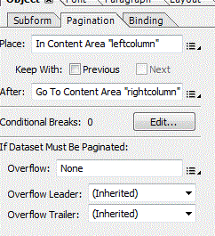

# 인쇄 채널 문서의 2열 레이아웃

이 짧은 문서에서는 인쇄 채널에서 2열 레이아웃을 만드는 데 필요한 단계를 강조 표시합니다. 사용 사례는 페이지 1이 2열 레이아웃이고 페이지 2가 표준 1열 레이아웃인 2개 페이지 문서를 생성하는 것입니다.

다음은 AEM Forms Designer을 사용하여 2개 열 레이아웃을 만드는 것과 관련된 높은 수준의 단계입니다.

* 페이지 1 마스터 페이지에서 2개의 콘텐츠 영역 만들기
* 두 컨텐츠 영역의 이름을 &quot;leftcolumn&quot; 및 &quot;rightcolumn&quot;으로 지정합니다.
* 하나의 콘텐츠 영역으로 두 번째 마스터 페이지 만들기(기본값)
* 페이지 매김 탭(제목 없는 하위 양식)(1페이지)과 (제목 없는 하위 양식)(2페이지)을 선택하고 아래 스크린샷과 같이 속성을 설정합니다.

페이지 매김 속성이 설정되면 (제목 없는 하위 양식) (1페이지)에서 하위 양식 또는 대상 영역을 추가할 수 있습니다.

그런 다음 이러한 하위 양식 또는 대상 영역에 문서 조각을 추가할 수 있습니다. 왼쪽 열이 가득 차면 콘텐츠가 오른쪽 열로 흐릅니다.

로컬 서버에서 이를 테스트하려면 이 문서와 관련된 에셋을 다운로드하십시오. 이 페이지 아래쪽으로 스크롤

* [패키지 관리자를 사용하여 샘플 인쇄 채널 문서 다운로드 및 설치](assets/print-channel-with-two-column-layout.zip)
* [인쇄 채널 문서 미리 보기](http://localhost:4502/content/dam/formsanddocuments/2columnlayout/jcr:content?channel=print&amp;mode=preview&amp;dataRef=service%3A%2F%2FFnDTestData&amp;wcmmode=disabled)
