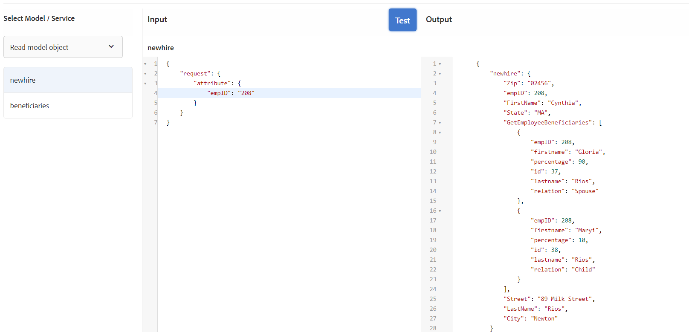

# 양식 데이터 모델 구성

## Apache Sling 연결 풀링된 DataSource

RDBMS 백업 양식 데이터 모델을 만드는 첫 번째 단계는 Apache Sling Connection Booled DataSource를 구성하는 것입니다. 데이터 소스를 구성하려면 아래 단계를 따르십시오.

* 브라우저를 [configMgr](http://localhost:4502/system/console/configMgr)로 가리킵니다.
* **Apache Sling 연결 풀링된 DataSource 검색**
* 새 항목을 추가하고 스크린샷에 표시된 대로 값을 제공합니다.
* 
* 변경 내용 저장

>[!NOTE]
>JDBC 연결 URI, 사용자 이름 및 암호는 MySQL 데이터베이스 구성에 따라 변경됩니다.

## 양식 데이터 모델 만들기

* 브라우저를 [데이터 통합](http://localhost:4502/aem/forms.html/content/dam/formsanddocuments-fdm)으로 지정합니다.
* _만들기_->_양식 데이터 모델_&#x200B;을 클릭합니다.
* 양식 데이터 모델에 의미 있는 이름 및 제목을 제공합니다(예: **Employee**).
* _다음_&#x200B;을 클릭합니다
* 이전 섹션(포럼)에서 만든 데이터 소스 선택
* _만들기_->편집을 클릭하여 새로 만든 양식 데이터 모델을 편집 모드로 엽니다.
* 직원 스키마를 보려면 _forums_ 노드를 확장합니다. 직원 노드를 확장하여 2개의 테이블 보기

## 모델에 개체 추가

* employee 노드가 확장되었는지 확인합니다.
* 전체 및 수혜자 개체를 선택하고 _선택한 항목 추가_&#x200B;를 클릭합니다.

## 새 엔터티에 읽기 서비스 추가

* 전체 엔티티 선택
* _속성 편집_&#x200B;을 클릭합니다.
* 읽기 서비스 드롭다운 목록에서 가져오기를 선택합니다.
* + 아이콘을 클릭하여 가져오기 서비스에 매개 변수를 추가합니다.
* 스크린샷에 표시된 대로 값을 지정합니다.
* 
>[!NOTE]
> get 서비스에서는 전체 엔티티의 empID 열에 매핑되는 값을 예상합니다.이 값을 전달하는 여러 가지 방법이 있으며 이 자습서에서는 empID가 empID라는 요청 매개 변수를 통해 전달됩니다.
* _완료_&#x200B;를 클릭하여 가져오기 서비스에 대한 인수를 저장합니다.
* 양식 데이터 모델에 대한 변경 내용을 저장하려면 _완료_&#x200B;를 클릭합니다.

## 2엔티티 간 연결 추가

데이터베이스 엔티티 간에 정의된 연결은 양식 데이터 모델에서 자동으로 만들어지지 않습니다. 양식 데이터 모델 편집기를 사용하여 엔티티 간 연결을 정의해야 합니다. 모든 전체 실체는 하나 이상의 수혜자를 가질 수 있으며, 우리는 총회와 수혜자 실체 사이에 일대다 조합을 정의해야 합니다.
다음 단계는 일대다 연결을 만드는 프로세스를 안내합니다.

* 전체 엔티티를 선택하고 _연결 추가_&#x200B;를 클릭합니다.
* 아래 스크린샷에 나와 있는 연관성 및 기타 속성에 의미 있는 제목과 식별자를 제공합니다.
   

* 인수 섹션 아래의 _편집_ 아이콘을 클릭합니다.

* 이 스크린샷에 표시된 대로 값을 지정합니다.
* 
* **수혜자와 전체 엔티티의 empID 열을 사용하여 두 엔티티를 연결합니다.**
* _완료_&#x200B;를 클릭하여 변경 내용을 저장합니다.

## 양식 데이터 모델 테스트

양식 데이터 모델에는 이제 empID를 수락하고 newhire 및 그 수익자의 세부 정보를 반환하는 **_get_** 서비스가 있습니다. get 서비스를 테스트하려면 아래 단계를 따르십시오.

* 전체 엔티티 선택
* _테스트 모델 개체_&#x200B;를 클릭합니다.
* 유효한 empID를 제공하고 _테스트_&#x200B;를 클릭합니다.
* 아래 스크린샷에 표시된 대로 결과를 얻으십시오
* 
