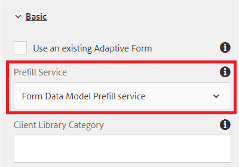

# 적응형 양식 만들기

지금까지 다음을 만들었습니다

* 2개의 테이블이 있는 데이터베이스 - `newhire` 및 `beneficiaries`
* 구성된 Apache Sling 연결의 풀링된 데이터 소스
* RDBMS 기반 양식 데이터 모델

다음 단계는 양식 데이터 모델을 사용하도록 적응형 양식을 만들고 구성하는 것입니다.  먼저 시작할 수 있습니다. [다운로드 및 가져오기](assets/fdm-demo-af.zip) 샘플 양식입니다. 샘플 양식에는 직원 세부 정보를 표시하는 섹션과 직원의 수혜자를 나열하는 섹션이 있습니다.

## 양식 데이터 모델과 양식 연결

이 강의와 함께 제공되는 샘플 양식은 양식 데이터 모델과 연결되어 있지 않습니다. 양식 데이터 모델을 사용하도록 양식을 구성하려면 다음 작업을 수행해야 합니다.

* FDMDemo 양식 선택
* 클릭 _속성_->_양식 모델_
* 드롭다운 목록에서 양식 데이터 모델 선택
* 이전 단원에서 만든 양식 데이터 모델을 검색하여 선택합니다.
* 클릭 _저장 및 닫기_

## 미리 채우기 서비스 구성

첫 번째 단계는 양식에 대한 미리 채우기 서비스를 연결하는 것입니다. 미리 채우기 서비스를 연결하려면 아래에 언급된 단계를 따르십시오

* 다음 항목 선택 `FDMDemo` 양식
* 클릭 _편집_ 편집 모드에서 양식을 열려면
* 콘텐츠 계층에서 양식 컨테이너 를 선택하고 렌치 아이콘을 클릭하여 속성 시트를 엽니다
* 선택 _양식 데이터 모델 미리 채우기 서비스_ 미리 채우기 서비스 드롭다운 목록
* 파란색 ☑ 을 클릭하여 변경 내용을 저장합니다.

* 

## 직원 세부 정보 구성

다음 단계는 적응형 양식의 텍스트 필드를 양식 데이터 모델 요소에 바인딩하는 것입니다. 다음 필드의 속성 시트를 열고 아래와 같이 bindRef를 설정해야 합니다

| 필드 이름 | 바인드 참조 |
|------------|--------------------|
| 이름 | /newhire/FirstName |
| 성 | /newhire/lastName |

>[!NOTE]
>
>언제든지 텍스트 필드를 추가하여 적절한 양식 데이터 모델 요소에 바인딩할 수 있습니다

## 수혜자 테이블 구성

다음 단계는 사원의 수익자를 표 형식으로 표시하는 것입니다. 제공된 샘플 양식에는 4개의 열과 단일 행이 있는 테이블이 있습니다. 수혜자 수에 따라 성장하도록 표를 구성해야 한다.

* 편집 모드로 양식을 엽니다.
* 루트 패널->수혜자->테이블 확장
* Row1을 선택하고 렌치 아이콘을 클릭하여 등록 정보 시트를 엽니다.
* 바인드 참조 설정 **/newhire/GetEmployeeBenefits**
* 반복 설정 - 최소 개수를 1로 설정하고 최대 개수를 5로 설정합니다.
* Row1 구성은 아래 스크린샷과 같아야 합니다.
  
* 파란색 아이콘을 ☑ 변경 사항을 저장합니다.

## 행 셀 바인딩

마지막으로 행 셀을 양식 데이터 모델 요소에 바인딩해야 합니다.

* 루트 패널 확장->수혜자->테이블->행1
* 아래 표에 따라 각 행 셀의 바인드 참조 설정

| 행 셀 | 바인드 참조 |
|------------|----------------------------------------------|
| 이름 | /newhire/GetEmployeeBenefits/firstname |
| 성 | /newhire/GetEmployeeBenefits/lastname |
| 관계 | /newhire/GetEmployeeBenefits/관계 |
| 백분율 | /newhire/GetEmployeeBenefits/percentage |

* 파란색 아이콘을 ☑ 변경 사항을 저장합니다.

## 양식 테스트

이제 url에서 적절한 empID가 있는 양식을 열어야 합니다. 다음 2개의 링크는 데이터베이스의 정보로 양식을 채웁니다.
[empID=207인 양식](http://localhost:4502/content/dam/formsanddocuments/fdmdemo/jcr:content?wcmmode=disabled&amp;empID=207)
[empID=208인 양식](http://localhost:4502/content/dam/formsanddocuments/fdmdemo/jcr:content?wcmmode=disabled&amp;empID=208)

## 문제 해결

내 양식이 비어 있고 데이터가 없습니다.

* 양식 데이터 모델이 올바른 결과를 반환하는지 확인하십시오.
* 양식이 올바른 양식 데이터 모델과 연결되어 있습니다.
* 필드 바인딩 확인
* stdout 로그 파일을 확인합니다. 파일에 쓰여지는 empID가 표시됩니다.이 값이 표시되지 않으면 양식에서 제공된 사용자 지정 템플릿을 사용하지 않을 수 있습니다.

테이블이 채워지지 않음

* Row1 바인딩 확인
* 행 1에 대한 반복 설정이 올바르게 설정되어 있는지 확인합니다(최소 =1 및 최대 = 5 이상).
