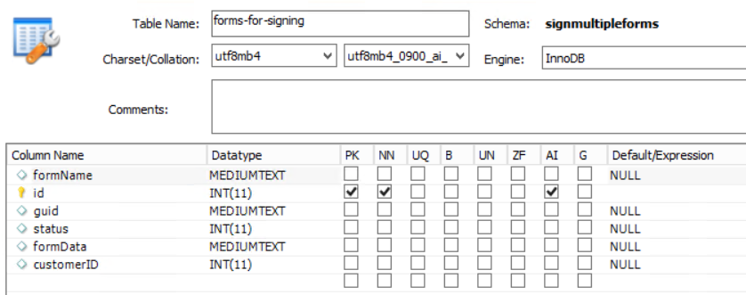

# 데이터 소스 구성

AEM에서 외부 데이터베이스와 통합할 수 있는 방법은 여러 가지가 있습니다. 데이터베이스를 통합하는 가장 일반적인 방법 중 하나는 Apache Sling 연결의 풀링된 데이터 소스 구성 속성을 사용하여 [configMgr](http://localhost:4502/system/console/configMgr).
첫 번째 단계는 적절한 를 다운로드하여 배포하는 것입니다 [MySql 드라이버](https://mvnrepository.com/artifact/mysql/mysql-connector-java) AEM.
Apache Sling 연결의 풀링된 데이터 소스를 만들고 아래 스크린샷에 지정된 속성을 제공합니다. 데이터베이스 스키마는 이 자습서 자산의 일부로 제공됩니다.

데이터베이스에는 아래 스크린샷에 표시된 대로 3개의 열이 있는 formdata 라는 하나의 테이블이 있습니다.

>[!NOTE]
>데이터 소스의 이름을 지정하십시오. **기형문합법**. 샘플 코드는 이름을 사용하여 데이터베이스에 연결합니다.

| 속성 이름 | 값 |
| ------------------------|--------------------------------------- |
| 데이터 소스 이름 | `SaveAndContinue` |
| JDBC 드라이버 클래스 | `com.mysql.cj.jdbc.Driver` |
| JDBC 연결 URI | `jdbc:mysql://localhost:3306/aemformstutorial` |

## 자산

스키마를 생성할 SQL 파일은 다음과 같습니다. [여기에서 다운로드됨](assets/sign-multiple-forms.sql). 스키마와 테이블을 만들려면 MySql Workbench를 사용하여 이 파일을 가져와야 합니다.

## 다음 단계

[데이터베이스에 데이터를 저장하고 가져올 OSGi 서비스 만들기](./create-osgi-service.md)
