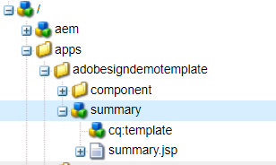

# 요약 단계 사용자 정의

요약 단계 구성 요소는 서명된 양식을 다운로드하기 위한 링크와 함께 양식 제출의 요약을 표시하는 데 사용됩니다. 요약 단계는 일반적으로 양식의 마지막 패널에 배치됩니다.
이 사용 사례에서는 즉시 사용 가능한 요약 구성 요소를 기반으로 새 구성 요소를 만들고 사용자 지정 clientlib을 포함하도록 기능을 확장했습니다.

이 구성 요소는 Sign Multiple Form 레이블로 식별됩니다.

다음 스크린샷은 서명 의식 완료 시 메시지를 표시하기 위해 만든 새 구성 요소를 보여 줍니다



새 구성 요소는 기본 제공 요약 구성 요소를 기반으로 합니다.


서명을 위해 다음 양식으로 이동하는 버튼을 추가했습니다


summary.jsp에는 다음 코드가 있습니다. 카테고리 ID로 식별되는 클라이언트 라이브러리에 대한 참조가 있습니다. **getnextform**

```java
<%--
  Guide Summary Component
--%>
<%@include file="/libs/fd/af/components/guidesglobal.jsp"%>
<%@include file="/libs/fd/afaddon/components/summary/summary.jsp"%>
<ui:includeClientLib categories="getnextform"/>
```

## 자산

사용자 지정 요약 구성 요소는 다음과 같을 수 있습니다. [여기에서 다운로드됨](assets/custom-summary-step.zip)

## 다음 단계

[서명할 다음 양식 받기](./create-client-lib.md)