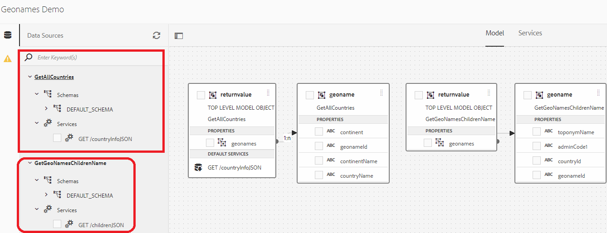
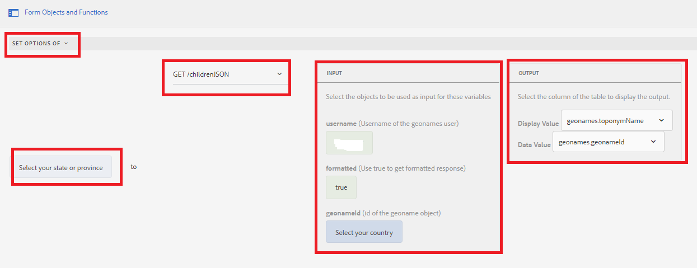

# 연속 드롭다운 목록

연속 드롭다운 목록은 하나의 DropDownList 컨트롤이 부모 또는 이전 DropDownList 컨트롤에 따라 달라지는 일련의 종속 DropDownList 컨트롤입니다. DropDownList 컨트롤의 항목은 다른 DropDownList 컨트롤에서 사용자가 선택한 항목을 기반으로 채워집니다.

## 사용 사례 데모

>[!VIDEO](https://video.tv.adobe.com/v/340344?quality=12&learn=on)

이 자습서에서는 이 기능을 보여주기 위해 [Geonames REST API](https://www.geonames.org/export/web-services.html)를 사용했습니다.
이러한 종류의 서비스를 제공하는 다양한 조직이 있으며 REST API를 잘 문서화한다면 데이터 통합 기능을 사용하여 AEM Forms과 쉽게 통합할 수 있습니다

다음 단계에 따라 AEM Forms에서 연속 드롭다운 목록을 구현했습니다

## 개발자 계정 만들기

[Geonames](https://www.geonames.org/login)(으)로 개발자 계정을 만드십시오. 사용자 이름을 기록해 둡니다. 이 사용자 이름은 geonames.org의 REST API를 호출하는 데 필요합니다.

## Swagger/OpenAPI 파일 만들기

OpenAPI 사양(이전 Swagger 사양)은 REST API에 대한 API 설명 포맷입니다. OpenAPI 파일을 사용하면 다음을 포함하여 전체 API를 설명할 수 있습니다.

* 사용 가능한 엔드포인트(/users) 및 각 엔드포인트의 작업(GET /users, POST /users)
* 각 작업에 대한 작업 매개 변수 입력 및 출력
인증 방법
* 연락처 정보, 라이선스, 사용 약관 및 기타 정보.
* API 사양은 YAML 또는 JSON으로 작성할 수 있습니다. 그 형식은 쉽게 배울 수 있고 인간과 기계 모두가 읽을 수 있다.

첫 번째 Swagger/OpenAPI 파일을 만들려면 [OpenAPI 설명서](https://swagger.io/docs/specification/2-0/basic-structure/)를 따르십시오.

>[!NOTE]
> AEM Forms은 OpenAPI Specification 버전 2.0(FKA Swagger)을 지원합니다.

[swagger 편집기](https://editor.swagger.io/)를 사용하여 Swagger 파일을 만들어 국가 또는 상태의 모든 국가 및 하위 요소를 가져오는 작업을 설명합니다. Swagger 파일은 JSON 또는 YAML 형식으로 만들 수 있습니다.

## 데이터 소스 만들기

AEM/AEM Forms을 타사 애플리케이션과 통합하려면 클라우드 서비스 구성에서 [데이터 소스를 만들기](https://experienceleague.adobe.com/docs/experience-manager-learn/forms/ic-web-channel-tutorial/parttwo.html)해야 합니다. [Swagger 파일](assets/geonames-swagger-files.zip)을 사용하여 데이터 원본을 만드십시오.
2개의 데이터 소스(하나는 모든 국가를 가져오고 다른 하나는 하위 요소를 가져오기 위해)를 만들어야 합니다

## 양식 데이터 모델 만들기

AEM Forms 데이터 통합은 [양식 데이터 모델](https://experienceleague.adobe.com/docs/experience-manager-65/forms/form-data-model/create-form-data-models.html)을(를) 만들고 작업할 수 있는 직관적인 사용자 인터페이스를 제공합니다. 이전 단계에서 만든 데이터 소스를 기반으로 양식 데이터 모델을 만듭니다. 2개의 데이터 소스를 포함하는 양식 데이터 모델

## 적응형 양식 만들기

양식 데이터 모델의 GET 호출을 적응형 양식과 통합하여 드롭다운 목록을 채웁니다.
2개의 드롭다운 목록이 있는 적응형 양식을 만듭니다. 하나는 국가를 나열하는 것이고, 하나는 선택한 국가에 따라 시/도를 나열하는 것이다.

### 국가 채우기 드롭다운 목록

국가 목록은 양식이 처음 초기화될 때 채워집니다. 다음 스크린샷은 국가 드롭다운 목록의 옵션을 채우도록 구성된 규칙 편집기를 보여 줍니다. 이 작업을 수행하려면 사용자 이름에 geonames 계정을 제공해야 합니다.

#### 시/도 드롭다운 목록 채우기

선택한 국가를 기반으로 시/도 드롭다운 목록을 채워야 합니다. 다음 스크린샷은 규칙 편집기 구성을 보여 줍니다

### 연습

선택한 국가 및 시/도를 기반으로 군과 시를 나열하는 양식에 군 및 시라는 2개의 드롭다운 목록을 추가합니다.

### 샘플 Assets

다음 에셋을 다운로드하여 연속 드롭다운 목록 샘플 생성을 시작할 수 있습니다.
완료된 Swagger 파일은 [여기](assets/geonames-swagger-files.zip)에서 다운로드할 수 있습니다.
Swagger 파일은 다음 REST API를 설명합니다
* [모든 국가 가져오기](https://secure.geonames.org/countryInfoJSON?username=yourusername)
* [Geoname 개체의 하위 항목 가져오기](https://secure.geonames.org/children?formatted=true&amp;geonameId=6252001&amp;username=yourusername)

완료된 [양식 데이터 모델은 여기에서 다운로드할 수 있습니다](assets/geonames-api-form-data-model.zip)
