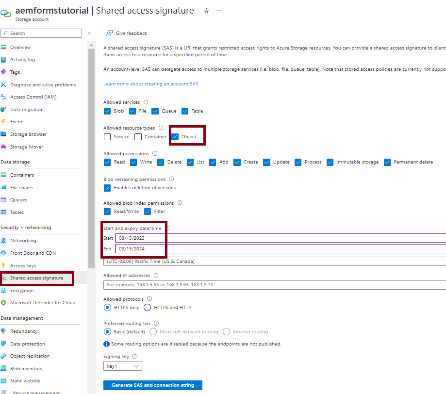
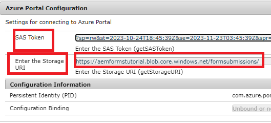

# Azure Storage에 양식 제출 저장

이 문서에서는 제출된 AEM Forms 데이터를 Azure Storage에 저장하기 위해 REST를 호출하는 방법을 보여 줍니다.
제출된 양식 데이터를 Azure Storage에 저장하려면 다음 단계를 수행해야 합니다.

>[!NOTE]
>이 문서의 코드는 적응형 양식을 기반으로 하는 핵심 구성 요소에서는 작동하지 않습니다. [핵심 구성 요소 기반 적응형 양식에 대한 동등한 문서는 여기에서 제공됩니다](https://experienceleague.adobe.com/docs/experience-manager-learn/forms/prefill-form-with-data-attachments/introduction.html?lang=en)


## Azure 스토리지 계정 만들기

[Azure 포털 계정에 로그인하고 저장소 계정을 만듭니다.](https://learn.microsoft.com/en-us/azure/storage/common/storage-account-create?tabs=azure-portal#create-a-storage-account-1). 저장소 계정에 의미 있는 이름을 입력하고 검토 를 클릭한 다음 만들기 를 클릭합니다. 이렇게 하면 모든 기본값으로 저장소 계정이 만들어집니다. 이 문서에서는 당사의 스토리지 계정을 명시했습니다 `aemformstutorial`.


## 컨테이너 만들기

다음으로 양식 제출의 데이터를 저장할 컨테이너를 만들어야 합니다.
저장소 계정 페이지에서 왼쪽의 컨테이너 메뉴 항목을 클릭하고 라는 컨테이너를 만듭니다. `formssubmissions`. 공개 액세스 수준이 비공개로 설정되어 있는지 확인하십시오.


## 컨테이너에 SAS 만들기

Azure 스토리지 컨테이너와 상호 작용할 수 있는 인증 방법인 공유 액세스 서명 또는 SAS 방법을 사용합니다.
스토리지 계정의 컨테이너로 이동하여 스크린샷과 같이 줄임표를 클릭하고 SAS 생성 옵션을 선택합니다.

아래 스크린샷에 표시된 대로 적절한 권한과 적절한 종료 날짜를 지정하고 SAS 토큰 및 URL 생성 을 클릭하십시오. Blob SAS 토큰 및 Blob SAS URL을 복사합니다. 다음 두 값을 사용하여 HTTP 호출을 수행합니다



## Blob SAS 토큰 및 저장소 URI를 제공합니다.

코드를 보다 일반화하기 위해 아래 표시된 대로 OSGi 구성을 사용하여 두 속성을 구성할 수 있습니다. 다음 _**기형문합법**_ 은 스토리지 계정의 이름입니다. _**formsubmissions**_ 는 데이터가 저장되는 컨테이너입니다.
스토리지 URI 끝에 /가 있고 SAS 토큰이 다음으로 시작하는지 확인하십시오.



## PUT 요청 만들기

다음 단계는 제출된 양식 데이터를 Azure Storage에 저장하기 위한 PUT 요청을 만드는 것입니다. 모든 양식 제출은 고유한 BLOB ID로 식별해야 합니다. 고유 BLOB ID는 일반적으로 코드에서 만들어져 PUT 요청의 URL에 삽입됩니다.
다음은 PUT 요청의 부분 URL입니다. 다음 `aemformstutorial` 는 저장소 계정의 이름이고, formsubmissions는 고유한 BLOB ID로 데이터가 저장되는 컨테이너입니다. URL의 나머지 부분은 그대로 유지됩니다.
https://aemformstutorial.blob.core.windows.net/formsubmissions/blobid/sastoken 다음은 PUT 요청을 사용하여 제출된 양식 데이터를 Azure Storage에 저장하도록 작성된 함수입니다. URL에서 컨테이너 이름과 UUID를 사용합니다. 아래 나열된 샘플 코드를 사용하여 OSGi 서비스 또는 sling 서블릿을 만들고 양식 제출물을 Azure Storage에 저장할 수 있습니다.

```java
 public String saveFormDatainAzure(String formData) {
    log.debug("in SaveFormData!!!!!" + formData);
    String sasToken = azurePortalConfigurationService.getSASToken();
    String storageURI = azurePortalConfigurationService.getStorageURI();
    log.debug("The SAS Token is " + sasToken);
    log.debug("The Storage URL is " + storageURI);
    org.apache.http.impl.client.CloseableHttpClient httpClient = HttpClientBuilder.create().build();
    UUID uuid = UUID.randomUUID();
    String putRequestURL = storageURI + uuid.toString();
    putRequestURL = putRequestURL + sasToken;
    HttpPut httpPut = new HttpPut(putRequestURL);
    httpPut.addHeader("x-ms-blob-type", "BlockBlob");
    httpPut.addHeader("Content-Type", "text/plain");

    try {
        httpPut.setEntity(new StringEntity(formData));

        CloseableHttpResponse response = httpClient.execute(httpPut);
        log.debug("Response code " + response.getStatusLine().getStatusCode());
        if (response.getStatusLine().getStatusCode() == 201) {
            return uuid.toString();
        }
    } catch (IOException e) {
        log.error("Error: " + e.getMessage());
        throw new RuntimeException(e);
    }
    return null;

}
```

## 컨테이너에 저장된 데이터 확인


## 솔루션 테스트

* [사용자 지정 OSGi 번들 배포](./assets/SaveAndFetchFromAzure.core-1.0.0-SNAPSHOT.jar)

* [사용자 지정 적응형 양식 템플릿 및 템플릿과 연결된 페이지 구성 요소 가져오기](./assets/store-and-fetch-from-azure.zip)

* [샘플 적응형 양식 가져오기](./assets/bank-account-sample-form.zip)

* [OSGi 구성 콘솔을 사용하여 Azure 포털 구성에서 적절한 값을 지정합니다](https://experienceleague.adobe.com/docs/experience-manager-learn/forms/some-useful-integrations/store-form-data-in-azure-storage.html?lang=en#provide-the-blob-sas-token-and-storage-uri)

* [BankAccount 양식 미리 보기 및 제출](http://localhost:4502/content/dam/formsanddocuments/azureportalstorage/bankaccount/jcr:content?wcmmode=disabled)

* 선택한 Azure 스토리지 컨테이너에 데이터가 저장되었는지 확인합니다. Blob ID를 복사합니다.
* [BankAccount 양식 미리 보기](http://localhost:4502/content/dam/formsanddocuments/azureportalstorage/bankaccount/jcr:content?wcmmode=disabled&amp;guid=dba8ac0b-8be6-41f2-9929-54f627a649f6) 및 Azure 스토리지의 데이터로 미리 채워질 양식의 URL에서 Blob ID를 guid 매개 변수로 지정합니다

