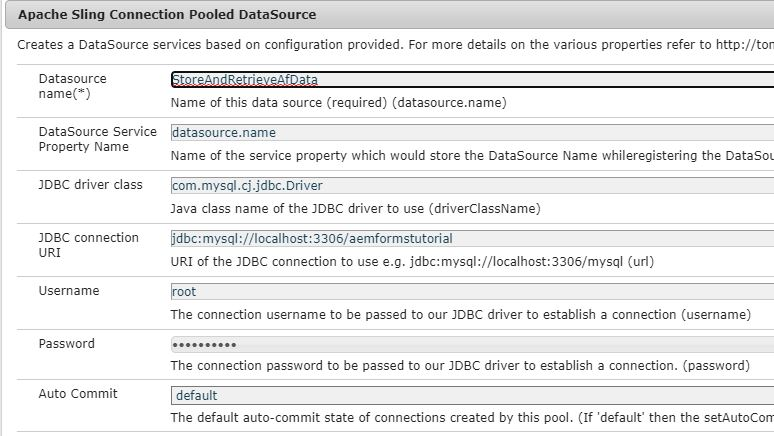

# 데이터 소스 구성

AEM에서 외부 데이터베이스와 통합할 수 있는 방법은 여러 가지가 있습니다. 데이터베이스 통합의 가장 일반적인 표준 방법 중 하나는 configMgr을 통해 Apache Sling Connection Pooled DataSource 구성 속성을 사용하는 [것입니다](http://localhost:4502/system/console/configMgr).
첫 번째 단계는 해당 [MySQL 드라이버를](https://mvnrepository.com/artifact/mysql/mysql-connector-java) 다운로드하고 AEM에 배포하는 것입니다.
그런 다음 데이터베이스에 대한 Sling Connection 풀링된 DataSource 속성을 설정합니다. 다음 스크린샷은 이 자습서에 사용된 설정을 보여줍니다. 이 자습서 자산의 일부로 데이터베이스 스키마가 사용자에게 제공됩니다.

* JDBC 드라이버 클래스: `com.mysql.cj.jdbc.Driver`
* JDBC 연결 URI: `jdbc:mysql://localhost:3306/aemformstutorial`

>[!NOTE]
>OSGi 서비스에서 사용되는 이름이므로 데이터 소스 이름 `StoreAndRetrieveAfData` 을 지정하십시오.

## 데이터베이스 만들기

다음 데이터베이스가 이 사용 사례에 사용되었습니다. 데이터베이스에는 아래 스크린샷에 표시된 것처럼 4개의 열이 있는 하나의 테이블이 있습니다 `formdatawithattachments` .

* 열 **뒤의 데이터에는** 적응형 양식 데이터가 포함됩니다.
* 열 첨부 **정보에는** 양식 첨부 파일에 대한 정보가 포함됩니다.
* column **telephoneNumber** 는 양식을 채우는 사람의 모바일 번호를 포함합니다.

MySQL 워크벤치를 [사용하여](assets/data-base-schema.sql)데이터베이스 스키마를 가져와 데이터베이스를 생성하십시오.

## 양식 데이터 모델 작성

양식 데이터 모델을 만들고 이전 단계에서 만든 데이터 소스를 기반으로 합니다.
아래 스크린샷에 표시된 대로 이 양식 데이터 모델의 **get** 서비스를 구성합니다.
get 서비스에서 배열을 반환하지 **않도록** 확인하십시오.

이 **get** 서비스는 응용 프로그램 ID와 연결된 전화 번호를 가져오는 데 사용됩니다.

그런 다음 이 양식 데이터 모델을 **MyAccountForm에서** 사용하여 응용 프로그램 ID와 연결된 전화 번호를 가져옵니다.
