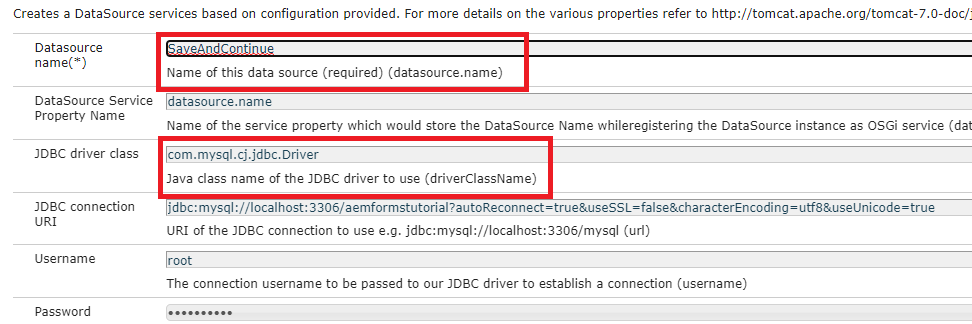

# 서버에 샘플 에셋 배포

AEM 서버에서 이 기능을 사용하려면 아래 지침을 따르십시오

* [데이터베이스 스키마 만들기](assets/icdrafts.sql)
* [클라이언트 라이브러리 가져오기](assets/icdrafts.zip)
* [적응형 양식 가져오기](assets/SavedDraftsAdaptiveForm.zip)
* 데이터 소스 생성 호출됨 _저장 및 계속_

| 속성 이름 | 속성 값 |
|---|---|
| 데이터 소스 이름 | 저장 및 계속 |
| JDBC 드라이버 클래스 | com.mysql.cj.jdbc.Driver |
| JDBC 연결 URL | jdbc:mysql://localhost:3306/aemformstutorial?autoReconnect=true&amp;useSSL=false&amp;characterEncoding=utf8&amp;useUnicode=true |

* [icdraft 번들 배포](assets/icdrafts.icdrafts.core-1.0-SNAPSHOT.jar)
* 다음을 확인하십시오. _CCRDocumentInstanceService를 사용하여 저장 활성화_ 아래 표시된 대로 OSGI 구성에서
   
* 대화형 통신을 엽니다. 초안으로 저장을 클릭하여 저장합니다
* [저장된 초안 보기](http://localhost:4502/content/dam/formsanddocuments/saveddrafts/jcr:content?wcmmode=disabled)

>[!NOTE]
>xml 파일은 AEM 서버 설치의 루트 폴더에 저장됩니다. Eclipse 프로젝트 >는 요구 사항에 따라 솔루션을 사용자 정의할 수 있도록 제공됩니다.

샘플 구현이 있는 eclipse 프로젝트는 다음과 같을 수 있습니다. [여기에서 다운로드됨](assets/icdrafts-eclipse-project.zip)
