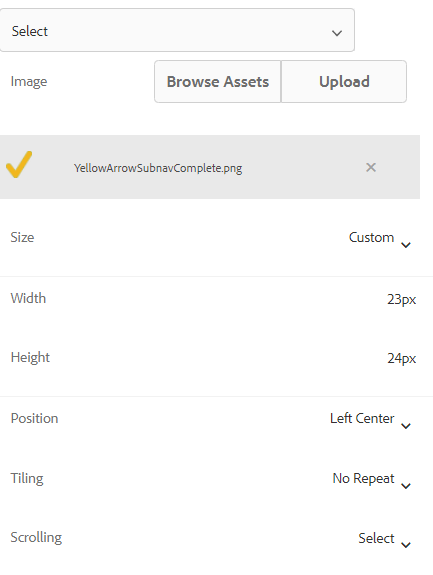

# 활성화된/완료된 탭을 표시하는 아이콘 추가

적응형 양식에 왼쪽 탭 탐색이 있는 경우 탭 상태를 나타내는 아이콘을 표시할 수 있습니다. 예를 들어 아래 스크린샷과 같이 활성 탭을 나타내는 아이콘과 완료된 탭을 나타내는 아이콘을 표시하려는 경우

## 적응형 양식 만들기

기본 템플릿과 캔버스 3.0 테마를 기반으로 하는 간단한 적응형 양식을 사용하여 샘플 양식을 만들었습니다.
다음 [이 문서에 사용된 아이콘](assets/icons.zip) 여기에서 다운로드할 수 있습니다.

## 기본 상태 스타일 지정

편집 모드에서 양식을 엽니다. 스타일 레이어에 있는지 확인하고 탭(예: 일반 탭)을 선택합니다.
아래 스크린샷에 표시된 대로 탭의 스타일 편집기를 열면 기본 상태가 됩니다

아래 표시된 대로 기본 상태에 대한 CSS 속성을 설정합니다 | 범주 | 속성 이름 | 속성 값 | |:—|:—|:—| | Dimension 및 위치 | 너비 | 50px | | 텍스트 | 글꼴 두께| 굵게 | | 텍스트 | 색상 | #FFF | |텍스트 | 라인 높이| 3 | |텍스트 | 텍스트 정렬 | 왼쪽 | |배경| 색상 | #056dae |

변경 사항 저장

## 활성 상태 스타일 지정

활성 상태인지 확인하고 다음 CSS 속성을 스타일링하십시오

| 범주 | 속성 이름 | 속성 값 |
|:---|:---|:---|
| Dimension 및 위치 | 폭 | 50픽셀 |
| 텍스트 | 글꼴 두께 | 볼드체 |
| 텍스트 | 컬러 | #FFF |
| 텍스트 | 선 높이 | 3 |
| 텍스트 | 텍스트 맞춤 | 왼쪽 |
| 배경 | 컬러 | #056dae |

아래 스크린샷에 표시된 대로 배경 이미지의 스타일을 지정합니다.

변경 사항을 저장합니다.

## 방문한 상태 스타일 지정

방문 상태인지 확인하고 다음 속성을 스타일링하십시오

| 범주 | 속성 이름 | 속성 값 |
|:---|:---|:---|
| Dimension 및 위치 | 폭 | 50픽셀 |
| 텍스트 | 글꼴 두께 | 볼드체 |
| 텍스트 | 컬러 | #FFF |
| 텍스트 | 선 높이 | 3 |
| 텍스트 | 텍스트 맞춤 | 왼쪽 |
| 배경 | 컬러 | #056dae |

아래 스크린샷에 표시된 대로 배경 이미지의 스타일을 지정합니다.

변경 사항 저장

양식을 미리 보고 아이콘이 예상대로 작동하는지 테스트하십시오.
