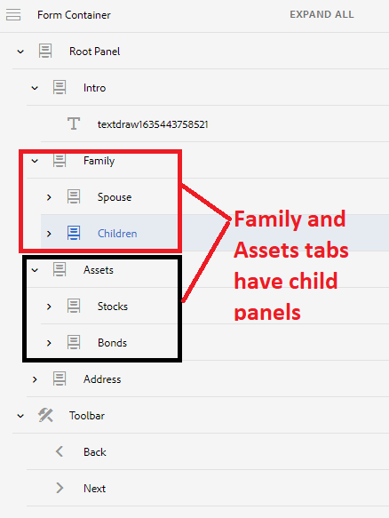

# 여러 패널이 있는 탐색 탭

양식에 탐색 탭이 있고 탭 중 하나에 여러 패널이 있는 경우 하위 패널의 제목을 숨기고 탭과 이러한 탭의 하위 패널 간을 계속 탐색할 수 있습니다

## 적응형 양식 만들기

다음 구조를 사용하여 적응형 양식을 만듭니다. 루트 패널에는 왼쪽에 탭으로 표시되는 하위 패널이 있습니다. 이들 중 일부 &quot;**탭**&quot;에는 추가 하위 패널이 있습니다. 예를 들어 [가족] 탭에는 [배우자]와 [1차 하위 구성요소]라는 두 개의 하위 패널이 있습니다.

또한 FormContainer 아래에 이전 및 다음 단추와 함께 도구 모음이 추가됩니다




이 양식의 기본 동작은 왼쪽에 모든 패널을 표시한 다음 다음 버튼을 클릭할 때 한 탭에서 다른 탭으로 이동하는 것입니다.

이 기본 동작을 변경하려면 다음을 수행해야 합니다

>[!VIDEO](https://video.tv.adobe.com/v/338369?quality=12&learn=on)


다음 코드를 의 클릭 이벤트에 추가합니다. **다음** 코드 편집기를 사용하는 단추

```javascript
window.guideBridge.setFocus(null, 'nextItemDeep', true);
```

다음 코드를 의 클릭 이벤트에 추가합니다. **이전** 코드 편집기를 사용하는 단추

```javascript
window.guideBridge.setFocus(null, 'prevItemDeep', true);
```

위의 코드는 탭과 각 탭의 하위 패널 사이를 탐색하는 데 도움이 됩니다.

## 하위 패널 제목 숨기기

스타일 편집기를 사용하여 탭 하위 패널의 제목을 숨깁니다.

>[!VIDEO](https://video.tv.adobe.com/v/338370?quality=12&learn=on)

>[!NOTE]
>
>이 문서에 설명된 기능이 마지막 탭에서 작동하지 않습니다. 예를 들어, 주소 탭에 하위 패널이 있는 경우 이 기능은 작동하지 않습니다.
