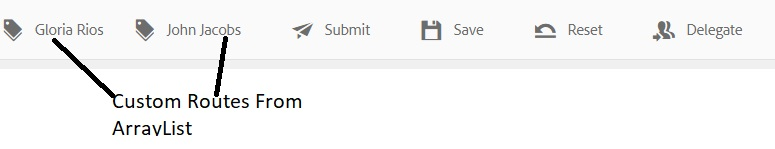

# AEM Workflow의 ArrayList 변수

ArrayList 유형의 변수가 AEM Forms 6.5에 도입되었습니다. ArrayList 변수를 사용하는 일반적인 사용 사례는 AssignTask에서 사용할 사용자 지정 경로를 정의하는 것입니다.

AEM Workflow에서 ArrayList 변수를 사용하려면 제출된 데이터에서 반복 요소를 생성하는 적응형 양식을 만들어야 합니다. 일반적인 방법은 배열 요소를 포함하는 스키마를 정의하는 것입니다. 이 문서를 위해 배열 요소를 포함하는 간단한 JSON 스키마를 만들었습니다. 사용 사례는 경비 보고서를 작성하는 직원입니다. 경비 보고서에서는 제출자의 관리자 이름과 관리자의 관리자 이름을 캡처합니다. 관리자의 이름은 managerchain이라는 어레이에 저장됩니다. 아래 스크린샷은 비용 보고서 양식과 적응형 Forms 제출의 데이터를 보여줍니다.


다음은 적응형 양식 제출의 데이터입니다. 적응형 양식은 JSON 스키마를 기반으로 하며 스키마에 바인딩된 데이터가 afBoundData 요소의 데이터 요소 아래에 저장됩니다. managerchain은 배열이므로 ArrayList를 managerchain 배열 내의 객체의 이름 요소로 채워야 합니다.

```json
{
    "afData": {
        "afUnboundData": {
            "data": {
                "numericbox_2762582281554154833426": 700
            }
        },
        "afBoundData": {
            "data": {
                "Employee": {
                    "Name": "Conrad Simms",
                    "Department": "IT",
                    "managerchain": [{
                        "name": "Gloria Rios"
                    }, {
                        "name": "John Jacobs"
                    }]
                },
                "expense": [{
                    "description": "Hotel",
                    "amount": 300
                }, {
                    "description": "Air Fare",
                    "amount": 400
                }]
            }
        },
        "afSubmissionInfo": {
            "computedMetaInfo": {},
            "stateOverrides": {},
            "signers": {},
            "afPath": "/content/dam/formsanddocuments/helpx/travelexpensereport",
            "afSubmissionTime": "20190402102953"
            }
        }
}
```

하위 유형 문자열의 ArrayList 변수를 초기화하려면 JSON 점 표기법 또는 XPath 매핑 모드를 사용할 수 있습니다. 다음 스크린샷에서는 JSON 점 표기법을 사용하여 CustomRoute라는 ArrayList 변수를 채우는 방법을 보여줍니다. 아래 스크린샷에 표시된 대로 배열 개체의 요소를 가리키는지 확인합니다. managerchain 배열 개체의 이름으로 CustomRouts ArrayList를 채우고 있습니다.
그런 다음 CustomRoute ArrayList를 사용하여 AssignTask 구성 요소의 경로를 채웁니다

CustomRouts ArrayList 변수가 제출된 데이터의 값으로 초기화되면 AssignTask 구성 요소의 Route가 CustomRouts 변수를 사용하여 채워집니다. 아래 스크린샷에서는 AssignTask의 사용자 지정 경로를 보여 줍니다


시스템에서 이 워크플로우를 테스트하려면 다음 단계를 수행하십시오

* ArrayListVariable.zip 파일을 다운로드하여 파일 시스템에 저장합니다
* [AEM Package ](assets/arraylistvariable.zip) Manager를 사용하여 zip 파일을 가져옵니다.
* [TravelExpenseReport 양식 열기](http://localhost:4502/content/dam/formsanddocuments/helpx/travelexpensereport/jcr:content?wcmmode=disabled)
* 두 개의 비용과 두 명의 관리자의 이름을 입력합니다
* 제출 단추를 누릅니다
* [받은 편지함 열기](http://localhost:4502/aem/inbox)
* &quot;비용 관리자에게 할당&quot;이라는 새 작업이 표시됩니다
* 작업과 연결된 양식을 엽니다
* 관리자 이름을 사용하는 두 개의 사용자 지정 경로가 표시됩니다
   [ReviewExpenseReportWorkflow를 탐색합니다.](http://localhost:4502/editor.html/conf/global/settings/workflow/models/ReviewExpenseReport.html) 이 워크플로우는 ArrayList 변수, JSON 유형 변수, Or-Split 구성 요소의 규칙 편집기 를 사용합니다
