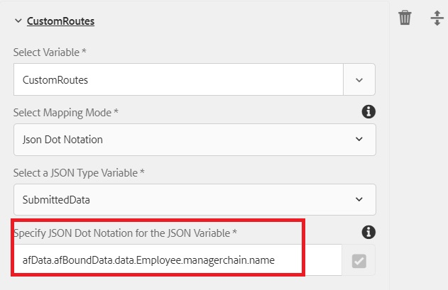

# AEM 워크플로우의 ArrayList 변수

ArrayList 유형의 변수가 AEM Forms 6.5에서 도입되었습니다. ArrayList 변수를 사용하는 일반적인 사용 사례는 AssignTask에서 사용할 사용자 지정 경로를 정의하는 것입니다.

AEM Workflow에서 ArrayList 변수를 사용하려면 제출된 데이터의 반복 요소를 생성하는 적응형 양식을 만들어야 합니다. 배열 요소를 포함하는 스키마를 정의하는 것이 일반적인 방법입니다. 이 문서의 목적에 따라 배열 요소를 포함하는 간단한 JSON 스키마를 만들었습니다. 사용 사례는 지출 보고서를 작성하는 직원입니다. 지출 보고서에서, 우리는 제출자의 관리자 이름과 매니저 이름을 캡처한다. 관리자 이름은 managerchain이라는 스토리지에 저장됩니다. 아래의 스크린샷은 비용 보고서 양식과 적응형 Forms 제출 자료의 데이터를 보여줍니다.


적응형 양식 제출의 데이터는 다음과 같습니다. 적응형 양식은 JSON 스키마를 기반으로 하므로 스키마에 바인딩된 데이터가 afBoundData 요소의 데이터 요소 아래에 저장됩니다. managerchain은 배열이므로 managerchain 배열 내에 있는 객체의 이름 요소로 ArrayList를 채워야 합니다.

```json
{
    "afData": {
        "afUnboundData": {
            "data": {
                "numericbox_2762582281554154833426": 700
            }
        },
        "afBoundData": {
            "data": {
                "Employee": {
                    "Name": "Conrad Simms",
                    "Department": "IT",
                    "managerchain": [{
                        "name": "Gloria Rios"
                    }, {
                        "name": "John Jacobs"
                    }]
                },
                "expense": [{
                    "description": "Hotel",
                    "amount": 300
                }, {
                    "description": "Air Fare",
                    "amount": 400
                }]
            }
        },
        "afSubmissionInfo": {
            "computedMetaInfo": {},
            "stateOverrides": {},
            "signers": {},
            "afPath": "/content/dam/formsanddocuments/helpx/travelexpensereport",
            "afSubmissionTime": "20190402102953"
            }
        }
}
```

하위 유형 문자열의 ArrayList 변수를 초기화하려면 JSON 점 표기법 또는 XPath 매핑 모드를 사용할 수 있습니다. 다음 스크린샷은 JSON 점 표기법을 사용하여 CustomRoute라는 ArrayList 변수를 채우는 것을 보여줍니다. 아래 스크린샷과 같이 배열 개체의 요소를 가리키는지 확인하십시오. managerchain 배열 개체의 이름으로 CustomRouts ArrayList를 채우고 있습니다.
그런 다음 CustomRouts ArrayList를 사용하여 AssignTask 구성 요소사용자 지정 경로를 채웁니다. CustomRouts ArrayList 변수가 제출된 데이터의 값으로 초기화되면 AssignTask 구성 요소의 경로가 CustomRouts 변수를 사용하여 채워집니다. 아래 스크린샷은 AssignTask의 사용자 지정 경로를

시스템에서 이 워크플로우를 테스트하려면 다음 단계를 따르십시오

* ArrayListVariable.zip 파일을 파일 시스템에 다운로드 및 저장
* [AEM 패키지 관리자를 사용하여 zip 파일](assets/arraylistvariable.zip) 가져오기
* [TravelExpenseReport 양식 열기](http://localhost:4502/content/dam/formsanddocuments/helpx/travelexpensereport/jcr:content?wcmmode=disabled)
* 두 개의 비용과 두 명의 관리자의 이름을 입력하십시오.
* 제출 단추를 누르십시오.
* [받은 편지함 열기](http://localhost:4502/aem/inbox)
* &quot;비용 관리자에게 할당&quot;이라는 새 작업이 표시됩니다.
* 작업과 연관된 양식 열기
* 관리자 이름이 있는 두 개의 사용자 지정 경로가 표시됩니다.
   [ReviewExpenseReportWorkflow를 탐색합니다.](http://localhost:4502/editor.html/conf/global/settings/workflow/models/ReviewExpenseReport.html) 이 워크플로우는 ArrayList 변수, JSON 유형 변수, Or-Split 구성 요소의 규칙 편집기를 사용합니다
