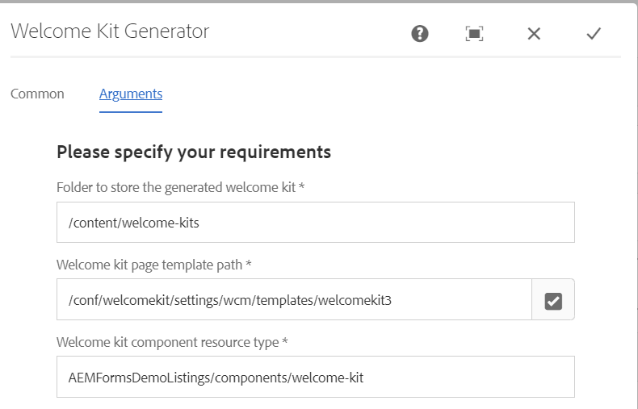

# 워크플로 구성 요소

워크플로우 구성 요소는 생성된 페이지를 저장할 페이지 템플릿, 구성 요소 리소스 유형 및 기본 폴더와 같은 자산을 나열하는 페이지 관련 정보를 캡처합니다.



## 워크플로우 프로세스 구현

다음 Java 코드는 워크플로우 구성 요소와 연결되었습니다. 이 코드는 시작 키트 페이지를 만들고, 워크플로우 변수(submitterName 및 documentsSelected)에서 값을 추출합니다. 그런 다음 이러한 값은 페이지에 사용된 구성 요소의 속성으로 설정됩니다. 또한 이 코드는 워크플로우 프로세스 변수의 값을 설정합니다 **welcomekiturl**.

```java
package com.welcomekit.core.workflowprocess;
import com.adobe.granite.workflow.WorkflowException;
import com.adobe.granite.workflow.WorkflowSession;
import com.adobe.granite.workflow.exec.WorkItem;
import com.adobe.granite.workflow.exec.WorkflowData;
import com.adobe.granite.workflow.exec.WorkflowProcess;
import com.adobe.granite.workflow.metadata.MetaDataMap;
import com.day.cq.commons.Externalizer;
import com.day.cq.commons.jcr.JcrUtil;
import com.day.cq.search.PredicateGroup;
import com.day.cq.search.Query;
import com.day.cq.search.QueryBuilder;
import com.day.cq.search.result.SearchResult;
import com.day.cq.wcm.api.Page;
import com.day.cq.wcm.api.PageManager;
import com.day.cq.wcm.api.WCMException;
import org.apache.commons.lang3.StringUtils;
import org.apache.sling.api.resource.ModifiableValueMap;
import org.apache.sling.api.resource.PersistenceException;
import org.apache.sling.api.resource.Resource;
import org.apache.sling.api.resource.ResourceResolver;
import org.osgi.service.component.annotations.Component;
import org.osgi.service.component.annotations.Reference;
import static org.apache.sling.jcr.resource.api.JcrResourceConstants.*;
import javax.jcr.Node;
import javax.jcr.RepositoryException;
import javax.jcr.Session;
import java.text.SimpleDateFormat;
import java.util.Date;
import java.util.HashMap;
import java.util.Map;
import java.util.UUID;
@Component
public class CreatePage implements WorkflowProcess {
  private static final String WORKFLOW_WELCOME_KIT_PAGE_TEMPLATE_PATH = "WELCOME_KIT_PAGE_TEMPLATE_PATH";
  private static final String WORKFLOW_WELCOME_KIT_COMPONENT_RESOURCE_TYPE = "WELCOME_KIT_COMPONENT_RESOURCE_TYPE";

  private static final String WORKFLOW_ROOT_PAGE_PATH = "ROOT_PAGE_PATH";

  String[] docummentNames = null;
  @Reference
  private QueryBuilder queryBuilder;
  private Page createWelcomeKitPage(ResourceResolver resourceResolver, String welcomeKitId, String templatePath, String pageTitle) throws RepositoryException, WCMException {
    final PageManager pageManager = resourceResolver.adaptTo(PageManager.class);

    final Node node = JcrUtil.createPath(StringUtils.substringBeforeLast(welcomeKitId, "/"), NT_SLING_ORDERED_FOLDER, NT_SLING_ORDERED_FOLDER, resourceResolver.adaptTo(Session.class), false);

    Page page = pageManager.create(node.getPath(), StringUtils.substringAfterLast(welcomeKitId, "/"), templatePath, pageTitle, true);

    return page;
  }

  private < T > boolean persistData(WorkItem workItem, WorkflowSession workflowSession, String key, T val) {
    WorkflowData data = workItem.getWorkflow().getWorkflowData();
    if (data.getMetaDataMap() == null) {
      return false;
    }

    data.getMetaDataMap().put(key, val);
    workflowSession.updateWorkflowData(workItem.getWorkflow(), data);
    return true;
  }
  private Resource findResourceByResourceType(Page page, String resourceType) throws RepositoryException {
    final ResourceResolver resourceResolver = page.getContentResource().getResourceResolver();
    final Map < String, String > map = new HashMap < > ();
    map.put("path", page.getContentResource().getPath());
    map.put("path.self", "true");
    map.put("property", SLING_RESOURCE_TYPE_PROPERTY);
    map.put("property.value", resourceType);
    map.put("p.limit", "1");

    final Query query = queryBuilder.createQuery(PredicateGroup.create(map), resourceResolver.adaptTo(Session.class));
    final SearchResult result = query.getResult();

    if (result.getHits().size() > 0) {

      return resourceResolver.getResource(result.getHits().get(0).getPath());
    } else {
      return null;
    }
  }

  private void updateComponentOnPage(Page page, String resourceType, String propertyName, String propertyValue) throws PersistenceException, RepositoryException {

    final Resource resource = findResourceByResourceType(page, resourceType);

    if (resource != null) {
      final ModifiableValueMap properties = resource.adaptTo(ModifiableValueMap.class);
      if (propertyName.equalsIgnoreCase("paths")) {
        properties.remove(propertyName);
        String[] docummentNames = propertyValue.split(",");

        properties.put(propertyName, docummentNames);
      } else {
        System.out.println("Finding resource type" + propertyName);
        properties.remove(propertyName);
        properties.put(propertyName, propertyValue);

      }

    }
  }
  @Override
  public void execute(WorkItem workItem, WorkflowSession workflowSession, MetaDataMap metaDataMap) throws WorkflowException {
    String docSelected = (String) workItem.getWorkflow().getWorkflowData().getMetaDataMap().get("documentsSelected");
    String submitter = (String) workItem.getWorkflow().getWorkflowData().getMetaDataMap().get("submitter");

    docummentNames = docSelected.split(",");
    final ResourceResolver resourceResolver = workflowSession.adaptTo(ResourceResolver.class);

    String templatePath = metaDataMap.get(WORKFLOW_WELCOME_KIT_PAGE_TEMPLATE_PATH, String.class);
    String welcomeKitResourceType = metaDataMap.get(WORKFLOW_WELCOME_KIT_COMPONENT_RESOURCE_TYPE, String.class);
    String rootPagePath = metaDataMap.get(WORKFLOW_ROOT_PAGE_PATH, "/content/welcome-kits");

    // Get Asset Folder properties
    final String welcomeKitId = rootPagePath + "/" + new SimpleDateFormat("yyyy/MM").format(new Date()) + "/" + UUID.randomUUID();
    final String welcomeKitName = "Welcome Kit";

    try {
      // Get or create the press kit page
      Page page = createWelcomeKitPage(resourceResolver, welcomeKitId, templatePath, welcomeKitName);
      updateComponentOnPage(page, welcomeKitResourceType, "paths", docSelected);
      updateComponentOnPage(page, "wcm/foundation/components/text", "text", "<p>Hello " + submitter + ".</p><p> Thank you for submitting your request. Please find the documents requested by you</p>");

      resourceResolver.commit();
      Externalizer externalizer = resourceResolver.adaptTo(Externalizer.class);
      String myExternalizedUrl = externalizer.externalLink(resourceResolver, Externalizer.LOCAL, page.getPath()) + ".html";
      persistData(workItem, workflowSession, "welcomekiturl", myExternalizedUrl);

    } catch (WCMException | PersistenceException | RepositoryException e) {
      throw new WorkflowException(String.format("Could not build Welcome Kit page for [ %s ]", "selected documents"), e);
    }

  }
}
```
