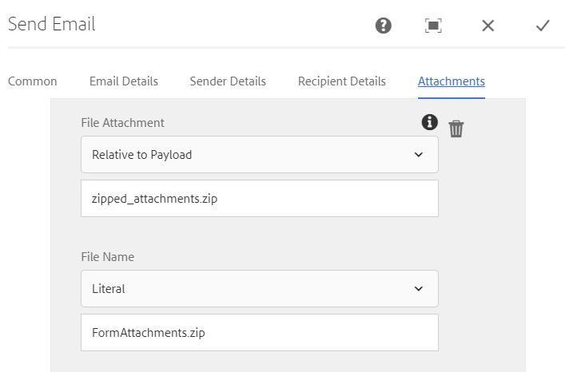

# 소개

일반적인 사용 사례는 AEM 워크플로우에서 전자 메일 구성 요소를 사용하여 적응형 양식 첨부 파일을 전송하는 것입니다.
고객은 일반적으로 양식 첨부 파일을 압축하거나 전자 메일 구성 요소를 사용하여 첨부 파일을 개별 파일로 보냅니다.

## Zip 파일로 양식 첨부 파일 보내기

사용 사례를 수행하기 위해 사용자 지정 워크플로우 프로세스 단계가 작성됩니다. 이 사용자 지정 프로세스에서는 *zip_attachments.zip* 파일의 페이로드 폴더 아래에 양식 첨부 파일이 생성되고 저장되는 zip 파일을 단계에서 생성합니다

## 양식 첨부 파일을 개별적으로 보내기

이 사용 사례를 수행하기 위해 사용자 지정 워크플로우 프로세스 단계가 작성됩니다. 이 사용자 지정 프로세스 단계에서는 ArrayList of Documents 및 ArrayList of Strings 유형의 워크플로우 변수를 채웁니다.

