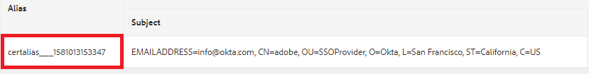

# OKTA를 사용하여 AEM 작성자 인증

> AEM as a Cloud Service에서 OKTA를 설정하는 방법에 대한 지침은 [SAML 2.0 인증](https://experienceleague.adobe.com/docs/experience-manager-learn/cloud-service/authentication/saml-2-0.html?lang=ko)을 참조하십시오.

첫 번째 단계는 OKTA 포털에서 앱을 구성하는 것입니다. OKTA 관리자가 앱을 승인하면 IdP 인증서와 SSO(Single Sign-On) URL에 액세스할 수 있습니다. 다음은 일반적으로 새 응용 프로그램을 등록할 때 사용되는 설정입니다.

* **응용 프로그램 이름:** 응용 프로그램 이름입니다. 애플리케이션에 고유한 이름을 지정해야 합니다.
* **SAML 받는 사람:** OKTA에서 인증한 후 SAML 응답과 함께 AEM 인스턴스에서 조회되는 URL입니다. SAML 인증 처리기는 일반적으로 / saml_login을 사용하여 모든 URL을 가로채지만 애플리케이션 루트 뒤에 추가하는 것이 좋습니다.
* **SAML 대상**: 응용 프로그램의 도메인 URL입니다. 도메인 URL에서 프로토콜(http 또는 https)을 사용하지 마십시오.
* **SAML 이름 ID:** 드롭다운 목록에서 전자 메일을 선택합니다.
* **환경**: 적절한 환경을 선택하십시오.
* **특성**: SAML 응답에서 사용자에 대해 표시되는 특성입니다. 필요에 따라 지정합니다.

## AEM Trust Store에 OKTA(IdP) 인증서 추가

SAML 어설션은 암호화되므로 OKTA와 AEM 간에 보안 통신을 허용하려면 AEM Trust Store에 IdP(OKTA) 인증서를 추가해야 합니다.
아직 초기화되지 않은 경우 [트러스트 스토어를 초기화합니다](http://localhost:4502/libs/granite/security/content/truststore.html).
Trust Store 암호를 기억하십시오. 이 암호는 나중에 이 프로세스에서 사용해야 합니다.

* [글로벌 신뢰 저장소](http://localhost:4502/libs/granite/security/content/truststore.html)&#x200B;(으)로 이동합니다.
* &quot;CER 파일에서 인증서 추가&quot;를 클릭합니다. OKTA에서 제공한 IdP 인증서를 추가하고 제출 을 클릭합니다.

  >[!NOTE]
  >
  >인증서를 사용자에게 매핑하지 마십시오.

인증서를 Trust Store에 추가하면 아래 스크린샷과 같이 인증서 별칭을 얻어야 합니다. 사용자의 경우 별칭 이름이 다를 수 있습니다.

**인증서 별칭을 메모합니다. 이 작업은 이후 단계에서 필요합니다.**

### SAML 인증 처리기 구성

[configMgr](http://localhost:4502/system/console/configMgr)&#x200B;(으)로 이동합니다.
&quot;Adobe Granite SAML 2.0 Authentication Handler&quot;를 검색하여 엽니다.
아래에 지정된 대로 다음 속성을 제공합니다
다음은 지정해야 하는 주요 속성입니다.

* **경로** - 인증 처리기가 트리거되는 경로입니다.
* **IdP Url**:OKTA에서 제공하는 IdP URL입니다.
* **IDP 인증서 별칭**:IdP 인증서를 AEM Trust Store에 추가할 때 받은 별칭입니다.
* **서비스 공급자 엔터티 Id**:AEM 서버의 이름입니다.
* **키 저장소의 암호**:사용한 Trust Store 암호입니다
* **기본 리디렉션**:인증 성공 시 리디렉션할 URL입니다.
* **UserID 특성**:uid
* **암호화 사용**:false
* **CRX 사용자 자동 만들기**:true
* **그룹에 추가**:true
* **기본 그룹**:oktausers(사용자가 추가되는 그룹입니다. AEM 내에서 기존 그룹을 제공할 수 있습니다.)
* **NamedIDPolicy**: 요청한 제목을 나타내는 데 사용할 이름 식별자의 제약 조건을 지정합니다. 강조 표시된 다음 문자열 **urn:oasis:names:tc:SAML:2.0:nameidformat:emailAddress**&#x200B;을(를) 복사하여 붙여 넣으십시오
* **동기화된 특성** - AEM 프로필의 SAML 어설션에 저장되는 특성입니다.

### Apache Sling Referrer 필터 구성

[configMgr](http://localhost:4502/system/console/configMgr)&#x200B;(으)로 이동합니다.
&quot;Apache Sling Referrer Filter&quot;를 검색하여 엽니다. 아래에 지정된 대로 다음 속성을 설정합니다.

* **Allow Empty**: false
* **호스트 허용**: IdP의 호스트 이름(대/소문자를 구분함)
* **Regexp 호스트 허용**: IdP의 호스트 이름(대/소문자를 구분함)
Sling Referrer Filter Referrer 속성 스크린샷

#### OKTA 통합에 대한 디버그 로깅 구성

AEM에서 OKTA 통합을 설정할 때 AEM의 SAML 인증 핸들러에 대한 DEBUG 로그를 검토하는 것이 좋습니다. 로그 수준을 DEBUG로 설정하려면 AEM OSGi 웹 콘솔을 통해 새 Sling 로거 구성을 만드십시오.

스테이지 및 프로덕션에서 이 로거를 제거하거나 비활성화하여 로그 소음을 줄여야 합니다.

AEM에서 OKTA 통합을 설정할 때 AEM의 SAML 인증 핸들러에 대한 DEBUG 로그를 검토하는 것이 좋습니다. 로그 수준을 DEBUG로 설정하려면 AEM OSGi 웹 콘솔을 통해 새 Sling 로거 구성을 만드십시오.
**로그 소음을 줄이려면 단계 및 프로덕션에서 이 로거를 제거하거나 사용하지 않도록 설정하십시오.**
* [configMgr](http://localhost:4502/system/console/configMgr)&#x200B;(으)로 이동

* &quot;Apache Sling Logging Logger 구성&quot; 검색 및 열기
* 다음 구성으로 로거를 만듭니다.
   * **로그 수준**: 디버그
   * **로그 파일**: logs/saml.log
   * **로거**: com.adobe.granite.auth.saml
* 설정을 저장하려면 저장 을 클릭합니다.

#### OKTA 구성 테스트

AEM 인스턴스에서 로그아웃 링크에 액세스해 보십시오. OKTA SSO가 작동 중입니다.
