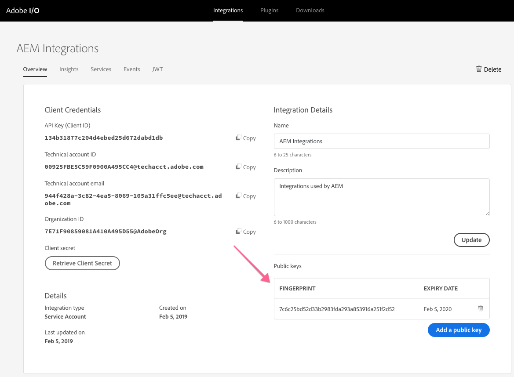
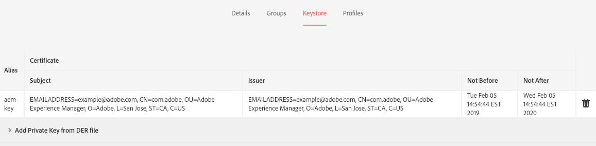

# Adobe I/O에 사용할 공개 및 개인 키 설정

AEM은 공개/개인 키 쌍을 사용하여 Adobe I/O 및 기타 웹 서비스와 안전하게 통신합니다. 이 짧은 자습서에서는 AEM과 Adobe I/O 모두에서 작동하는 [!DNL openssl] 명령줄 도구를 사용하여 호환 키와 키 저장소를 생성하는 방법을 보여줍니다.

>[!CAUTION]
>
>이 안내서는 낮은 환경에서 개발하고 사용하는 데 유용한 자체 서명된 키를 만듭니다. 운영 시나리오에서는 키가 일반적으로 조직의 IT 보안 팀에서 생성 및 관리됩니다.

## 공개/개인 키 쌍 {#generate-the-public-private-key-pair} 생성

[[!DNL openssl]](https://www.openssl.org/docs/man1.0.2/man1/openssl.html) 명령줄 도구의 [[!DNL req] 명령](https://www.openssl.org/docs/man1.0.2/man1/req.html)을(를) 사용하여 Adobe I/O 및 Adobe Experience Manager과 호환되는 키 쌍을 생성할 수 있습니다.

```shell
$ openssl req -x509 -sha256 -nodes -days 365 -newkey rsa:2048 -keyout private.key -out certificate.crt
```

[!DNL openssl generate] 명령을 완료하려면 요청 시 인증서 정보를 제공합니다. Adobe I/O과 AEM은 이러한 값이 무엇인지에 신경 쓰지 않지만, 값과 일치하고 키를 설명합니다.

```
Generating a 2048 bit RSA private key
...........................................................+++
...+++
writing new private key to 'private.key'
-----
You are about to be asked to enter information that will be incorporated
into your certificate request.
What you are about to enter is what is called a Distinguished Name or a DN.
There are quite a few fields but you can leave some blank
For some fields there will be a default value,
If you enter '.', the field will be left blank.
-----
Country Name (2 letter code) []:US
State or Province Name (full name) []:CA
Locality Name (eg, city) []:San Jose
Organization Name (eg, company) []:Example Co
Organizational Unit Name (eg, section) []:Digital Marketing
Common Name (eg, fully qualified host name) []:com.example
Email Address []:me@example.com
```

## 새 키 저장소 {#add-key-pair-to-a-new-keystore}에 키 쌍 추가

키 쌍을 새 [!DNL PKCS12] 키 저장소에 추가할 수 있습니다. [[!DNL openssl]'s [!DNL pcks12] 명령의 일부로, ](https://www.openssl.org/docs/man1.0.2/man1/pkcs12.html) 키 저장소의 이름(`-  caname`를 통해)과 키 저장소 암호(`-  passout`를 통해)가 정의됩니다.`-name`

이러한 값은 키 스토어와 키를 AEM에 로드하는 데 필요합니다.

```shell
$ openssl pkcs12 -export -caname my-keystore -in certificate.crt -name my-key -inkey private.key -out keystore.p12 -passout pass:my-password
```

이 명령의 출력은 `keystore.p12` 파일입니다.

>[!NOTE]
>
>**[!DNL my-keystore]**, **[!DNL my-key]** 및 **[!DNL my-password]**&#x200B;의 매개 변수 값은 자신의 값으로 대체됩니다.

## 키 저장소 내용 확인 {#verify-the-keystore-contents}

Java [[!DNL keytool] 명령줄 도구](https://docs.oracle.com/middleware/1213/wls/SECMG/keytool-summary-appx.htm#SECMG818)는 키 저장소에 대한 가시성을 제공하여 키가 키 저장소 파일([!DNL keystore.p12])에 성공적으로 로드되도록 합니다.

```shell
$ keytool -keystore keystore.p12 -list

Enter keystore password: my-password

Keystore type: jks
Keystore provider: SUN

Your keystore contains 1 entry

my-key, Feb 5, 2019, PrivateKeyEntry,
Certificate fingerprint (SHA1): 7C:6C:25:BD:52:D3:3B:29:83:FD:A2:93:A8:53:91:6A:25:1F:2D:52
```



## 키 저장소를 AEM {#adding-the-keystore-to-aem}에 추가

AEM에서는 생성된 **개인 키**&#x200B;를 사용하여 Adobe I/O 및 기타 웹 서비스와 안전하게 통신합니다. AEM에서 개인 키에 액세스하려면 AEM 사용자의 키 저장소에 설치해야 합니다.

**AEM > [!UICONTROL 도구] > [!UICONTROL 보안] > [!UICONTROL 사용자]** 및 **개인 키가 연결될 사용자**&#x200B;로 이동합니다.

### AEM 키 저장소 {#create-an-aem-keystore} 만들기


*저장소 만들기 >  [!UICONTROL 도구]  >  [!UICONTROL 보안]  >  [!UICONTROL 사용자]  > 사용자 편집*

키 저장소를 만들라는 메시지가 표시되면 그렇게 합니다. 이 키 저장소는 AEM에만 있으며 openssl을 통해 만든 키 저장소는 아닙니다. 암호는 어떤 것이든 될 수 있으며 [!DNL openssl] 명령에 사용된 암호와 동일할 필요가 없습니다.

### 키 저장소 {#install-the-private-key-via-the-keystore}를 통해 개인 키를 설치합니다


*[!UICONTROL 추가]  >  [!UICONTROL 키 저장소]  >  [!UICONTROL 키 저장소에서 개인 키 추가]*

사용자의 키 저장소 콘솔에서 **[!UICONTROL 개인 키 추가 양식 KeyStore 파일]**&#x200B;을 클릭하고 다음 정보를 추가합니다.

* **[!UICONTROL 새 별칭]**:AEM에서 키의 별칭입니다. 어떤 항목일 수 있으며 openssl 명령으로 만든 키 저장소의 이름과 일치하지 않아도 됩니다.
* **[!UICONTROL 키 저장소 파일]**:openssl pkcs12 명령 출력(keystore.p12)
* **[!UICONTROL KeyStore 파일 암호]**:인수를 통해 openssl pkcs12 명령에 설정된  `-passout` 암호입니다.
* **[!UICONTROL 개인 키 별칭]**:위의 openssl  `-name` pkcs12 명령의 인수에 제공된 값(예: `my-key`).
* **[!UICONTROL 개인 키 암호]**:인수를 통해 openssl pkcs12 명령에 설정된  `-passout` 암호입니다.

>[!CAUTION]
>
>KeyStore 파일 암호 및 개인 키 암호는 두 입력에 대해 동일합니다. 일치하지 않는 암호를 입력하면 키를 가져올 수 없습니다.

### 개인 키가 AEM 키 저장소 {#verify-the-private-key-is-loaded-into-the-aem-keystore}에 로드되었는지 확인합니다


*[!UICONTROL > 키 저장소에서 개인 키]   [!UICONTROL 확인]*

개인 키가 제공된 키 저장소에서 AEM 키 저장소로 성공적으로 로드되면 개인 키의 메타데이터가 사용자의 키 저장소 콘솔에 표시됩니다.

## Adobe I/O {#adding-the-public-key-to-adobe-i-o}에 공개 키 추가

공개 키의 해당 개인 키가 있는 AEM 서비스 사용자가 안전하게 통신할 수 있도록 하려면 일치하는 공개 키를 Adobe I/O에 업로드해야 합니다.

### Adobe I/O 새 통합 {#create-a-adobe-i-o-new-integration} 만들기


*[[!UICONTROL Adobe I/O 통합 만들기]](https://console.adobe.io/)  >  [!UICONTROL 새 통합]*

Adobe I/O에서 새 통합을 만들려면 공개 인증서를 업로드해야 합니다. `openssl req` 명령으로 생성된 **certificate.crt**&#x200B;를 업로드합니다.

### 공개 키가 Adobe I/O {#verify-the-public-keys-are-loaded-in-adobe-i-o}에 로드되었는지 확인합니다.


설치된 공개 키 및 만료 날짜가 Adobe I/O의 [!UICONTROL 통합] 콘솔에 나열되어 있습니다.**[!UICONTROL 공개 키 추가]** 단추를 통해 여러 공개 키를 추가할 수 있습니다.

이제 AEM에 개인 키가 있고 Adobe I/O 통합에는 해당 공개 키가 저장되어 AEM이 Adobe I/O과 안전하게 통신할 수 있습니다.
