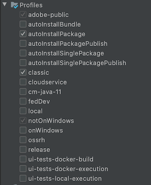

# 로컬 AEM 개발 환경 설정

AEM, Adobe Experience Manager에 대한 로컬 개발 설정에 대한 안내서입니다. 로컬 설치, Apache Maven, 통합 개발 환경 및 디버깅/문제 해결에 대한 중요한 항목을 다룹니다. **[!DNL Eclipse IDE], [!DNL CRXDE Lite], [!DNL Visual Studio Code] 및[!DNL IntelliJ]**&#x200B;을 사용한 개발에 대해 설명합니다.

## 개요

로컬 개발 환경을 설정하는 것은 Adobe Experience Manager 또는 AEM용으로 개발할 때 첫 번째 단계입니다. 시간을 내어 품질 개발 환경을 설정하여 생산성을 높이고 코드를 보다 신속하게 작성할 수 있습니다. AEM 로컬 개발 환경을 4가지 영역으로 나눌 수 있습니다.

* 로컬 AEM 인스턴스
* [!DNL Apache Maven] 프로젝트
* 통합 개발 환경(IDE)
* 문제 해결

## 로컬 AEM 인스턴스 설치

로컬 AEM 인스턴스를 참조할 때 개발자의 개인 컴퓨터에서 실행 중인 Adobe Experience Manager 사본에 대해 이야기하고 있습니다. ****** 모든 AEM 개발은 로컬 AEM 인스턴스에 대해 코드를 작성하고 실행하는 것으로 시작해야 합니다.

AEM을 처음 사용하는 경우 두 가지 기본 실행 모드를 설치할 수 있습니다.***작성자*** 및 ***게시***. ***작성자*** [실행 모드](https://helpx.adobe.com/experience-manager/6-5/sites/deploying/using/configure-runmodes.html)는 디지털 마케터가 컨텐츠를 만들고 관리하는 데 사용할 환경입니다. **대부분의**&#x200B;을 개발할 때 코드를 작성자 인스턴스에 배포합니다. 구성 요소를 추가 및 구성할 수 있을 뿐만 아니라 새 페이지를 만들 수도 있습니다. AEM Sites은 WYSIWYG 작성 CMS이므로 대부분의 CSS 및 JavaScript를 작성 인스턴스에 대해 테스트할 수 있습니다.

또한 로컬 ***Publish*** 인스턴스에 대해 *critical* 테스트 코드도 사용됩니다. ***게시*** 인스턴스는 웹 사이트 방문자가 상호 작용하는 AEM 환경입니다. ***게시*** 인스턴스는 ***작성자*** 인스턴스와 동일한 기술 스택이지만 구성 및 권한과 관련된 몇 가지 주요 차이점이 있습니다. 코드는 높은 수준 환경으로 승격되기 전에 *항상*&#x200B;로컬 ***게시*** 인스턴스에 대해 테스트해야 합니다.

### 단계

1. [Java](https://downloads.experiencecloud.adobe.com/content/software-distribution/en/general.html)가 설치되어 있는지 확인합니다.
   * AEM 6.5+의 경우 [Java JDK 11](https://experience.adobe.com/#/downloads/content/software-distribution/en/general.html?1_group.propertyvalues.property=.%2Fjcr%3Acontent%2Fmetadata%2Fdc%3AsoftwareType&amp;1_group.propertyvalues.operation=equals&amp;1_group.propertyvalues.0_values=software-type%3Atologing&amp;orderby=%40jcr%3Acontent%2Fjcr%3AlastModified&amp;orderby.sort=desc&amp;layout=list&amp;p.offset=0&amp;p.limit=14)을 선호합니다.
   * [AEM 6.5 이전 버전의 AEM용 Java JDK 8](https://www.oracle.com/technetwork/java/javase/downloads/index.html#JDK8) 
2. [AEM QuickStart Jar 및 [!DNL license.properties]](https://helpx.adobe.com/experience-manager/6-5/sites/deploying/using/deploy.html#GettingtheSoftware)의 사본을 가져옵니다.
3. 다음과 같이 컴퓨터에 폴더 구조를 만듭니다.

   ```plain
   ~/aem-sdk
       /author
       /publish
   ```

4. [!DNL QuickStart] JAR의 이름을 ***aem-author-p4502.jar***&#x200B;로 변경하고 `/author` 디렉토리 아래에 배치합니다. `/author` 디렉토리 아래에 ***[!DNL license.properties]*** 파일을 추가합니다.
5. [!DNL QuickStart] JAR의 복사본을 만들고, 이름을 ***aem-publish-p4503.jar***&#x200B;로 변경하고, `/publish` 디렉토리 아래에 배치합니다. `/publish` 디렉토리 아래에 ***[!DNL license.properties]*** 파일의 복사본을 추가합니다.

   ```plain
   ~/aem-sdk
       /author
           + aem-author-p4502.jar
           + license.properties
       /publish
           + aem-publish-p4503.jar
           + license.properties
   ```

6. ***aem-author-p4502.jar*** 파일을 두 번 클릭하여 **Author** 인스턴스를 설치합니다. 이렇게 하면 로컬 컴퓨터의 포트 **4502**&#x200B;에서 실행되는 작성자 인스턴스가 시작됩니다.

   ***aem-publish-p4503.jar*** 파일을 두 번 클릭하여 **Publish** 인스턴스를 설치합니다. 이렇게 하면 로컬 컴퓨터의 포트 **4503**&#x200B;에서 실행되는 게시 인스턴스가 시작됩니다.

   >[!NOTE]
   >
   >개발 시스템의 하드웨어에 따라 **Author 및 Publish** 인스턴스를 동시에 실행하는 것이 어려울 수 있습니다. 로컬 설정에서 둘 다 동시에 실행할 필요가 거의 없습니다.

   자세한 내용은 [AEM 인스턴스 배포 및 유지 관리](https://helpx.adobe.com/experience-manager/6-5/sites/deploying/using/deploy.html)를 참조하십시오.

## Apache Maven 설치

***[!DNL Apache Maven]*** 는 Java 기반 프로젝트에 대한 빌드 및 배포 절차를 관리하는 도구입니다. AEM은 Java 기반 플랫폼이고 [!DNL Maven] 은 AEM 프로젝트에 대한 코드를 관리하는 표준 방법입니다. ***AEM Maven Project*** 또는 ***AEM Project***&#x200B;라고 말하는 경우, Adobe는 사이트에 대한 *사용자 지정* 코드를 모두 포함하는 Maven 프로젝트를 참조합니다.

모든 AEM 프로젝트는 최신 버전의 **[!DNL AEM Project Archetype]**&#x200B;에서 빌드해야 합니다.[https://github.com/Adobe-Marketing-Cloud/aem-project-archetype](https://github.com/Adobe-Marketing-Cloud/aem-project-archetype) [!DNL AEM Project Archetype]은(는) 일부 샘플 코드와 컨텐츠를 사용하여 AEM 프로젝트의 부트스트랩을 만듭니다. [!DNL AEM Project Archetype]에도 프로젝트에 사용하도록 구성된 **[!DNL AEM WCM Core Components]**&#x200B;이 포함되어 있습니다.

>[!CAUTION]
>
>새 프로젝트를 시작할 때 최신 버전의 Archetype을 사용하는 것이 좋습니다. AEM에는 여러 버전의 기본 버전이 있으며 일부 버전은 이전 버전과 호환되지 않습니다.

### 단계

1. [Apache Maven](https://maven.apache.org/download.cgi) 다운로드
2. [Apache Maven](https://maven.apache.org/install.html)을 설치하고 명령줄 `PATH`에 설치가 추가되었는지 확인합니다.
   * [!DNL macOS] 사용자는 Homebrew를 사용하여 Maven을 설치할 수  [있습니다](https://brew.sh/)
3. 새 명령줄 터미널을 열고 다음을 실행하여 **[!DNL Maven]**&#x200B;이 설치되어 있는지 확인합니다.

   ```shell
   $ mvn --version
   Apache Maven 3.3.9
   Maven home: /Library/apache-maven-3.3.9
   Java version: 1.8.0_111, vendor: Oracle Corporation
   Java home: /Library/Java/JavaVirtualMachines/jdk1.8.0_111.jdk/Contents/Home/jre
   Default locale: en_US, platform encoding: UTF-8
   ```

4. **[!DNL repo.adobe.com]** 프로필을 [!DNL Maven] [settings.xml](https://maven.apache.org/settings.html) 파일에 추가하여 maven 빌드 프로세스에 **[!DNL adobe-public]**&#x200B;을(를) 자동으로 추가합니다.

5. `~/.m2/settings.xml`에 이름이 `settings.xml`인 파일이 아직 없는 경우 만듭니다.

6. **[!DNL adobe-public]** 프로필을 여기](https://repo.adobe.com/)의 지침에 따라 [ 파일에 추가합니다.`settings.xml`

   샘플 `settings.xml`은 아래에 나와 있습니다. *참고: 사용자 디렉토리 아래 `settings.xml` 에 대한 및 배치의 이름 지정 규칙 `.m2` 이 중요합니다.*

   ```xml
   <settings xmlns="https://maven.apache.org/SETTINGS/1.0.0"
     xmlns:xsi="https://www.w3.org/2001/XMLSchema-instance"
     xsi:schemaLocation="https://maven.apache.org/SETTINGS/1.0.0
                         https://maven.apache.org/xsd/settings-1.0.0.xsd">
   <profiles>
    <!-- ====================================================== -->
    <!-- A D O B E   P U B L I C   P R O F I L E                -->
    <!-- ====================================================== -->
        <profile>
            <id>adobe-public</id>
            <activation>
                <activeByDefault>true</activeByDefault>
            </activation>
            <properties>
                <releaseRepository-Id>adobe-public-releases</releaseRepository-Id>
                <releaseRepository-Name>Adobe Public Releases</releaseRepository-Name>
                <releaseRepository-URL>https://repo.adobe.com/nexus/content/groups/public</releaseRepository-URL>
            </properties>
            <repositories>
                <repository>
                    <id>adobe-public-releases</id>
                    <name>Adobe Public Repository</name>
                    <url>https://repo.adobe.com/nexus/content/groups/public</url>
                    <releases>
                        <enabled>true</enabled>
                        <updatePolicy>never</updatePolicy>
                    </releases>
                    <snapshots>
                        <enabled>false</enabled>
                    </snapshots>
                </repository>
            </repositories>
            <pluginRepositories>
                <pluginRepository>
                    <id>adobe-public-releases</id>
                    <name>Adobe Public Repository</name>
                    <url>https://repo.adobe.com/nexus/content/groups/public</url>
                    <releases>
                        <enabled>true</enabled>
                        <updatePolicy>never</updatePolicy>
                    </releases>
                    <snapshots>
                        <enabled>false</enabled>
                    </snapshots>
                </pluginRepository>
            </pluginRepositories>
        </profile>
   </profiles>
    <activeProfiles>
        <activeProfile>adobe-public</activeProfile>
    </activeProfiles>
   </settings>
   ```

7. 다음 명령을 실행하여 **adobe-public** 프로필이 활성 상태인지 확인합니다.

   ```shell
   $ mvn help:effective-settings
   ...
   <activeProfiles>
       <activeProfile>adobe-public</activeProfile>
   </activeProfiles>
   <pluginGroups>
       <pluginGroup>org.apache.maven.plugins</pluginGroup>
       <pluginGroup>org.codehaus.mojo</pluginGroup>
   </pluginGroups>
   </settings>
   [INFO] ------------------------------------------------------------------------
   [INFO] BUILD SUCCESS
   [INFO] ------------------------------------------------------------------------
   [INFO] Total time:  0.856 s
   ```

   **[!DNL adobe-public]** 이 표시되지 않으면 Adobe 보고서가 `~/.m2/settings.xml` 파일에서 제대로 참조되지 않았다는 표시입니다. 이전 단계를 다시 방문하여 settings.xml 파일이 Adobe 보고서를 참조하는지 확인하십시오.

## 통합 개발 환경 설정

통합 개발 환경 또는 IDE는 텍스트 편집기, 구문 지원 및 빌드 도구를 결합하는 애플리케이션입니다. 개발 유형에 따라 다른 IDE보다 한 IDE가 더 선호될 수 있습니다. IDE에 관계없이 를 테스트하려면 정기적으로 ***push*** 코드를 로컬 AEM 인스턴스에 푸시할 수 있어야 합니다. 또한 Git과 같은 소스 제어 관리 시스템에 유지하려면 종종 ***로컬 AEM 인스턴스에서 AEM 프로젝트로 가져오기*** 구성을 가져오는 것이 중요합니다.

다음은 로컬 AEM 인스턴스와의 통합을 보여주는 해당 비디오와 함께 AEM 개발에 사용되는 몇 가지 인기 있는 IDE입니다.

>[!NOTE]
>
> WKND 프로젝트가 기본적으로 AEM as a Cloud Service에서 작동하도록 업데이트되었습니다. [6.5/6.4](https://github.com/adobe/aem-guides-wknd#building-for-aem-6xx)와 이전 버전과 호환되도록 업데이트되었습니다. AEM 6.5 또는 6.4를 사용하는 경우 `classic` 프로필을 Maven 명령에 추가합니다.

```shell
$ mvn clean install -PautoInstallSinglePackage -Pclassic
```

IDE를 사용할 때는 Maven Profile 탭에서 `classic`을 확인하십시오.



*IntelliJ Maven 프로필*

### [!DNL Eclipse] IDE

**[[!DNL Eclipse] IDE](https://www.eclipse.org/ide/)**&#x200B;는 오픈 소스 및 ***free***!이기 때문에 Java 개발을 위해 가장 많이 사용되는 IDE 중 하나입니다. Adobe은 [!DNL Eclipse]에 대한 플러그인 **[[!DNL AEM Developer Tools]](https://eclipse.adobe.com/aem/dev-tools/)**&#x200B;을 제공하여 코드를 로컬 AEM 인스턴스와 동기화할 수 있는 좋은 GUI로 쉽게 개발할 수 있도록 합니다. [!DNL Eclipse] IDE는 [!DNL AEM Developer Tools]의 GUI를 지원하기 때문에 일반적으로 AEM을 처음 사용하는 개발자에게 권장됩니다.

#### 설치 및 설정

1. [!DNL Java EE Developers]용 [!DNL Eclipse] IDE를 다운로드하여 설치합니다.[https://www.eclipse.org](https://www.eclipse.org/)
1. 지침에 따라 [!DNL AEM Developer Tools] 플러그인을 설치합니다.[https://eclipse.adobe.com/aem/dev-tools/](https://eclipse.adobe.com/aem/dev-tools/)

>[!VIDEO](https://video.tv.adobe.com/v/25906?quality=12&learn=on)

* 00:30 - Maven 프로젝트 가져오기
* 01:24 - Maven을 사용하여 소스 코드 빌드 및 배포
* 04:33 - AEM 개발자 도구를 사용한 푸시 코드 변경
* 10:55 - AEM 개발자 도구를 사용하여 코드 변경 사항 가져오기
* 13:12 - Eclipse의 통합 디버깅 도구 사용

### IntelliJ IDEA

**[IntelliJ IDEA](https://www.jetbrains.com/idea/)**&#x200B;는 전문 Java 개발을 위한 강력한 IDE입니다. [!DNL IntelliJ IDEA] 두 가지 맛으로  ****** [!DNL Community] 무료 편집과 상업(유료) 버전 [!DNL Ultimate] 이 제공됩니다. [!DNL IntellIJ IDEA] 의 자유 [!DNL Community] 버전은 더 많은 AEM 개발을 위해 충분하지만, [!DNL Ultimate] [는 기능 세트를 확장합니다](https://www.jetbrains.com/idea/download).

#### [!DNL Installation and Setup]

1. [!DNL IntelliJ IDEA] 을 다운로드하여 설치합니다.[https://www.jetbrains.com/idea/download](https://www.jetbrains.com/idea/download)
1. [!DNL Repo] 설치(명령줄 도구):[https://github.com/Adobe-Marketing-Cloud/tools/tree/master/repo](https://github.com/Adobe-Marketing-Cloud/tools/tree/master/repo#installation)

>[!VIDEO](https://video.tv.adobe.com/v/26089/?quality=12&learn=on)

* 00:00 - Maven 프로젝트 가져오기
* 05:47 - Maven을 사용하여 소스 코드 빌드 및 배포
* 08:17 - Repo를 사용한 변경 내용 푸시
* 14:39 - Repo를 사용하여 변경 사항 가져오기
* 17:25 - IntelliJ IDEA의 통합 디버깅 도구 사용

### [!DNL Visual Studio Code]

**[Visual Studio ](https://code.visualstudio.com/)** 코드는 향상된 JavaScript 지원,  ***브라우저 디버깅 지원 기능을 통해***   [!DNL Intellisense]프런트 엔드 개발자에게 가장 많이 사용하는 도구입니다. **[!DNL Visual Studio Code]** 는 오픈 소스이며, 자유롭게 사용할 수 있으며, 강력한 확장이 있습니다. [!DNL Visual Studio Code] 는 Adobe 도구인  **[repo](https://github.com/Adobe-Marketing-Cloud/tools/tree/master/repo#integration-into-visual-studio-code)의 도움을 받아 AEM과 통합하도록 설정할 수 있습니다.** AEM과 통합하도록 설치할 수 있는 몇 가지 커뮤니티에서 지원하는 확장도 있습니다.

[!DNL Visual Studio Code] 는 주로 AEM 클라이언트 라이브러리를 만들기 위해 CSS/LESS 및 JavaScript 코드를 작성하는 프런트 엔드 개발자에게 적합합니다. 노드 정의(대화 상자, 구성 요소)는 모두 원시 XML로 편집해야 하므로 이 도구는 새 AEM 개발자에게 가장 적합한 방법이 아닐 수 있습니다. [!DNL Visual Studio Code]에 사용할 수 있는 Java 확장은 몇 가지가 있지만, 주로 Java 개발 [!DNL Eclipse IDE] 또는 [!DNL IntelliJ]을 수행하는 것이 선호될 수 있습니다.

#### 중요 링크

* [****](https://code.visualstudio.com/Download) **Visual Studio 코드 다운로드**
* **[리포지토리](https://github.com/Adobe-Marketing-Cloud/tools/tree/master/repo#integration-into-visual-studio-code)**  - JCR 컨텐츠를 위한 FTP와 유사한 도구
* **[aemfed](https://aemfed.io/)**  - AEM 프런트엔드 워크플로우 속도 향상
* **[AEM 동기화](https://marketplace.visualstudio.com/items?itemName=Yinkai15.aemsync)**  - Visual Studio 코드용 커뮤니티 지원* 확장

>[!VIDEO](https://video.tv.adobe.com/v/25907?quality=12&learn=on)

* 00:30 - Maven 프로젝트 가져오기
* 00:53 - Maven을 사용하여 소스 코드 빌드 및 배포
* 04:03 - Repo 명령줄 도구를 사용하여 푸시 코드 변경
* 08:29 - Repo 명령줄 도구를 사용하여 코드 변경 내용 가져오기
* 10:40 - aemed 도구를 사용하여 코드 변경 푸시
* 14:24 - 문제 해결, 클라이언트 라이브러리 다시 작성

### [!DNL CRXDE Lite]

[CRXDE ](https://helpx.adobe.com/experience-manager/6-4/sites/developing/using/developing-with-crxde-lite.html) Litee는 AEM 저장소의 브라우저 기반 보기입니다. [!DNL CRXDE Lite] 가 AEM에 포함되어 있으므로 개발자가 파일 편집, 구성 요소 정의, 대화 상자 및 템플릿과 같은 표준 개발 작업을 수행할 수 있습니다. [!DNL CRXDE Lite] 는  ****** 전체 개발 환경이 아니지만 디버깅 도구로 매우 효과적입니다. [!DNL CRXDE Lite] 는 코드 베이스의 외부에서 제품 코드를 확장하거나 간단히 이해할 때 유용합니다. [!DNL CRXDE Lite] 는 리포지토리에 대한 강력한 보기를 제공하고 권한을 효과적으로 테스트 및 관리하는 방법을 제공합니다.

[!DNL CRXDE Lite] 는 코드를 테스트하고 디버깅하기 위해 항상 다른 IDE와 함께 사용해야 하지만 기본 개발 도구로 사용해서는 안 됩니다. 여기에는 제한된 구문 지원, 자동 완료 기능 없음, 소스 제어 관리 시스템과의 제한된 통합 기능이 있습니다.

>[!VIDEO](https://video.tv.adobe.com/v/25917?quality=12&learn=on)

## 문제 해결

***도움말!*** 코드가 작동하지 않습니다! 모든 개발 상태에서 마찬가지로 코드가 예상대로 작동하지 않는 경우가 있을 수 있습니다. AEM은 강력한 플랫폼이지만 강력한 성능을 갖춘 매우 복잡한 플랫폼입니다. 다음은 문제 해결 및 추적 측면에서 볼 때 몇 가지 높은 수준의 시작 지점입니다(하지만 잘못될 수 있는 완전한 목록은 아님).

### 코드 배포 확인

문제가 발생할 때 첫 번째 단계는 코드가 성공적으로 AEM에 배포되어 설치되었는지 확인하는 것입니다.

1. **패키지  [!UICONTROL 관리자]** 를 확인하여 코드 패키지가 업로드 및 설치되었는지 확인합니다. [http://localhost:4502/crx/packmgr/index.jsp](http://localhost:4502/crx/packmgr/index.jsp)에서 확인하십시오. 최근에 패키지가 설치되었는지 확인하려면 타임스탬프를 확인하십시오.
1. [!DNL Repo] 또는 [!DNL AEM Developer Tools] 등의 도구를 사용하여 증분 파일 업데이트를 수행하는 경우 **파일이 로컬 AEM 인스턴스에 푸시되어 파일 내용이 업데이트되는지[!DNL CRXDE Lite]**&#x200B;확인합니다.[http://localhost:4502/crx/de/index.jsp](http://localhost:4502/crx/de/index.jsp)
1. **OSGi 번들의** Java 코드와 관련된 문제가 번들에 업로드되고 있는지 확인합니다. [!UICONTROL Adobe Experience Manager Web Console]을 엽니다.[http://localhost:4502/system/console/bundles](http://localhost:4502/system/console/bundles) 및 번들을 검색합니다. 번들에 **[!UICONTROL Active]** 상태가 있는지 확인합니다. **[!UICONTROL 설치됨]** 상태의 번들 문제 해결에 대한 자세한 내용은 아래를 참조하십시오.

#### 로그 확인

AEM은 채팅 플랫폼이며 **error.log**&#x200B;에 유용한 정보를 많이 기록합니다. **error.log**&#x200B;는 AEM이 설치된 위치에서 찾을 수 있습니다.&lt; `aem-installation-folder>/crx-quickstart/logs/error.log`.

문제를 추적하는 유용한 기법은 Java 코드에 로그 문을 추가하는 것입니다.

```java
import org.slf4j.Logger;
import org.slf4j.LoggerFactory;
...

public class MyClass {
    private final Logger log = LoggerFactory.getLogger(getClass());

    ...

    String myVariable = "My Variable";

    log.debug("Debug statement of myVariable {}", myVariable);

    log.info("Info statement of myVariable {}", myVariable);
}
```

기본적으로 **error.log** 는 *[!DNL INFO]* 문을 로깅하도록 구성되어 있습니다. 로그 수준을 변경하려면 [!UICONTROL 로그 지원]으로 이동하십시오.[http://localhost:4502/system/console/slinglog](http://localhost:4502/system/console/slinglog) 또한 **error.log**&#x200B;가 너무 수다하다. [!UICONTROL 로그 지원]을 사용하여 지정된 Java 패키지에 대한 로그 문을 구성할 수 있습니다. 사용자 지정 코드 문제를 OOTB AEM 플랫폼 문제와 쉽게 구분하기 위해 프로젝트에 가장 좋습니다.


#### 번들이 설치 상태 {#bundle-active}에 있습니다.

모든 번들(조각 제외)은 **[!UICONTROL Active]** 상태여야 합니다. 코드 번들이 [!UICONTROL Installed] 상태로 표시되면 해결해야 하는 문제가 있습니다. 대부분의 경우 종속성 문제입니다.


위의 스크린샷에서 [!DNL WKND Core bundle]은 [!UICONTROL Installed] 상태입니다. 이는 번들에 AEM 인스턴스에서 사용할 수 있는 것과 다른 `com.adobe.cq.wcm.core.components.models` 버전이 필요하기 때문입니다.

사용할 수 있는 유용한 도구는 [!UICONTROL 종속성 파인더]입니다.[http://localhost:4502/system/console/depfinder](http://localhost:4502/system/console/depfinder) Java 패키지 이름을 추가하여 AEM 인스턴스에서 사용할 수 있는 버전을 검사합니다.


위의 예를 계속 설명하면 AEM 인스턴스에 설치된 버전이 번들에 필요한 **12.2**&#x200B;과 **12.6**&#x200B;임을 알 수 있습니다. 여기서 뒤로 이동하고 AEM에 대한 [!DNL Maven] 종속성이 AEM 프로젝트의 [!DNL Maven] 종속성이 일치하는지 확인할 수 있습니다. 위의 예에서 [!DNL Core Components] **v2.2.0**&#x200B;은 AEM 인스턴스에 설치되어 있지만 코드 번들은 **v2.2.2**&#x200B;에 대한 종속으로 빌드되어 종속성 문제가 발생합니다.

#### Sling 모델 등록 확인 {#osgi-component-sling-models}

AEM 구성 요소는 항상 [!DNL Sling Model] 을 사용하여 비즈니스 논리를 캡슐화하고 HTL 렌더링 스크립트가 깨끗한지 확인해야 합니다. Sling 모델을 찾을 수 없는 문제가 발생하는 경우 콘솔에서 [!DNL Sling Models]을(를) 확인하는 것이 도움이 될 수 있습니다.[http://localhost:4502/system/console/status-slingmodels](http://localhost:4502/system/console/status-slingmodels) Sling 모델이 등록되었는지 여부 및 어떤 리소스 유형(구성 요소 경로)에 연결되어 있는지 알 수 있습니다.


`wknd/components/content/byline`의 구성 요소 리소스 유형에 연결된 [!DNL Sling Model], `BylineImpl`의 등록을 표시합니다.

#### CSS 또는 JavaScript 문제

대부분의 CSS 및 JavaScript 문제의 경우 브라우저의 개발 도구를 사용하는 것이 문제를 해결하는 가장 효과적인 방법입니다. AEM 작성자 인스턴스에 대해 개발할 때 문제를 좁히려면 페이지를 &quot;게시됨으로&quot;보는 것이 좋습니다.


[!UICONTROL 페이지 속성] 메뉴를 열고 [!UICONTROL 게시됨으로 보기]를 클릭합니다. 이렇게 하면 AEM 편집기 없이 페이지가 열리고 쿼리 매개 변수가 **wcmmode=disabled**&#x200B;로 설정됩니다. 이렇게 하면 AEM 작성 UI가 효과적으로 비활성화되고 프런트 엔드 문제를 훨씬 쉽게 문제 해결/디버깅할 수 있습니다.

프런트 엔드 코드 개발 시 오래된 CSS/JS가 로드되거나 오래된 다른 문제가 자주 발생합니다. 첫 번째 단계로 브라우저 기록이 지워졌는지, 필요한 경우 시크릿 브라우저 또는 새 세션을 시작해야 합니다.

#### 클라이언트 라이브러리 디버깅

여러 가지 카테고리 및 포함 방법을 사용하여 여러 클라이언트 라이브러리를 포함하려면 문제를 해결하는 것이 번거로울 수 있습니다. AEM은 이 작업에 도움이 되는 몇 가지 도구를 표시합니다. 가장 중요한 도구 중 하나는 [!UICONTROL 클라이언트 라이브러리 다시 작성]입니다. 이 도구를 사용하면 AEM에서 더 적은 파일을 다시 컴파일하고 CSS를 생성할 수 있습니다.

* [덤프 라이브러리](http://localhost:4502/libs/granite/ui/content/dumplibs.html)  - AEM 인스턴스에 등록된 모든 클라이언트 라이브러리를 나열합니다. &lt;host>/libs/granite/ui/content/dumplibs.html
* [테스트 출력](http://localhost:4502/libs/granite/ui/content/dumplibs.test.html)  - 사용자가 카테고리를 기반으로 clientlib의 예상 HTML 출력을 볼 수 있습니다. &lt;host>/libs/granite/ui/content/dumplibs.test
* [라이브러리 종속성 유효성 검사](http://localhost:4502/libs/granite/ui/content/dumplibs.validate.html)  - 찾을 수 없는 모든 종속성 또는 포함된 카테고리를 강조 표시합니다. &lt;host>/libs/granite/ui/content/dumplibs.validate
* [클라이언트 라이브러리 다시 작성](http://localhost:4502/libs/granite/ui/content/dumplibs.rebuild.html)  - 사용자가 AEM에서 모든 클라이언트 라이브러리를 다시 빌드하거나 클라이언트 라이브러리의 캐시를 무효화할 수 있습니다. 이 도구는 AEM이 생성된 CSS를 다시 컴파일하도록 할 수 있으므로 LESS를 사용하여 개발할 때 특히 유용합니다. 일반적으로 캐시를 무효화한 다음 페이지 새로 고침을 수행하고 모든 라이브러리를 다시 빌드하는 것보다 더 효과적입니다. &lt;host>/libs/granite/ui/content/dumplibs.rebuild


>[!NOTE]
>
>[!UICONTROL 클라이언트 라이브러리 다시 작성] 도구를 사용하여 캐시를 지속적으로 무효화해야 하는 경우에는 모든 클라이언트 라이브러리를 한 번 다시 빌드하는 것이 좋을 수 있습니다. 이 작업은 약 15분 정도 걸릴 수 있지만 일반적으로 나중에 캐싱 문제가 해결됩니다.
