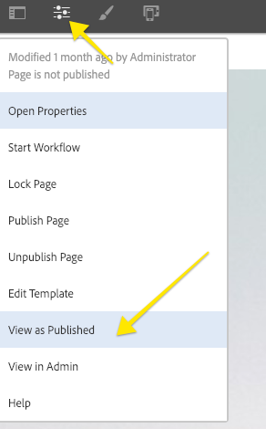

# 로컬 AEM 개발 환경 설정

AEM, Adobe Experience Manager의 로컬 개발 설정 가이드 로컬 설치, Apache Maven, 통합 개발 환경 및 디버깅/문제 해결에 대한 중요한 주제를 다룹니다. 개발 **[!DNL Eclipse IDE],[!DNL CRXDE Lite]및[!DNL Visual Studio Code]관련[!DNL IntelliJ]** 논의

## 개요

Adobe Experience Manager과 AEM용으로 개발할 때는 로컬 개발 환경을 설정하는 것이 첫 번째 단계입니다. 작업 생산성을 높이고 보다 나은 코드를 보다 신속하게 작성할 수 있도록 품질 개발 환경을 설정하는 데 시간을 할애할 수 있습니다. AEM 로컬 개발 환경을 4개 영역으로 나눌 수 있습니다.

* 로컬 AEM 인스턴스
* [!DNL Apache Maven] 프로젝트
* IDE(Integrated Development Environment)
* 문제 해결

## 로컬 AEM 인스턴스 설치

로컬 AEM 인스턴스를 참조하면 개발자의 개인 컴퓨터에서 실행 중인 Adobe Experience Manager의 사본에 대해 이야기하고 있습니다. ***모든*** AEM 개발은 로컬 AEM 인스턴스에 대해 코드를 작성하고 실행하여 시작해야 합니다.

AEM을 처음 사용하는 경우 두 가지 기본 실행 모드를 설치할 수 있습니다. ***작성*** 및 ***게시***. 작성 ****** [실행](https://helpx.adobe.com/experience-manager/6-5/sites/deploying/using/configure-runmodes.html) 모드는 디지털 마케터가 컨텐츠를 만들고 관리하는 데 사용하는 환경입니다. 개발 **시간** 중 가장 많은 시간을 개발하면 작성 인스턴스에 코드를 배포하게 됩니다. 구성 요소를 추가 및 구성할 수 있을 뿐만 아니라 새 페이지를 만들 수도 있습니다. AEM Sites은 WYSIWYG 작성 CMS이므로 대부분의 CSS와 JavaScript를 저작 인스턴스에서 테스트할 수 있습니다.

또한 로컬 게시 인스턴스에 대해 *중요한* 테스트 ***코드이기도*** 합니다. 게시 ****** 인스턴스는 웹 사이트 방문자가 상호 작용할 AEM 환경입니다. 게시 ****** 인스턴스는 ***작성자*** 인스턴스와 동일한 기술 스택이지만 구성 및 권한에 몇 가지 주요 차이점이 있습니다. 코드는 *항상* 로컬 ***게시*** 인스턴스에 대해 테스트되어야 더 높은 수준 환경으로 승격됩니다.

### 단계

1. Java [가](https://downloads.experiencecloud.adobe.com/content/software-distribution/en/general.html) 설치되어 있는지 확인합니다.
   * AEM [6.5+용 Java JDK 11](https://experience.adobe.com/#/downloads/content/software-distribution/en/general.html?1_group.propertyvalues.property=.%2Fjcr%3Acontent%2Fmetadata%2Fdc%3AssoftwareType&amp;1_group.propertyvalues.operation=equals&amp;1_group.propertyvalues.0_values=software-type%3Atoting&amp;orderby=%40jcr%2Fjcr%3AlastModified&amp;orderby.sort=desc&amp;layout=list&amp;p.offset=0&amp;p.limit=14) 선호
   * [AEM 6.5 이전 AEM용 Java JDK 8](https://www.oracle.com/technetwork/java/javase/downloads/index.html#JDK8)
2. AEM [QuickStart Jar 및 a를 [!DNL license.properties]](https://helpx.adobe.com/experience-manager/6-5/sites/deploying/using/deploy.html#GettingtheSoftware)다운로드합니다.
3. 다음과 같이 컴퓨터에 폴더 구조를 만듭니다.

   ```plain
   ~/aem-sdk
       /author
       /publish
   ```

4. JAR의 이름을 [!DNL QuickStart] aem-author-p4502.jar ***로 변경하고*** `/author` 디렉토리 아래에 배치합니다. 디렉토리 아래에 ***[!DNL license.properties]*** 파일을 `/author` 추가합니다.
5. JAR를 복사하고 이름을 [!DNL QuickStart] aem-publish-p4503.jar ***로 변경하여*** `/publish` 디렉토리 아래에 배치합니다. 디렉토리 아래에 파일 ***[!DNL license.properties]*** 복사본을 `/publish` 추가합니다.

   ```plain
   ~/aem-sdk
       /author
           + aem-author-p4502.jar
           + license.properties
       /publish
           + aem-publish-p4503.jar
           + license.properties
   ```

6. aem-author- ***p4502.jar*** 파일을 두 번 클릭하여 **작성자 인스턴스를** 설치합니다. 로컬 컴퓨터의 포트 **4502에서** 실행되는 작성자 인스턴스가 시작됩니다.

   aem-publish-p ***4503.jar*** 파일을 두 번 클릭하여 **게시 인스턴스를** 설치합니다. 로컬 컴퓨터의 포트 **4503에서 실행되는 게시** 인스턴스가 시작됩니다.

   >[!NOTE]
   >
   >개발 시스템의 하드웨어에 따라 동시에 **작성자 및 게시** 인스턴스를 실행하는 것은 어려울 수 있습니다. 로컬 설정에서 두 가지 모두를 동시에 실행할 필요가 거의 없습니다.

   자세한 내용은 AEM 인스턴스 [배포 및 유지 관리를 참조하십시오](https://helpx.adobe.com/kr/experience-manager/6-5/sites/deploying/using/deploy.html).

## Apache Maven 설치

***[!DNL Apache Maven]*** 은 Java 기반 프로젝트에 대한 빌드 및 배포 절차를 관리하는 도구입니다. AEM은 Java 기반 플랫폼이며 AEM 프로젝트의 코드 [!DNL Maven] 를 관리하는 표준 방법입니다. AEM ***Maven 프로젝트*** 또는 ***AEM 프로젝트***&#x200B;라고 하는 경우 Adobe는 사이트에 대한 모든 *사용자 지정* 코드를 포함하는 Maven 프로젝트를참조합니다.

모든 AEM 프로젝트는 최신 버전의 Flash Player에서 구현되어야 합니다. **[!DNL AEM Project Archetype]**[ https://github.com/Adobe-Marketing-Cloud/aem-project-archetype](https://github.com/Adobe-Marketing-Cloud/aem-project-archetype). 이 [!DNL AEM Project Archetype] 는 일부 샘플 코드와 컨텐츠로 AEM 프로젝트의 부트스트랩을 만듭니다. 이 [!DNL AEM Project Archetype] 에는 프로젝트에서 사용할 수 있도록 구성된 **[!DNL AEM WCM Core Components]** 기능도 포함되어 있습니다.

>[!CAUTION]
>
>새로운 프로젝트를 시작할 때는 최신 버전의 원형형을 사용하는 것이 좋습니다. 원형의 여러 버전이 있고 모든 버전이 AEM의 이전 버전과 호환되지 않는다는 점을 염두에 두십시오.

### 단계

1. Apache [Maven 다운로드](https://maven.apache.org/download.cgi)
2. Apache [Maven을](https://maven.apache.org/install.html) 설치하고 명령줄 `PATH`에 설치가 추가되었는지 확인합니다.
   * [!DNL macOS] Homebrew를 사용하여 Maven을 설치할 수 [있음](https://brew.sh/)
3. 새 명령줄 터미널 **[!DNL Maven]** 을 열고 다음을 실행하여 설치되었는지 확인합니다.

   ```shell
   $ mvn --version
   Apache Maven 3.3.9
   Maven home: /Library/apache-maven-3.3.9
   Java version: 1.8.0_111, vendor: Oracle Corporation
   Java home: /Library/Java/JavaVirtualMachines/jdk1.8.0_111.jdk/Contents/Home/jre
   Default locale: en_US, platform encoding: UTF-8
   ```

4. 마스터 빌드 프로세스에 자동으로 추가되도록 **[!DNL adobe-public]**[!DNL Maven][ settings.xml](https://maven.apache.org/settings.html) 파일 **[!DNL repo.adobe.com]** 에 프로필을 추가합니다.

5. 이름이 없는 파일 `settings.xml` 을 `~/.m2/settings.xml` 만듭니다.

6. 여기 **[!DNL adobe-public]** 지침에 따라 `settings.xml` 파일에 프로필 [을 추가합니다](https://repo.adobe.com/).

   샘플 `settings.xml` 은 아래에 나와 있습니다. *참고: 사용자 디렉토리 아래`settings.xml`의 이름 지정 규칙과 위치`.m2`가 중요합니다.*

   ```xml
   <settings xmlns="https://maven.apache.org/SETTINGS/1.0.0"
     xmlns:xsi="https://www.w3.org/2001/XMLSchema-instance"
     xsi:schemaLocation="https://maven.apache.org/SETTINGS/1.0.0
                         https://maven.apache.org/xsd/settings-1.0.0.xsd">
   <profiles>
    <!-- ====================================================== -->
    <!-- A D O B E   P U B L I C   P R O F I L E                -->
    <!-- ====================================================== -->
        <profile>
            <id>adobe-public</id>
            <activation>
                <activeByDefault>true</activeByDefault>
            </activation>
            <properties>
                <releaseRepository-Id>adobe-public-releases</releaseRepository-Id>
                <releaseRepository-Name>Adobe Public Releases</releaseRepository-Name>
                <releaseRepository-URL>https://repo.adobe.com/nexus/content/groups/public</releaseRepository-URL>
            </properties>
            <repositories>
                <repository>
                    <id>adobe-public-releases</id>
                    <name>Adobe Public Repository</name>
                    <url>https://repo.adobe.com/nexus/content/groups/public</url>
                    <releases>
                        <enabled>true</enabled>
                        <updatePolicy>never</updatePolicy>
                    </releases>
                    <snapshots>
                        <enabled>false</enabled>
                    </snapshots>
                </repository>
            </repositories>
            <pluginRepositories>
                <pluginRepository>
                    <id>adobe-public-releases</id>
                    <name>Adobe Public Repository</name>
                    <url>https://repo.adobe.com/nexus/content/groups/public</url>
                    <releases>
                        <enabled>true</enabled>
                        <updatePolicy>never</updatePolicy>
                    </releases>
                    <snapshots>
                        <enabled>false</enabled>
                    </snapshots>
                </pluginRepository>
            </pluginRepositories>
        </profile>
   </profiles>
    <activeProfiles>
        <activeProfile>adobe-public</activeProfile>
    </activeProfiles>
   </settings>
   ```

7. 다음 명령을 실행하여 **adobe-public** 프로필이 활성 상태인지 확인합니다.

   ```shell
   $ mvn help:effective-settings
   ...
   <activeProfiles>
       <activeProfile>adobe-public</activeProfile>
   </activeProfiles>
   <pluginGroups>
       <pluginGroup>org.apache.maven.plugins</pluginGroup>
       <pluginGroup>org.codehaus.mojo</pluginGroup>
   </pluginGroups>
   </settings>
   [INFO] ------------------------------------------------------------------------
   [INFO] BUILD SUCCESS
   [INFO] ------------------------------------------------------------------------
   [INFO] Total time:  0.856 s
   ```

   Adobe 보고서가 파일에서 제대로 참조되지 **[!DNL adobe-public]** 않는다는 것을 나타내는 `~/.m2/settings.xml` 것입니다. 이전 단계를 다시 방문하여 settings.xml 파일이 Adobe 보고서를 참조하는지 확인하십시오.

## 통합 개발 환경 설정

통합 개발 환경 또는 IDE는 텍스트 편집기, 구문 지원 및 빌드 도구가 통합된 애플리케이션입니다. 개발 유형에 따라 IDE가 다른 IDE보다 더 선호될 수 있습니다. IDE에 상관없이 코드를 테스트하기 위해 로컬 AEM 인스턴스에 ***코드를*** 정기적으로 푸시할 수 있어야 합니다. 또한 Git과 같은 소스 제어 관리 시스템으로 ***유지하기 위해 로컬 AEM 인스턴스에서 AEM 프로젝트로 구성을 가져오는*** 것도 중요합니다.

다음은 로컬 AEM 인스턴스와의 통합을 보여주는 해당 비디오와 함께 AEM 개발에 사용되는 가장 많이 사용되는 IDE 중 일부입니다.

### [!DNL Eclipse] IDE

IDE **[[!DNL Eclipse] 는](https://www.eclipse.org/ide/)** 오픈 소스와 ***무료***&#x200B;솔루션이므로 IDE는 Java 개발 시 가장 널리 사용되는 IDE 중 하나입니다. Adobe은 코드 **[를 로컬 AEM 인스턴스와 동기화하는 멋진 GUI를 사용하여 쉽게 개발할 수 있도록 해주는 플러그인([!DNL AEM Developer Tools]](https://eclipse.adobe.com/aem/dev-tools/)**[!DNL Eclipse] )을 제공합니다. GUI를 통해 [!DNL Eclipse] AEM을 처음 사용하는 개발자는 IDE를 사용하는 것이 좋습니다 [!DNL AEM Developer Tools].

#### 설치 및 설정

1. 다음 용도로 [!DNL Eclipse] IDE를 다운로드하여 설치합니다 [!DNL Java EE Developers]. [https://www.eclipse.org](https://www.eclipse.org/)
1. 지침에 따라 플러그인을 [!DNL AEM Developer Tools] 설치합니다. [https://eclipse.adobe.com/aem/dev-tools/](https://eclipse.adobe.com/aem/dev-tools/)

>[!VIDEO](https://video.tv.adobe.com/v/25906?quality=12&learn=on)

* 00:30 - Maven 프로젝트 가져오기
* 01:24 - Maven을 사용하여 소스 코드 작성 및 배포
* 04:33 - AEM 개발자 도구를 사용한 푸시 코드 변경
* 10:55 - AEM 개발자 도구를 사용하여 코드 변경 내용 가져오기
* 13:12 - Eclipse의 통합 디버깅 도구 사용

### IntelliJ IDEA

IntelliJ **[IDEA는](https://www.jetbrains.com/idea/)** 전문적인 Java 개발을 위한 강력한 IDE입니다. [!DNL IntelliJ IDEA] 두 가지 버전, ***무료*** 에디션 [!DNL Community] 및 상업용(유료) [!DNL Ultimate] 버전으로 제공됩니다. 무료 [!DNL Community] 버전은 더 많은 AEM 개발 [!DNL IntellIJ IDEA] 을 위해 충분하지만 기능 세트를 [!DNL Ultimate][확장시켜 줍니다](https://www.jetbrains.com/idea/download).

#### [!DNL Installation and Setup]

1. 다음을 다운로드하여 설치합니다 [!DNL IntelliJ IDEA]. [https://www.jetbrains.com/idea/download](https://www.jetbrains.com/idea/download)
1. 설치 [!DNL Repo] (명령줄 도구): [https://github.com/Adobe-Marketing-Cloud/tools/tree/master/repo](https://github.com/Adobe-Marketing-Cloud/tools/tree/master/repo#installation)

>[!VIDEO](https://video.tv.adobe.com/v/26089/?quality=12&learn=on)

* 00:00 - Maven 프로젝트 가져오기
* 05:47 - Maven을 사용하여 소스 코드 작성 및 배포
* 08:17 - Repo를 사용한 푸시 변경
* 14:39 - 르보를 사용하여 변경 내용 가져오기
* 17:25 - IntelliJ IDEA의 통합 디버깅 도구 사용

### [!DNL Visual Studio Code]

**[Visual Studio 코드](https://code.visualstudio.com/)** 는 향상된 JavaScript 지원 ***및 브라우저 디버깅 지원을 통해*** 프런트 엔드 개발자에게 [!DNL Intellisense]가장 많이 사용되는 툴이되었습니다. **[!DNL Visual Studio Code]** 은 다양한 강력한 확장 기능을 통해 무료로 오픈 소스로 제공됩니다. [!DNL Visual Studio Code] aem과 Adobe 도구, **[repo를 통합하도록 설정할 수 있습니다](https://github.com/Adobe-Marketing-Cloud/tools/tree/master/repo#integration-into-visual-studio-code).** 또한 AEM과 통합하기 위해 설치할 수 있는 커뮤니티에서 지원되는 여러 익스텐션이 있습니다.

[!DNL Visual Studio Code] 은 AEM 클라이언트 라이브러리를 만들기 위해 주로 CSS/LESS 및 JavaScript 코드를 작성할 프런트 엔드 개발자에게 적합합니다. 노드 정의(대화 상자, 구성 요소)는 모두 Raw XML로 편집해야 하므로 이 도구는 새 AEM 개발자에게 가장 적합한 선택이 아닐 수 있습니다. 몇 가지 Java 확장 기능을 사용할 수 있지만, 주로 Java 개발 [!DNL Visual Studio Code]을 수행하거나 기본 [!DNL Eclipse IDE] 을 사용할 [!DNL IntelliJ] 수도 있습니다.

#### 중요 링크

* [**Visual**](https://code.visualstudio.com/Download) **Studio 코드 다운로드**
* **[repo](https://github.com/Adobe-Marketing-Cloud/tools/tree/master/repo#integration-into-visual-studio-code)** - JCR 컨텐츠용 FTP 좋아요 도구
* **[aemfed](https://aemfed.io/)** - AEM 프런트 엔드 워크플로우 가속화
* **[AEM Sync](https://marketplace.visualstudio.com/items?itemName=Yinkai15.aemsync)** - Visual Studio 코드를 위한 커뮤니티 지원* 확장

>[!VIDEO](https://video.tv.adobe.com/v/25907?quality=12&learn=on)

* 00:30 - Maven 프로젝트 가져오기
* 00:53 - Maven을 사용하여 소스 코드 작성 및 배포
* 04:03 - 보고서 명령줄 도구를 사용한 푸시 코드 변경
* 08:29 - 보고서 명령줄 도구를 사용하여 코드 변경 내용 가져오기
* 10:40 - aemfed 도구를 사용하여 코드 변경 내용 푸시
* 14:24 - 문제 해결, 클라이언트 라이브러리 다시 구성

### [!DNL CRXDE Lite]

[CRXDE Lite](https://helpx.adobe.com/experience-manager/6-4/sites/developing/using/developing-with-crxde-lite.html) 는 AEM 저장소의 브라우저 기반 보기입니다. [!DNL CRXDE Lite] 는 AEM에 포함되어 있으므로 개발자는 파일 편집, 구성 요소, 대화 상자 및 템플릿과 같은 표준 개발 작업을 수행할 수 있습니다. [!DNL CRXDE Lite] 은 ***완전한 개발 환경이 아니라*** 디버깅 도구로 매우 효과적입니다. [!DNL CRXDE Lite] 는 코드 기준 이외의 제품 코드를 확장하거나 간단히 이해할 때 유용합니다. [!DNL CRXDE Lite] 저장소에 대한 강력한 뷰와 권한을 효과적으로 테스트 및 관리하는 방법을 제공합니다.

[!DNL CRXDE Lite] 코드를 테스트 및 디버그하기 위해 항상 다른 IDE와 함께 사용해야 하지만 기본 개발 도구로는 사용하지 말아야 합니다. 구문 지원이 제한되고 자동 완성 기능이 없으며 소스 제어 관리 시스템과의 통합이 제한됩니다.

>[!VIDEO](https://video.tv.adobe.com/v/25917?quality=12&learn=on)

## 문제 해결

***도움말!*** 코드가 작동하지 않습니다. 모든 개발 과정처럼 코드가 예상대로 작동하지 않는 경우가 종종 있습니다(아마도 많음). AEM은 강력한 플랫폼이지만 강력한 성능을 갖춘 복잡한 플랫폼입니다. 다음은 문제 해결 및 추적 시 몇 가지 높은 수준의 시작 지점입니다(하지만 실패할 수 있는 몇 가지 전체 목록은 아님).

### 코드 배포 확인

문제가 발생할 경우 첫 번째 단계는 코드가 성공적으로 배포되어 AEM에 설치되었는지 확인하는 것입니다.

1. **패키지[!UICONTROL 관리자를]** 확인하여 코드 패키지가 업로드되고 설치되었는지 확인합니다. [http://localhost:4502/crx/packmgr/index.jsp](http://localhost:4502/crx/packmgr/index.jsp). 최근에 패키지가 설치되었는지 타임스탬프를 확인하십시오.
1. 또는 [!DNL Repo] 와 같은 도구를 사용하여 증분 파일 업데이트 [!DNL AEM Developer Tools]를 수행하는 경우 파일이 로컬 AEM 인스턴스로 푸시되었고 파일 내용이 업데이트되었는지 **[!DNL CRXDE Lite]** 확인하십시오. [http://localhost:4502/crx/de/index.jsp](http://localhost:4502/crx/de/index.jsp)
1. **OSGi 번들의 Java 코드와 관련된 문제가 발견되면 번들이 업로드되었는지** 확인하십시오. Open the [!UICONTROL Adobe Experience Manager Web Console]: [http://localhost:4502/system/console/bundles](http://localhost:4502/system/console/bundles) 번들을 검색하고 찾아보십시오. 번들의 상태가 **[!UICONTROL 활성]** 상태인지 확인합니다. 번들 문제 해결과 관련된 자세한 내용은 **[!UICONTROL 설치]** 상태를 참조하십시오.

#### 로그 확인

AEM은 채팅 플랫폼이며 **error.log에 많은 유용한 정보를 기록합니다**. AEM이 설치된 **위치에서 error.log** 를 찾을 수 있습니다.&lt; `aem-installation-folder>/crx-quickstart/logs/error.log`.

문제를 추적하는 유용한 방법은 Java 코드에 로그 문을 추가하는 것입니다.

```java
import org.slf4j.Logger;
import org.slf4j.LoggerFactory;
...

public class MyClass {
    private final Logger log = LoggerFactory.getLogger(getClass());

    ...

    String myVariable = "My Variable";

    log.debug("Debug statement of myVariable {}", myVariable);

    log.info("Info statement of myVariable {}", myVariable);
}
```

기본적으로 **error.log** 는 로그 *[!DNL INFO]* 명령문을 포함하도록 구성됩니다. 로그 수준을 변경하려면 [!UICONTROL 로그 지원으로 이동합니다]. [http://localhost:4502/system/console/slinglog](http://localhost:4502/system/console/slinglog). 또한 **error.log가 너무** 수다하다는 것을 알 수 있습니다. 로그 지원 [!UICONTROL 을] 사용하여 지정된 Java 패키지에만 대한 로그 문을 구성할 수 있습니다. 사용자 지정 코드 문제를 OOTB AEM 플랫폼 문제와 쉽게 구분하기 위해 프로젝트에 가장 좋은 방법입니다.


#### 번들이 설치됨 상태입니다. {#bundle-active}

모든 번들(조각 제외)은 **[!UICONTROL 활성]** 상태여야 합니다. 코드 번들이 [!UICONTROL 설치됨] 상태로 표시되는 경우 해결해야 할 문제가 있습니다. 대부분의 경우 종속성 문제가 있습니다.


위 스크린샷에서 이 [!DNL WKND Core bundle] 는 [!UICONTROL 설치됨] 상태입니다. 이는 번들이 AEM 인스턴스에서 사용할 수 있는 버전과 다른 버전이 `com.adobe.cq.wcm.core.components.models` 필요하기 때문입니다.

사용할 수 있는 유용한 도구는 [!UICONTROL 종속성 파인더입니다]. [http://localhost:4502/system/console/depfinder](http://localhost:4502/system/console/depfinder). AEM 인스턴스에서 사용 가능한 버전을 검사하려면 Java 패키지 이름을 추가합니다.


위의 예에서 AEM 인스턴스에 설치된 버전이 **12.2** 와 번들에 필요한 **12.6** 버전임을 확인할 수 있습니다. 여기서 역방향으로 작업하고 AEM에 대한 [!DNL Maven] 종속성이 AEM 프로젝트의 [!DNL Maven] 종속성과 일치하는지 확인할 수 있습니다. 위의 예에서 [!DNL Core Components]**v2.2.0** 은 AEM 인스턴스에 설치되지만 코드 번들은 **v2.2.2**&#x200B;에 대한 종속성을 사용하여 빌드되었기 때문에 종속성 문제가 발생했습니다.

#### Sling 모델 등록 확인 {#osgi-component-sling-models}

AEM 구성 요소는 항상 비즈니스 로직을 캡슐화하고 HTL 렌더링 스크립트 [!DNL Sling Model] 를 깔끔하게 유지하도록 해야 합니다. Sling Model을 찾을 수 없는 문제가 발생하는 경우 콘솔에서 [!DNL Sling Models] 를 확인하는 것이 도움이 될 수 있습니다. [http://localhost:4502/system/console/status-slingmodels](http://localhost:4502/system/console/status-slingmodels). 그러면 Sling 모델이 등록되었는지 및 어떤 리소스 유형(구성 요소 경로)이 연결되어 있는지 알 수 있습니다.


구성 요소 리소스 유형 [!DNL Sling Model]에 연결되어 `BylineImpl` 있는 A의 등록을 보여줍니다 `wknd/components/content/byline`.

#### CSS 또는 JavaScript 문제

대부분의 CSS 및 JavaScript 문제에 대해 브라우저의 개발 도구를 사용하는 것이 문제를 해결하는 가장 효과적인 방법입니다. AEM 작성자 인스턴스에 대해 개발 시 문제를 좁히려면 &quot;게시됨&quot;으로 페이지를 보는 것이 유용합니다.



페이지 [!UICONTROL 속성] 메뉴를 열고 [!UICONTROL 게시됨으로 보기를 클릭합니다]. 이렇게 하면 AEM 편집기 없이 페이지가 열리고 쿼리 매개 변수가 wcmmode=disabled로 **설정됩니다**. 이렇게 하면 AEM 작성 UI가 효과적으로 비활성화되고 문제 해결/디버깅 프런트 엔드 문제가 훨씬 쉬워집니다.

프런트 엔드 코드를 개발할 때 자주 발생하는 또 다른 문제는 오래된 CSS/JS가 로드되고 있는 것입니다. 첫 번째 단계로, 브라우저 내역이 지워졌는지 확인하고 필요한 경우 익명 브라우저 또는 새 세션을 시작합니다.

#### 클라이언트 라이브러리 디버깅

여러 가지 카테고리 방법과 여러 클라이언트 라이브러리를 포함할 때 문제를 해결하는 데 어려움이 있을 수 있습니다. AEM은 이 문제를 해결하는 데 도움이 되는 여러 도구를 제공합니다. 가장 중요한 도구 중 하나는 [!UICONTROL AEM에서 LESS 파일을 다시 컴파일하고 CSS를 생성하게 하는 클라이언트 라이브러리] 재구축입니다.

* [덤프 라이브러리](http://localhost:4502/libs/granite/ui/content/dumplibs.html) - AEM 인스턴스에 등록된 모든 클라이언트 라이브러리를 나열합니다. &lt;host>/libs/granite/ui/content/dumplibs.html
* [테스트 출력](http://localhost:4502/libs/granite/ui/content/dumplibs.test.html) - 사용자가 카테고리를 기반으로 clientlib의 예상 HTML 출력을 볼 수 있습니다. &lt;host>/libs/granite/ui/content/dumplibs.test.html
* [라이브러리 종속성 유효성 검사](http://localhost:4502/libs/granite/ui/content/dumplibs.validate.html) - 찾을 수 없는 모든 종속성 또는 포함된 카테고리를 강조 표시합니다. &lt;host>/libs/granite/ui/content/dumplibs.validate.html
* [클라이언트 라이브러리](http://localhost:4502/libs/granite/ui/content/dumplibs.rebuild.html) 다시 구성 - 사용자가 AEM에서 모든 클라이언트 라이브러리를 다시 빌드하거나 클라이언트 라이브러리의 캐시를 무효화할 수 있도록 합니다. 이 도구는 AEM에서 생성된 CSS를 다시 컴파일할 수 있으므로 LESS로 개발 시 특히 효과적입니다. 일반적으로 캐시를 무효화한 다음 모든 라이브러리를 재구성하는 대신 페이지 새로 고침을 수행하는 것이 더 효과적입니다. &lt;host>/libs/granite/ui/content/dumplibs.rebuild.html


>[!NOTE]
>
>클라이언트 라이브러리 [!UICONTROL 다시 작성] 도구를 사용하여 캐시를 계속 무효화해야 하는 경우 모든 클라이언트 라이브러리를 한 번 다시 구성하는 것이 더 좋을 수 있습니다. 이 경우 약 15분 정도 걸릴 수 있지만, 일반적으로 나중에 캐싱 문제가 해결됩니다.
