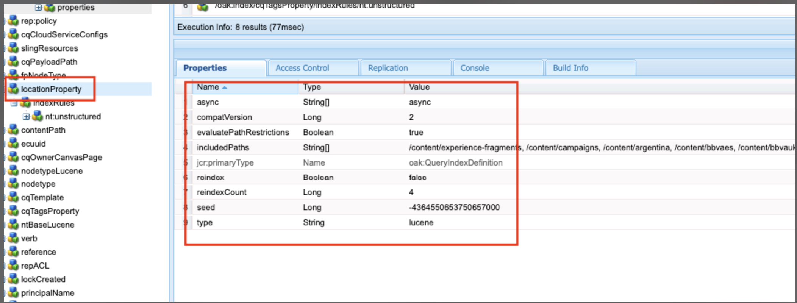

# AEM의 색인 지정 모범 사례

Adobe Experience Manager(AEM)의 색인 지정 모범 사례에 대해 알아봅니다. Apache [잭래빗 오크](https://jackrabbit.apache.org/oak/docs/query/query.html) 는 AEM에서 컨텐츠 검색을 지원하며 주요 사항은 다음과 같습니다.

- 기본적으로 AEM은 검색 및 쿼리 기능을 지원하는 다양한 인덱스(예: )를 제공합니다 `damAssetLucene`, `cqPageLucene` 등.
- 모든 인덱스 정의는 아래의 저장소에 저장됩니다. `/oak:index` 노드.
- AEM as a Cloud Service은 Oak Lucene 인덱스만 지원합니다.
- 인덱스 구성은 AEM 프로젝트 코드베이스에서 관리되고 Cloud Manager CI/CD 파이프라인을 사용하여 배포되어야 합니다.
- 제공된 쿼리에 대해 여러 인덱스를 사용할 수 있는 경우 **예상 비용이 가장 낮은 색인이 사용됩니다.**.
- 지정된 쿼리에 사용할 수 있는 색인이 없을 경우 일치하는 콘텐츠를 찾기 위해 콘텐츠 트리를 이동합니다. 단, 기본 제한은 `org.apache.jackrabbit.oak.query.QueryEngineSettingsService` 는 10,000개의 노드만 트래버스합니다.
- 쿼리 결과는 다음과 같습니다 **마지막으로 필터링됨** 현재 사용자가 읽기 액세스 권한을 보유하는지 확인합니다. 즉, 쿼리 결과가 인덱싱된 노드의 수보다 작을 수 있습니다.
- 색인 정의 변경 후 저장소를 다시 색인화하려면 시간이 필요하며 저장소 크기에 따라 다릅니다.

AEM 인스턴스의 성능에 영향을 주지 않는 효율적이고 올바른 검색 기능을 사용하려면 색인화 모범 사례를 이해하는 것이 중요합니다.

## 사용자 지정 인덱스 및 OOTB 인덱스

경우에 따라 검색 요구 사항을 지원하도록 사용자 정의 색인을 만들어야 합니다. 단, 사용자 지정 색인을 생성하기 전에 아래 지침을 따르십시오.

- 검색 요구 사항을 이해하고 OOTB 인덱스가 검색 요구 사항을 지원할 수 있는지 확인합니다. 사용 **쿼리 성능 도구**, 사용 가능한 위치: [로컬 SDK](http://localhost:4502/libs/granite/operations/content/diagnosistools/queryPerformance.html) Developer Console을 통해 또는 AEM CS `https://author-pXXXX-eYYYY.adobeaemcloud.com/ui#/aem/libs/granite/operations/content/diagnosistools/queryPerformance.html?appId=aemshell`.

- 최적의 쿼리를 정의하고 [쿼리 최적화](https://experienceleague.adobe.com/docs/experience-manager-cloud-service/content/operations/query-and-indexing-best-practices.html?#optimizing-queries) 순서도 및 [JCR 쿼리 치트 시트](https://experienceleague.adobe.com/docs/experience-manager-65/assets/JCR_query_cheatsheet-v1.1.pdf?lang=en) 참조하십시오.

- OOTB 인덱스가 검색 요구 사항을 지원할 수 없는 경우 두 가지 옵션이 있습니다. 그러나 다음을 검토하십시오. [효율적인 인덱스 생성 팁](https://experienceleague.adobe.com/docs/experience-manager-65/content/implementing/deploying/practices/best-practices-for-queries-and-indexing.html?#should-i-create-an-index)
   - OOTB 인덱스 사용자 정의: 유지 관리 및 업그레이드가 용이하여 선호하는 옵션.
   - 완전히 맞춤화된 색인: 위의 옵션이 작동하지 않는 경우에만 해당됩니다.

### OOTB 인덱스 사용자 지정

- 위치 **AEMCS**, OOTB 인덱스 사용 사용자 지정 시 **\&lt;ootbindexname>-\&lt;productversion>-custom-\&lt;customversion>** 명명 규칙. 예를 들어, `cqPageLucene-custom-1` 또는 `damAssetLucene-8-custom-1`. 이렇게 하면 OOTB 색인이 업데이트될 때마다 사용자 지정된 색인 정의를 병합하는 데 도움이 됩니다. 다음을 참조하십시오 [기본 제공 색인 변경](https://experienceleague.adobe.com/docs/experience-manager-cloud-service/content/operations/indexing.html?#changes-to-out-of-the-box-indexes) 을 참조하십시오.

- 위치 **AEM 6.X**, 위의 이름 지정 _작동하지 않음_, 그러나 의 추가 속성으로 OOTB 인덱스를 업데이트하기만 하면 됩니다. `indexRules` 노드.

- 항상 CRX DE 패키지 관리자(/crx/packmgr/)를 사용하여 AEM 인스턴스에서 최신 OOTB 인덱스 정의를 복사하고 이름을 변경한 다음 XML 파일 내에 사용자 지정을 추가합니다.

- 다음 위치에 AEM 프로젝트에 인덱스 정의 저장 `ui.apps/src/main/content/jcr_root/_oak_index` 및 Cloud Manager CI/CD 파이프라인을 사용하여 배포합니다. 다음을 참조하십시오 [사용자 정의 색인 정의 배포](https://experienceleague.adobe.com/docs/experience-manager-cloud-service/content/operations/indexing.html?#deploying-custom-index-definitions) 을 참조하십시오.

### 완전히 맞춤화된 색인

완전히 맞춤화된 색인을 만드는 것은 마지막 옵션이어야 하며 위의 옵션이 작동하지 않는 경우에만 가능합니다.

- 완전히 맞춤화된 색인을 만들 때 **\&lt;prefix>.\&lt;customindexname>-\&lt;version>-custom-\&lt;customversion>** 명명 규칙. 예, `wknd.adventures-1-custom-1`. 이렇게 하면 이름 지정 충돌을 방지하는 데 도움이 됩니다. 여기, `wknd` 는 접두사이고, `adventures` 는 사용자 정의 색인 이름입니다. 이 규칙은 AEM 6.X와 AEMCS 모두에 적용할 수 있으며 향후 AEMCS로의 마이그레이션을 준비하는 데 도움이 됩니다.

- AEMCS는 Lucene 인덱스만 지원하므로 향후 AEMCS로의 마이그레이션에 대비하려면 항상 Lucene 인덱스를 사용하십시오. 다음을 참조하십시오 [Lucene 인덱스 및 속성 인덱스 비교](https://experienceleague.adobe.com/docs/experience-manager-65/content/implementing/deploying/practices/best-practices-for-queries-and-indexing.html?#lucene-or-property-indexes) 을 참조하십시오.

- OOTB 인덱스와 동일한 노드 유형에 사용자 정의 인덱스를 생성하지 마십시오. 대신, 의 추가 속성을 사용하여 OOTB 인덱스를 맞춤화합니다. `indexRules` 노드. 예를 들어 `dam:Asset` 노드 유형(OOTB 사용자 정의) `damAssetLucene` 색인입니다. _이는 성능 및 기능 문제의 일반적인 근본 원인이었습니다_.

- 또한 예를 들어 여러 노드 유형을 추가하지 마십시오 `cq:Page` 및 `cq:Tag` 색인 지정 규칙(`indexRules`) 노드. 대신 각 노드 유형에 대해 별도의 인덱스를 만듭니다.

- 위의 섹션에서 언급했듯이 인덱스 정의를 다음 위치에 AEM 프로젝트에 저장합니다. `ui.apps/src/main/content/jcr_root/_oak_index` 및 Cloud Manager CI/CD 파이프라인을 사용하여 배포합니다. 다음을 참조하십시오 [사용자 정의 색인 정의 배포](https://experienceleague.adobe.com/docs/experience-manager-cloud-service/content/operations/indexing.html?#deploying-custom-index-definitions) 을 참조하십시오.

- 색인 정의 지침은 다음과 같습니다.
   - 노드 유형(`jcr:primaryType`)은 다음과 같아야 합니다. `oak:QueryIndexDefinition`
   - 색인 유형(`type`)은 다음과 같아야 합니다. `lucene`
   - 비동기 속성(`async`)은 다음과 같아야 합니다. `async,nrt`
   - 사용 `includedPaths` 및 방지 `excludedPaths` 속성. 항상 설정 `queryPaths` 값과 동일한 값: `includedPaths` 값.
   - 경로 제한을 적용하려면 다음을 사용하십시오 `evaluatePathRestrictions` 속성 및 설정 `true`.
   - 사용 `tags` 인덱스에 태그를 지정하고 쿼리하는 동안 색인을 사용하도록 이 태그 값을 지정합니다. 일반 쿼리 구문은 다음과 같습니다 `<query> option(index tag <tagName>)`.

  ```xml
  /oak:index/wknd.adventures-1-custom-1
      - jcr:primaryType = "oak:QueryIndexDefinition"
      - type = "lucene"
      - compatVersion = 2
      - async = ["async", "nrt"]
      - includedPaths = ["/content/wknd"]
      - queryPaths = ["/content/wknd"]
      - evaluatePathRestrictions = true
      - tags = ["customAdvSearch"]
  ...
  ```

### 예

모범 사례를 이해하기 위해 몇 가지 예를 살펴보겠습니다.

#### 태그 속성을 잘못 사용

아래 이미지는 사용자 정의 및 OOTB 인덱스 정의를 보여주며 `tags` 속성, 두 색인이 모두 동일하게 사용 `visualSimilaritySearch` 값.


##### Analysis

이는 을(를) 잘못 사용한 것입니다. `tags` 사용자 지정 인덱스의 속성입니다. Oak 쿼리 엔진은 가장 낮은 예상 비용의 OOTB 인덱스 원인에서 사용자 지정 인덱스를 선택합니다.

올바른 방법은 OOTB 인덱스를 사용자 지정하고 `indexRules` 노드. 다음을 참조하십시오 [OOTB 인덱스 맞춤화](#customize-the-ootb-index) 을 참조하십시오.

#### 다음에 대한 색인 `dam:Asset` 노드 유형

아래 이미지는 다음에 대한 사용자 지정 인덱스를 보여 줍니다. `dam:Asset` 이 있는 노드 유형 `includedPaths` 속성을 특정 경로로 설정합니다.


##### Analysis

Assets에 대해 omnisearch를 수행하면 사용자 지정 색인의 예상 비용이 낮아 잘못된 결과가 반환됩니다.

에서 사용자 정의 인덱스 만들기 안 함 `dam:Asset` 노드 유형(OOTB 사용자 정의) `damAssetLucene` 에서 추가 속성을 사용한 색인 `indexRules` 노드.

#### 인덱싱 규칙에 있는 여러 노드 유형

아래 이미지는 아래에 여러 노드 유형이 있는 사용자 지정 색인을 보여 줍니다. `indexRules` 노드.


##### Analysis

단일 인덱스에 여러 노드 유형을 추가하는 것은 권장되지 않지만, 노드 유형이 과 밀접한 관련이 있는 경우(예: ) 동일한 인덱스에 노드 유형을 인덱싱하는 것이 좋습니다. `cq:Page` 및 `cq:PageContent`.

유효한 솔루션은 OOTB를 사용자 정의하는 것입니다 `cqPageLucene` 및 `damAssetLucene` 색인, 기존 아래에 추가 속성 추가 `indexRules` 노드.

#### 부재 `queryPaths` 속성

아래 이미지는 없이 사용자 정의 인덱스(명명 규칙도 따르지 않음)를 보여 줍니다. `queryPaths` 속성.



##### Analysis

항상 설정 `queryPaths` 값과 동일한 값: `includedPaths` 값. 또한 경로 제한을 적용하려면 을 설정합니다. `evaluatePathRestrictions` 다음으로 속성: `true`.

#### 색인 태그로 쿼리

아래 이미지는 와 함께 사용자 정의 인덱스를 보여 줍니다. `tags` 속성 및 쿼리하는 동안 속성을 사용하는 방법입니다.


```
/jcr:root/content/dam//element(*,dam:Asset)[(jcr:content/@contentFragment = 'true' and jcr:contains(., '/content/sitebuilder/test/mysite/live/ja-jp/mypage'))]order by @jcr:created descending option (index tag assetPrefixNodeNameSearch)
```

##### Analysis

충돌하지 않고 올바른 설정을 수행하는 방법을 보여 줍니다. `tags` 인덱스의 속성 값을 사용하고 쿼리하는 동안 사용합니다. 일반 쿼리 구문은 다음과 같습니다 `<query> option(index tag <tagName>)`. 추가 정보 [쿼리 옵션 색인 태그](https://jackrabbit.apache.org/oak/docs/query/query-engine.html#query-option-index-tag)

#### 사용자 정의 색인

아래 이미지는 와 함께 사용자 정의 인덱스를 보여 줍니다. `suggestion` 고급 검색 기능을 수행하기 위한 노드입니다.


##### Analysis

에 대한 사용자 지정 인덱스를 만드는 올바른 사용 사례입니다. [고급 검색](https://jackrabbit.apache.org/oak/docs/query/lucene.html#advanced-search-features) 기능. 단, 인덱스 이름은 **\&lt;prefix>.\&lt;customindexname>-\&lt;version>-custom-\&lt;customversion>** 명명 규칙.


## 유용한 도구

색인을 정의, 분석 및 최적화하는 데 도움이 되는 몇 가지 도구를 검토해 보겠습니다.

### 색인 생성 도구

다음 [Oak 색인 정의 생성기](https://oakutils.appspot.com/generate/index) 도구 도움말 **색인 정의 생성하기** 입력 쿼리를 기반으로 합니다. 사용자 지정 색인을 만드는 좋은 시작점입니다.

### 색인 분석 도구

다음 [인덱스 정의 분석기](https://oakutils.appspot.com/analyze/index) 도구 도움말 **색인 정의 분석하기** 색인 정의를 개선하기 위한 권장 사항을 제공합니다.

### 쿼리 성능 도구

더 OOTB _쿼리 성능 도구_ 다음에서 사용 가능: [로컬 SDK](http://localhost:4502/libs/granite/operations/content/diagnosistools/queryPerformance.html) Developer Console을 통해 또는 AEM CS `https://author-pXXXX-eYYYY.adobeaemcloud.com/ui#/aem/libs/granite/operations/content/diagnosistools/queryPerformance.html?appId=aemshell` 도움말 **쿼리 성능을 분석하려면** 및 [JCR 쿼리 치트 시트](https://experienceleague.adobe.com/docs/experience-manager-65/assets/JCR_query_cheatsheet-v1.1.pdf?lang=en) 을 클릭하여 최적의 쿼리를 정의합니다.

### 문제 해결 도구 및 팁

아래 대부분은 AEM 6.X 및 로컬 문제 해결 목적으로 적용할 수 있습니다.

- 다음에서 사용 가능한 색인 관리자 `http://host:port/libs/granite/operations/content/diagnosistools/indexManager.html` 유형, 마지막 업데이트, 크기와 같은 색인 정보를 가져올 수 있습니다.

- Oak 쿼리 및 색인 관련 Java™ 패키지에 대한 자세한 로깅 예: `org.apache.jackrabbit.oak.plugins.index`, `org.apache.jackrabbit.oak.query`, 및 `com.day.cq.search` 경유 `http://host:port/system/console/slinglog` 문제 해결.

- 의 JMX MBean _IndexStats_ 사용 가능한 유형: `http://host:port/system/console/jmx` 비동기 인덱싱과 관련된 상태, 진행률 또는 통계와 같은 인덱스 정보를 가져올 수 있습니다. 또한 다음을 제공합니다 _FailingIndexStats_: 여기에 결과가 없으면 는 손상된 색인이 없음을 의미합니다. AsyncIndexerService는 30분(구성 가능) 동안 업데이트하지 못한 인덱스를 손상된 것으로 표시하고 인덱싱을 중지합니다. 쿼리에서 예상한 결과가 나오지 않는 경우 리인덱싱하는 것은 계산적으로 비싸고 시간이 많이 소요되므로 개발자가 리인덱싱을 진행하기 전에 이를 확인하는 것이 좋습니다.

- 의 JMX MBean _LuceneIndex_ 사용 가능한 유형: `http://host:port/system/console/jmx` 크기, 색인 정의당 문서 수 등 Lucene 색인 통계의 경우.

- 의 JMX MBean _QueryStat_ 사용 가능한 유형: `http://host:port/system/console/jmx` 쿼리, 실행 시간 등 세부 정보가 포함된 느리고 인기 있는 쿼리를 포함하는 Oak 쿼리 통계용.

## 추가 리소스

자세한 내용은 다음 설명서를 참조하십시오.

- [Oak 쿼리 및 색인 지정](https://experienceleague.adobe.com/docs/experience-manager-65/content/implementing/deploying/deploying/queries-and-indexing.html)
- [쿼리 및 색인화 모범 사례](https://experienceleague.adobe.com/docs/experience-manager-cloud-service/content/operations/query-and-indexing-best-practices.html)
- [쿼리 및 색인 생성에 대한 우수 사례](https://experienceleague.adobe.com/docs/experience-manager-65/content/implementing/deploying/practices/best-practices-for-queries-and-indexing.html)
