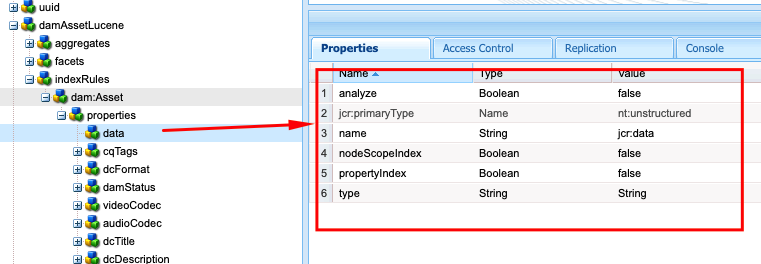

# AEM의 색인화 모범 사례

Adobe Experience Manager(AEM)의 색인 지정 모범 사례에 대해 알아봅니다. Apache [Jackrabbit Oak](https://jackrabbit.apache.org/oak/docs/query/query.html)은(는) AEM에서 컨텐츠 검색을 지원합니다. 핵심 사항은 다음과 같습니다.

- 기본적으로 AEM은 `damAssetLucene`, `cqPageLucene` 등과 같은 검색 및 쿼리 기능을 지원하는 다양한 인덱스를 제공합니다.
- 모든 인덱스 정의는 `/oak:index` 노드 아래의 저장소에 저장됩니다.
- AEM as a Cloud Service은 Oak Lucene 인덱스만 지원합니다.
- 인덱스 구성은 AEM 프로젝트 코드베이스에서 관리되고 Cloud Manager CI/CD 파이프라인을 사용하여 배포되어야 합니다.
- 지정된 쿼리에 여러 인덱스를 사용할 수 있는 경우 예상 비용이 가장 낮은 **인덱스가 사용됩니다**.
- 지정된 쿼리에 사용할 수 있는 색인이 없을 경우 일치하는 콘텐츠를 찾기 위해 콘텐츠 트리를 이동합니다. 그러나 `org.apache.jackrabbit.oak.query.QueryEngineSettingsService`을(를) 통한 기본 제한은 10,000개의 노드만 트래버스하는 것입니다.
- 쿼리 결과는 **마지막으로 필터링**&#x200B;되어 현재 사용자에게 읽기 권한이 있는지 확인합니다. 즉, 쿼리 결과가 인덱싱된 노드의 수보다 작을 수 있습니다.
- 색인 정의 변경 후 저장소를 다시 색인화하려면 시간이 필요하며 저장소 크기에 따라 다릅니다.

AEM 인스턴스의 성능에 영향을 주지 않는 효율적이고 올바른 검색 기능을 사용하려면 색인화 모범 사례를 이해하는 것이 중요합니다.

## 사용자 지정 인덱스 및 OOTB 인덱스

경우에 따라 검색 요구 사항을 지원하도록 사용자 정의 색인을 만들어야 합니다. 단, 사용자 지정 색인을 생성하기 전에 아래 지침을 따르십시오.

- 검색 요구 사항을 이해하고 OOTB 인덱스가 검색 요구 사항을 지원할 수 있는지 확인합니다. Developer Console 또는 `https://author-pXXXX-eYYYY.adobeaemcloud.com/ui#/aem/libs/granite/operations/content/diagnosistools/queryPerformance.html?appId=aemshell`을(를) 통해 [로컬 SDK](http://localhost:4502/libs/granite/operations/content/diagnosistools/queryPerformance.html) 및 AEMCS에서 사용할 수 있는 **쿼리 성능 도구**&#x200B;를 사용합니다.

- 최적의 쿼리를 정의하고 [쿼리 최적화](https://experienceleague.adobe.com/en/docs/experience-manager-cloud-service/content/operations/query-and-indexing-best-practices) 순서도와 [JCR 쿼리 치트 시트](https://experienceleague.adobe.com/docs/experience-manager-65/assets/JCR_query_cheatsheet-v1.1.pdf)를 참조하십시오.

- OOTB 인덱스가 검색 요구 사항을 지원할 수 없는 경우 두 가지 옵션이 있습니다. 그러나 효율적인 색인을 만들기 위한 [팁](https://experienceleague.adobe.com/ko/docs/experience-manager-65/content/implementing/deploying/practices/best-practices-for-queries-and-indexing)을 검토하십시오.
   - OOTB 인덱스 사용자 정의: 유지 관리 및 업그레이드가 용이하여 선호하는 옵션.
   - 완전히 맞춤화된 색인: 위의 옵션이 작동하지 않는 경우에만 해당됩니다.

### OOTB 인덱스 사용자 지정

- **AEMCS**&#x200B;에서 OOTB 인덱스를 사용자 지정할 때 **\&lt;OOTBIndexName>-\&lt;productVersion>-custom-\&lt;customVersion>** 명명 규칙을 사용합니다. 예: `cqPageLucene-custom-1` 또는 `damAssetLucene-8-custom-1`. 이렇게 하면 OOTB 색인이 업데이트될 때마다 사용자 지정된 색인 정의를 병합하는 데 도움이 됩니다. 자세한 내용은 [기본 제공 색인에 대한 변경 내용](https://experienceleague.adobe.com/ko/docs/experience-manager-cloud-service/content/operations/indexing)을 참조하세요.

- **AEM 6.X**&#x200B;에서 위의 이름 지정 _이(가) 작동하지 않습니다_. 그러나 `indexRules` 노드에서 필요한 속성으로 OOTB 인덱스를 업데이트하기만 하면 됩니다.

- 항상 CRX DE 패키지 관리자(/crx/packmgr/)를 사용하여 AEM 인스턴스에서 최신 OOTB 인덱스 정의를 복사하고 이름을 변경한 다음 XML 파일 내에 사용자 지정을 추가합니다.

- 인덱스 정의를 `ui.apps/src/main/content/jcr_root/_oak_index`의 AEM 프로젝트에 저장하고 Cloud Manager CI/CD 파이프라인을 사용하여 배포합니다. 자세한 내용은 [사용자 지정 인덱스 정의 배포](https://experienceleague.adobe.com/ko/docs/experience-manager-cloud-service/content/operations/indexing)를 참조하십시오.

### 완전히 맞춤화된 색인

완전히 맞춤화된 색인을 만드는 것은 마지막 옵션이어야 하며 위의 옵션이 작동하지 않는 경우에만 가능합니다.

- 전체 사용자 지정 인덱스를 만들 때 **\&lt;prefix>을(를) 사용합니다.\&lt;customIndexName>-\&lt;version>-custom-\&lt;customVersion>** 명명 규칙. 예, `wknd.adventures-1-custom-1`. 이렇게 하면 이름 지정 충돌을 방지하는 데 도움이 됩니다. 여기서 `wknd`은(는) 접두사이고 `adventures`은(는) 사용자 지정 인덱스 이름입니다. 이 규칙은 AEM 6.X와 AEMCS 모두에 적용할 수 있으며 향후 AEMCS로의 마이그레이션을 준비하는 데 도움이 됩니다.

- AEMCS는 Lucene 인덱스만 지원하므로 향후 AEMCS로의 마이그레이션에 대비하려면 항상 Lucene 인덱스를 사용하십시오. 자세한 내용은 [Lucene 인덱스 대 속성 인덱스](https://experienceleague.adobe.com/ko/docs/experience-manager-65/content/implementing/deploying/practices/best-practices-for-queries-and-indexing)를 참조하십시오.

- OOTB 인덱스와 동일한 노드 유형에 사용자 정의 인덱스를 생성하지 마십시오. 대신 `indexRules` 노드에서 필요한 속성으로 OOTB 인덱스를 사용자 지정합니다. 예를 들어 `dam:Asset` 노드 유형에 사용자 지정 인덱스를 만들지 말고 OOTB `damAssetLucene` 인덱스를 사용자 지정하십시오. _성능 및 기능 문제의 일반적인 근본 원인입니다_.

- 또한 인덱싱 규칙(`indexRules`) 노드 아래에 `cq:Page` 및 `cq:Tag`과 같은 여러 노드 형식을 추가하지 마십시오. 대신 각 노드 유형에 대해 별도의 인덱스를 만듭니다.

- 위의 섹션에서 설명한 대로 인덱스 정의를 `ui.apps/src/main/content/jcr_root/_oak_index`의 AEM 프로젝트에 저장하고 Cloud Manager CI/CD 파이프라인을 사용하여 배포합니다. 자세한 내용은 [사용자 지정 인덱스 정의 배포](https://experienceleague.adobe.com/ko/docs/experience-manager-cloud-service/content/operations/indexing)를 참조하십시오.

- 색인 정의 지침은 다음과 같습니다.
   - 노드 형식(`jcr:primaryType`)은 `oak:QueryIndexDefinition`이어야 합니다.
   - 인덱스 유형(`type`)은 `lucene`이어야 합니다.
   - 비동기 속성(`async`)은 `async,nrt`이어야 합니다.
   - `includedPaths`을(를) 사용하고 `excludedPaths` 속성을 사용하지 마십시오. 항상 `queryPaths` 값을 `includedPaths` 값과 동일한 값으로 설정하십시오.
   - 경로 제한을 적용하려면 `evaluatePathRestrictions` 속성을 사용하여 `true`(으)로 설정합니다.
   - `tags` 속성을 사용하여 인덱스에 태그를 지정하고 쿼리하는 동안 이 태그 값을 지정하여 인덱스를 사용하십시오. 일반 쿼리 구문은 `<query> option(index tag <tagName>)`입니다.

  ```xml
  /oak:index/wknd.adventures-1-custom-1
      - jcr:primaryType = "oak:QueryIndexDefinition"
      - type = "lucene"
      - compatVersion = 2
      - async = ["async", "nrt"]
      - includedPaths = ["/content/wknd"]
      - queryPaths = ["/content/wknd"]
      - evaluatePathRestrictions = true
      - tags = ["customAdvSearch"]
  ...
  ```

### 예

모범 사례를 이해하기 위해 몇 가지 예를 살펴보겠습니다.

#### 태그 속성을 잘못 사용

아래 이미지는 사용자 지정 및 OOTB 인덱스 정의를 보여 주며, `tags` 속성을 강조 표시하고 있습니다. 두 인덱스 모두 동일한 `visualSimilaritySearch` 값을 사용합니다.


##### Analysis

사용자 지정 인덱스에서 `tags` 속성을 잘못 사용했습니다. Oak 쿼리 엔진은 예상 비용이 가장 낮은 OOTB 인덱스 원인에서 사용자 지정 인덱스를 선택합니다.

올바른 방법은 OOTB 인덱스를 사용자 지정하고 `indexRules` 노드에 필요한 속성을 추가하는 것입니다. 자세한 내용은 [OOTB 인덱스 사용자 지정](#customize-the-ootb-index)을 참조하십시오.

#### `dam:Asset` 노드 유형의 인덱스

아래 이미지는 `includedPaths` 속성이 특정 경로로 설정된 `dam:Asset` 노드 유형에 대한 사용자 지정 인덱스를 보여 줍니다.


##### Analysis

Assets에서 omnisearch를 수행하는 경우 사용자 정의 색인의 예상 비용이 낮으므로 잘못된 결과가 반환됩니다.

`dam:Asset` 노드 유형에 사용자 지정 인덱스를 만들지 말고 `indexRules` 노드에서 필요한 속성으로 OOTB `damAssetLucene` 인덱스를 사용자 지정하십시오.

#### 인덱싱 규칙에 있는 여러 노드 유형

아래 이미지는 `indexRules` 노드 아래에 여러 노드 유형이 있는 사용자 지정 인덱스를 보여 줍니다.


##### Analysis

단일 인덱스에 여러 노드 유형을 추가하는 것은 권장되지 않지만 `cq:Page` 및 `cq:PageContent`과(와) 같이 노드 유형이 밀접한 관련이 있는 경우에는 동일한 인덱스에 노드 유형을 인덱싱해도 됩니다.

올바른 해결 방법은 OOTB `cqPageLucene` 및 `damAssetLucene` 인덱스를 사용자 지정하고 기존 `indexRules` 노드 아래에 필요한 속성을 추가하는 것입니다.

#### `queryPaths` 속성 없음

아래 이미지는 `queryPaths` 속성이 없는 사용자 지정 인덱스(명명 규칙도 따르지 않음)를 보여 줍니다.


##### Analysis

항상 `queryPaths` 값을 `includedPaths` 값과 동일한 값으로 설정하십시오. 또한 경로 제한을 적용하려면 `evaluatePathRestrictions` 속성을 `true`(으)로 설정하십시오.

#### 색인 태그로 쿼리

아래 이미지는 `tags` 속성이 있는 사용자 지정 인덱스 및 쿼리하는 동안 이 인덱스를 사용하는 방법을 보여 줍니다.


```
/jcr:root/content/dam//element(*,dam:Asset)[(jcr:content/@contentFragment = 'true' and jcr:contains(., '/content/sitebuilder/test/mysite/live/ja-jp/mypage'))]order by @jcr:created descending option (index tag assetPrefixNodeNameSearch)
```

##### Analysis

인덱스에서 충돌하지 않고 올바른 `tags` 속성 값을 설정하고 쿼리하는 동안 이 값을 사용하는 방법을 보여 줍니다. 일반 쿼리 구문은 `<query> option(index tag <tagName>)`입니다. [쿼리 옵션 인덱스 태그](https://jackrabbit.apache.org/oak/docs/query/query-engine.html#query-option-index-tag)도 참조하세요.

#### 사용자 정의 색인

아래 이미지는 고급 검색 기능을 수행하기 위한 `suggestion` 노드가 있는 사용자 지정 인덱스를 보여 줍니다.


##### Analysis

[고급 검색](https://jackrabbit.apache.org/oak/docs/query/lucene.html#advanced-search-features) 기능에 대한 사용자 지정 인덱스를 만드는 데 사용할 수 있는 올바른 사용 사례입니다. 그러나 인덱스 이름은 **\&lt;prefix> 뒤에 와야 합니다.\&lt;customIndexName>-\&lt;version>-custom-\&lt;customVersion>** 명명 규칙.

## Apache Tika를 비활성화하여 인덱스 최적화

AEM은 PDF, Word, Excel 등과 같은 _파일에서 메타데이터 및 텍스트 콘텐츠 추출_&#x200B;을 위해 [Apache Tika](https://tika.apache.org/)을 사용합니다. 추출된 콘텐츠는 저장소에 저장되고 Oak Lucene 인덱스로 인덱싱됩니다.

경우에 따라 사용자는 파일/에셋의 콘텐츠 내에서 검색할 능력이 필요하지 않습니다. 이러한 경우 Apache Tika를 비활성화하여 색인화 성능을 향상시킬 수 있습니다. 장점은 다음과 같습니다.

- 신속한 인덱싱
- 인덱스 크기 감소
- 하드웨어 사용량 감소

>[!CAUTION]
>
>Apache Tika를 비활성화하려면 먼저 검색 요구 사항에 에셋 콘텐츠 내에서 검색할 수 있는 기능이 필요하지 않은지 확인하십시오.


### MIME 유형별 비활성화

MIME 유형별로 Apache Tika를 비활성화하려면 다음 단계를 수행하십시오.

- 사용자 지정 또는 OOBT 인덱스 정의 아래에 `nt:unstructured` 유형의 `tika` 노드를 추가하십시오. 다음 예제에서는 OOTB `damAssetLucene` 인덱스에 대해 PDF MIME 유형을 사용하지 않도록 설정했습니다.

```xml
/oak:index/damAssetLucene
    - jcr:primaryType = "oak:QueryIndexDefinition"
    - type = "lucene"
    ...
    <tika jcr:primaryType="nt:unstructured">
        <config.xml/>
    </tika>
```

- `tika` 노드 아래에 다음 세부 정보가 있는 `config.xml`을(를) 추가합니다.

```xml
<properties>
  <parsers>
    <parser class="org.apache.tika.parser.EmptyParser">
      <mime>application/pdf</mime>
      <!-- Add more mime types to disable -->
  </parsers>
</properties>
```

- 저장된 인덱스를 새로 고치려면 인덱스 정의 노드 아래에서 `refresh` 속성을 `true`(으)로 설정합니다. 자세한 내용은 [인덱스 정의 속성](https://jackrabbit.apache.org/oak/docs/query/lucene.html#index-definition:~:text=Defaults%20to%2010000-,refresh,-Optional%20boolean%20property)을(를) 참조하십시오.

다음 이미지는 PDF 및 기타 MIME 유형을 비활성화하는 `tika` 노드 및 `config.xml` 파일이 있는 OOTB `damAssetLucene` 인덱스를 보여 줍니다.


### 완전히 비활성화

Apache Tika를 완전히 비활성화하려면 아래 단계를 수행하십시오.

- `/oak:index/<INDEX-NAME>/indexRules/<NODE-TYPE>`에서 `includePropertyTypes` 속성을 추가하고 값을 `String`(으)로 설정합니다. 예를 들어 아래 이미지에서는 OOBT `damAssetLucene` 인덱스의 `dam:Asset` 노드 유형에 대해 `includePropertyTypes` 속성이 추가됩니다.


- `properties` 노드 아래에 속성이 있는 `data`을(를) 추가합니다. 속성 정의 위에 있는 첫 번째 노드인지 확인하십시오. 예를 들어 아래 이미지 를 참조하십시오.

```xml
/oak:index/<INDEX-NAME>/indexRules/<NODE-TYPE>/properties/data
    - jcr:primaryType = "nt:unstructured"
    - type = "String"
    - name = "jcr:data"
    - nodeScopeIndex = false
    - propertyIndex = false
    - analyze = false
```



- 인덱스 정의 노드 아래에서 `reindex` 속성을 `true`(으)로 설정하여 업데이트된 인덱스 정의를 다시 인덱싱합니다.

## 유용한 도구

색인을 정의, 분석 및 최적화하는 데 도움이 되는 몇 가지 도구를 검토해 보겠습니다.

### 색인 생성 도구

[Oak 인덱스 정의 생성기](https://oakutils.appspot.com/generate/index) 도구를 사용하면 **입력 쿼리를 기반으로 인덱스 정의를 생성**&#x200B;할 수 있습니다. 사용자 지정 색인을 만드는 좋은 시작점입니다.

### 색인 분석 도구

[인덱스 정의 분석기](https://oakutils.appspot.com/analyze/index) 도구를 사용하여 **인덱스 정의를 분석**&#x200B;하고 인덱스 정의를 개선하기 위한 권장 사항을 제공합니다.

### 쿼리 성능 도구

Developer Console 또는 `https://author-pXXXX-eYYYY.adobeaemcloud.com/ui#/aem/libs/granite/operations/content/diagnosistools/queryPerformance.html?appId=aemshell`을(를) 통해 [로컬 SDK](http://localhost:4502/libs/granite/operations/content/diagnosistools/queryPerformance.html) 및 AEMCS에서 사용할 수 있는 OOTB _쿼리 성능 도구_&#x200B;를 통해 **쿼리 성능을 분석** 및 [JCR 쿼리 치트 시트](https://experienceleague.adobe.com/docs/experience-manager-65/assets/JCR_query_cheatsheet-v1.1.pdf?lang=en)에서 최적의 쿼리를 정의할 수 있습니다.

### 문제 해결 도구 및 팁

아래 대부분은 AEM 6.X 및 로컬 문제 해결 목적으로 적용할 수 있습니다.

- `http://host:port/libs/granite/operations/content/diagnosistools/indexManager.html`에서 사용 가능한 색인 관리자를 사용하여 유형, 마지막 업데이트, 크기 등의 색인 정보를 가져올 수 있습니다.

- 문제 해결을 위해 `http://host:port/system/console/slinglog`을(를) 통해 Oak 쿼리 및 `org.apache.jackrabbit.oak.plugins.index`, `org.apache.jackrabbit.oak.query`, `com.day.cq.search`과(와) 같은 인덱싱 관련 Java™ 패키지를 자세히 로깅합니다.

- _IndexStats_ 형식의 JMX MBean은 `http://host:port/system/console/jmx`에서 비동기 인덱싱과 관련된 상태, 진행률 또는 통계와 같은 인덱스 정보를 가져올 수 있습니다. 또한 _FailingIndexStats_&#x200B;도 제공합니다. 여기에 결과가 없으면 손상된 인덱스가 없음을 의미합니다. AsyncIndexerService는 30분(구성 가능) 동안 업데이트하지 못한 인덱스를 손상된 것으로 표시하고 인덱싱을 중지합니다. 쿼리에서 예상한 결과가 나오지 않는 경우 리인덱싱하는 것은 계산적으로 비싸고 시간이 많이 소요되므로 개발자가 리인덱싱을 진행하기 전에 이를 확인하는 것이 좋습니다.

- _LuceneIndex_ 유형의 JMX MBean은 `http://host:port/system/console/jmx`에서 크기, 인덱스 정의당 문서 수와 같은 Lucene 인덱스 통계에 사용할 수 있습니다.

- _QueryStat_ 유형의 JMX MBean은 쿼리, 실행 시간 등 세부 정보가 포함된 느리고 인기 있는 쿼리를 포함하여 Oak 쿼리 통계에 대해 `http://host:port/system/console/jmx`에서 사용할 수 있습니다.

## 추가 리소스

자세한 내용은 다음 설명서를 참조하십시오.

- [Oak 쿼리 및 색인화](https://experienceleague.adobe.com/ko/docs/experience-manager-65/content/implementing/deploying/deploying/queries-and-indexing)
- [쿼리 및 색인화 모범 사례](https://experienceleague.adobe.com/en/docs/experience-manager-cloud-service/content/operations/query-and-indexing-best-practices)
- [쿼리 및 색인화 모범 사례](https://experienceleague.adobe.com/ko/docs/experience-manager-65/content/implementing/deploying/practices/best-practices-for-queries-and-indexing)

