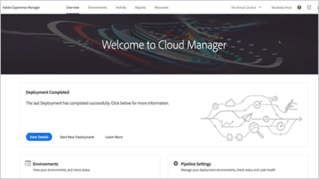

# 개요 {#overview}

Adobe Experience Manager은 AEM Sites, [!DNL Assets] 및 [!DNL Forms] 사용자가 사용할 수 있는 일반적인 기능 세트를 제공합니다.

## 새로운 기능

* **[워크플로우 AEM 사용(비디오)](./workflow/use-workflow.md)**

   *AEM Workflow는 AEM에서 컨텐츠를 공동 작업, 관리 및 처리하는 방법을 제공합니다.*

* **[AEM용 Cloud Manager 이해(비디오)](./cloud-manager/understand-cloud-manager-for-aem.md)**\
   *AEM용 Cloud Manager를 사용하면 AEM 환경을 손쉽게 관리, 검사 및 셀프 서비스를 수행할 수 있습니다.*

* **[Adobe I/O에 사용할 공개 및 개인 키 설정(자습서)](./authentication/set-up-public-private-keys-for-use-with-aem-and-adobe-io.md)**\
   *AEM 및 Adobe I/O에서 작동하는 키 및 키  [!DNL openssl] 저장소를 사용하여 생성하는 방법을 알아봅니다.*

* **[Cloud Manager CI/CD 파이프라인 사용(비디오)](./cloud-manager/use-the-cicd-pipeline-in-cloud-manager-for-aem.md)**\
   *Cloud Manager의 CI/CD 파이프라인을 사용하여 안전하고 일관된 배포를 보장하는 방법을 알아봅니다.*

## 직원 추천

<table>
<tr>
  <td>
    
    

     <a href="./cloud-manager/understand-cloud-manager-for-aem.md">
    <strong>AEM용 Cloud Manager 이해</strong>
    </a>
    

    

    <em>AEM용 Cloud Manager는 AEM 환경을 쉽게 관리, 검사 및 셀프 서비스를 제공하는 간단하면서도 강력한 솔루션을 제공합니다.</em>
    

  </td>
   <td>
    
     

     <a href="./development/set-up-sling-dynamic-include.md">
    <strong>Sling 동적 포함(SDI) 설정</strong>
    </a>
    

    

    <em>SLING 동적 포함(SDI)을 설정하고 동적 AEM 구성 요소가 항상 새로운 콘텐츠를 제공하는 방법을 살펴봅니다.</em>
    

  </td>
  <td>
    
    

    <a href="./administration/understand-reasons-to-upgrade.md">
    <strong>AEM을 업그레이드해야 하는 이유 이해하기</strong>
    </a>
    

    

    <em>최신 버전의 AEM으로 업그레이드를 고려할 때 이해할 수 있는 주요 기능에 대한 높은 수준의 분류입니다.</em>
    

  </td>
</tr>
</table>

## 추가 리소스

* [Experience League - AEM 살펴보기](https://experienceleague.adobe.com/#recommended/solutions/experience-manager)
* [AEM as a Cloud Service 튜토리얼](/help/cloud-service/overview.md)
* [AEM Sites 비디오 및 튜토리얼](/help/sites/overview.md)
* [AEM Assets 비디오 및 튜토리얼](/help/assets/overview.md)
* [AEM Forms 비디오 및 튜토리얼](/help/forms/overview.md)
