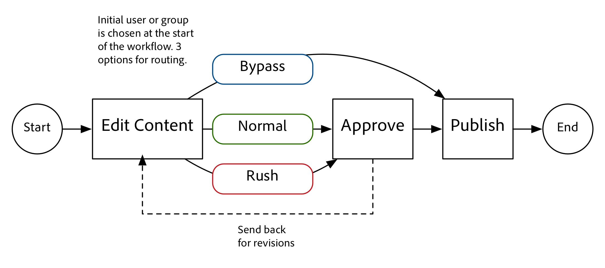
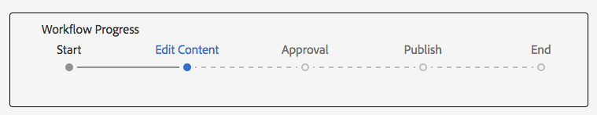
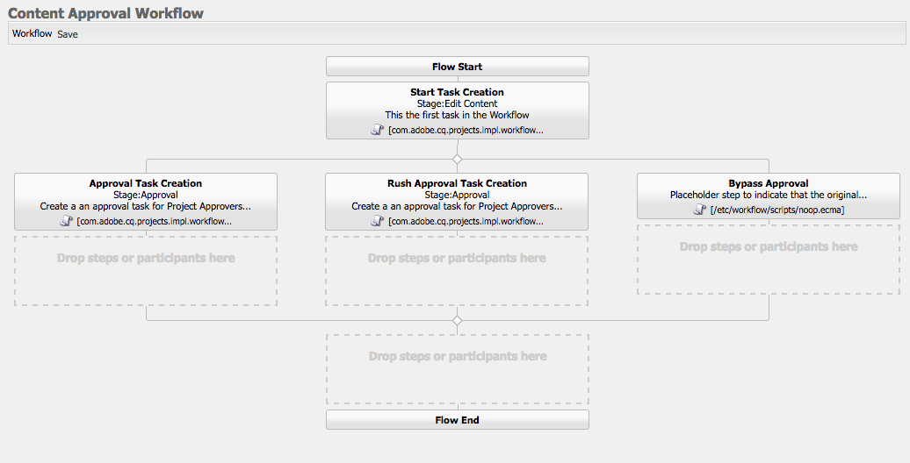

# AEM에서 프로젝트 개발

[!DNL AEM Projects]에 대한 개발 방법을 설명하는 개발 자습서입니다.  이 자습서에서는 컨텐츠 제작 워크플로우 및 작업을 관리하기 위해 AEM 내에서 새 프로젝트를 만드는 데 사용할 수 있는 사용자 정의 프로젝트 템플릿을 만듭니다.

>[!VIDEO](https://video.tv.adobe.com/v/16904/?quality=12&learn=on)

*이 비디오에서는 아래 튜토리얼에서 만든 완성된 워크플로우에 대한 간단한 데모를 제공합니다.*

## 소개 {#introduction}

[[!DNL AEM Projects]](https://helpx.adobe.com/experience-manager/6-5/sites/authoring/using/projects.html) 는 AEM Sites 또는 에셋 구현의 일부로 컨텐츠 만들기와 관련된 모든 워크플로우와 작업을 보다 손쉽게 관리하고 그룹화할 수 있도록 고안된 AEM 기능입니다.

AEM 프로젝트는 여러 [OOTB 프로젝트 템플릿](https://helpx.adobe.com/experience-manager/6-5/sites/authoring/using/projects.html#ProjectTemplates)과 함께 제공됩니다. 새 프로젝트를 만들 때 작성자는 사용 가능한 템플릿 중에서 선택할 수 있습니다. 고유한 비즈니스 요구 사항을 갖는 대규모 AEM 구현에서는 고객의 요구 사항에 맞게 맞춤화된 프로젝트 템플릿을 만들어야 합니다. 사용자 정의 프로젝트 템플릿을 만들면 프로젝트 대시보드를 구성하고 사용자 정의 워크플로우에 연결하며 프로젝트에 대한 추가 비즈니스 역할을 만들 수 있습니다. 프로젝트 템플릿의 구조를 살펴보고 샘플 템플릿을 만듭니다.


## 설정

이 자습서는 사용자 지정 프로젝트 템플릿을 만드는 데 필요한 코드를 단계별로 수행합니다. 자습서와 함께 따라 로컬 환경에서 [첨부된 패키지](./assets/develop-aem-projects/projects-tasks-guide.ui.apps-0.0.1-SNAPSHOT.zip)를 다운로드하여 설치할 수 있습니다. [GitHub](https://github.com/Adobe-Marketing-Cloud/aem-guides/tree/feature/projects-tasks-guide)에서 호스팅되는 전체 Maven 프로젝트에 액세스할 수도 있습니다.

* [완성된 자습서 패키지](./assets/develop-aem-projects/projects-tasks-guide.ui.apps-0.0.1-SNAPSHOT.zip)
* [GitHub의 전체 코드 저장소](https://github.com/Adobe-Marketing-Cloud/aem-guides/tree/feature/projects-tasks-guide)

이 자습서에서는 [AEM 개발 사례](https://helpx.adobe.com/experience-manager/6-5/sites/developing/using/the-basics.html)에 대한 기본적인 지식과 [AEM Maven 프로젝트 설정](https://helpx.adobe.com/experience-manager/6-5/sites/developing/using/ht-projects-maven.html)에 대해 잘 알고 있다고 가정합니다. 언급된 모든 코드는 참조로 사용하도록 되어 있으며 [로컬 개발 AEM 인스턴스](https://helpx.adobe.com/experience-manager/6-5/sites/deploying/using/deploy.html#GettingStarted)에만 배포해야 합니다.

## 프로젝트 템플릿 구조

프로젝트 템플릿은 소스 제어 하에 두어야 하며 /apps 아래의 응용 프로그램 폴더 아래에 있어야 합니다. 이름 지정 규칙이 ***/projects/templates/**&lt;my-template>인 하위 폴더에 배치하는 것이 좋습니다. 이 명명 규칙을 적용하면 작성자는 프로젝트를 만들 때 새 사용자 지정 템플릿을 자동으로 사용할 수 있게 됩니다. 사용 가능한 프로젝트 템플릿 구성은 다음 위치에 설정됩니다.**/content/projects/jcr:content** node by **cq:allowedTemplates** 속성 기본적으로 일반 표현식입니다.**/(apps|libs)/*/projects/templates/.***

프로젝트 템플릿의 루트 노드에는 **cq:Template**&#x200B;의 **jcr:primaryType**&#x200B;이 있습니다. 의 루트 노드 아래에 3개의 노드가 있습니다.**가젯**, **역할** 및 **워크플로**. 이러한 노드는 모두 **nt:unstructured**&#x200B;입니다. 루트 노드 아래에는 프로젝트 만들기 마법사에서 템플릿을 선택할 때 표시되는 thumbnail.png 파일도 있을 수 있습니다.

전체 노드 구조:

```shell
/apps/<my-app>
    + projects (nt:folder)
         + templates (nt:folder)
              + <project-template-root> (cq:Template)
                   + gadgets (nt:unstructured)
                   + roles (nt:unstructured)
                   + workflows (nt:unstructured)
```

### 프로젝트 템플릿 루트

프로젝트 템플릿의 루트 노드는 **cq:Template** 유형이 됩니다. 이 노드에서 프로젝트 만들기 마법사에 표시할 속성 **jcr:title** 및 **jcr:description**&#x200B;을 구성할 수 있습니다. 프로젝트의 속성을 채울 양식을 가리키는 **마법사**&#x200B;라는 속성도 있습니다. 기본값:사용자가 기본 프로젝트 속성을 채우고 그룹 구성원을 추가할 수 있으므로 **/libs/cq/core/content/projects/wizard/steps/defaultproject.html**&#x200B;은(는) 대부분의 경우 제대로 작동해야 합니다.

**프로젝트 만들기 마법사는 Sling POST 서블릿을 사용하지 않습니다. 대신 값이 사용자 지정 서블릿에 게시됩니다.**com.adobe.cq.projects.impl.servlet.ProjectServlet**. 사용자 지정 필드를 추가할 때 이 사항을 고려해야 합니다.*

번역 프로젝트 템플릿에 대한 사용자 지정 마법사의 예는 다음과 같습니다.**/libs/cq/core/content/projects/wizard/translationproject/defaultproject**

### 가젯 {#gadgets}

이 노드에는 추가 속성이 없지만 가젯 노드의 자식은 새 프로젝트를 만들 때 프로젝트 타일이 프로젝트 대시보드에 채우는 것을 제어합니다. [프로젝트 타일](https://helpx.adobe.com/experience-manager/6-5/sites/authoring/using/projects.html#ProjectTiles) (가젯 또는 포드라고도 함)은 프로젝트의 작업 공간을 채우는 간단한 카드입니다. otb 타일의 전체 목록은 다음 위치에 있습니다.**/libs/cq/gui/components/projects/admin/pod **프로젝트를 만든 후 프로젝트 소유자는 항상 타일을 추가/제거할 수 있습니다.

### 역할 {#roles}

모든 프로젝트에 대해 3개의 [기본 역할](https://helpx.adobe.com/experience-manager/6-5/sites/authoring/using/projects.html#UserRolesinaProject)이 있습니다.**옵저버**, **편집기** 및 **소유자**. 역할 노드 아래에 하위 노드를 추가하면 템플릿에 대한 비즈니스별 프로젝트 역할을 추가할 수 있습니다. 그런 다음 이러한 역할을 프로젝트와 연결된 특정 워크플로우에 연결할 수 있습니다.

### 워크플로우 {#workflows}

사용자 지정 프로젝트 템플릿을 만들어야 하는 가장 매력적인 이유 중 하나는 프로젝트에 사용할 수 있는 워크플로우를 구성할 수 있다는 것입니다. OOTB 워크플로우 또는 사용자 정의 워크플로우를 수행할 수 있습니다. **workflows** 노드 아래에 사용 가능한 워크플로우 모델을 지정하는 아래에 **모델** 노드(또한 `nt:unstructured`)와 하위 노드가 있어야 합니다. **modelId **속성은 /etc/workflow 아래의 워크플로 모델을 가리키며 **wizard** 속성은 워크플로를 시작할 때 사용되는 대화 상자를 가리킵니다. Projects의 가장 큰 장점은 워크플로우가 시작될 때 사용자 정의 대화 상자(마법사)를 추가하여 워크플로우에서 추가 작업을 수행할 수 있는 비즈니스별 메타데이터를 캡처하는 기능입니다.

```shell
<projects-template-root> (cq:Template)
    + workflows (nt:unstructured)
         + models (nt:unstructured)
              + <workflow-model> (nt:unstructured)
                   - modelId = points to the workflow model
                   - wizard = dialog used to start the workflow
```

## 프로젝트 템플릿 만들기 {#creating-project-template}

주로 노드를 복사/구성할 것이므로 CRXDE Lite을 사용합니다. 로컬 AEM 인스턴스에서 [CRXDE Lite](http://localhost:4502/crx/de/index.jsp)을 엽니다.

1. `/apps/&lt;your-app-folder&gt;` 아래의 `projects` 아래에 새 폴더를 만듭니다. `templates` 아래에 다른 폴더를 만듭니다.

   ```shell
   /apps/aem-guides/projects-tasks/
                       + projects (nt:folder)
                                + templates (nt:folder)
   ```

1. 보다 쉽게 만들기 위해 기존 간단한 프로젝트 템플릿에서 사용자 정의 템플릿을 시작합니다.

   1. 1단계에서 만든 *templates* 폴더 아래에 **/libs/cq/core/content/projects/templates/default** 노드를 복사하여 붙여 넣습니다.

   ```shell
   /apps/aem-guides/projects-tasks/
                + templates (nt:folder)
                     + default (cq:Template)
   ```

1. 이제 **/apps/aem-guides/projects-tasks/projects/templates/authoring-project** 등의 경로가 있어야 합니다.

   1. 작성자 프로젝트 노드의 **jcr:title** 및 **jcr:description** 속성을 사용자 정의 제목 및 설명 값으로 편집합니다.

      1. **wizard** 속성을 기본 프로젝트 속성을 가리키도록 두십시오.

   ```shell
   /apps/aem-guides/projects-tasks/projects/
            + templates (nt:folder)
                 + authoring-project (cq:Template)
                      - jcr:title = "Authoring Project"
                      - jcr:description = "A project to manage approval and publish process for AEM Sites or Assets"
                      - wizard = "/libs/cq/core/content/projects/wizard/steps/defaultproject.html"
   ```

1. 이 프로젝트 템플릿의 경우 작업을 사용하려고 합니다.
   1. **작업**&#x200B;이라는 authoring-project/gadgets 아래에 새 **nt:unstructured** 노드를 추가합니다.
   1. **cardWeight** = &quot;100&quot;, **jcr:title**=&quot;Tasks&quot; 및 **sling:resourceType**=&quot;cq/gui/components/projects/admin/pod/taskpod&quot;에 대한 작업 노드에 문자열 속성을 추가합니다.

   이제 새 프로젝트를 만들 때 기본적으로 [작업 타일](https://docs.adobe.com/docs/en/aem/6-3/author/projects.html#Tasks)이 표시됩니다.

   ```shell
   ../projects/templates/authoring-project
       + gadgets (nt:unstructured)
            + team (nt:unstructured)
            + asset (nt:unstructured)
            + work (nt:unstructured)
            + experiences (nt:unstructured)
            + projectinfo (nt:unstructured)
            ..
            + tasks (nt:unstructured)
                 - cardWeight = "100"
                 - jcr:title = "Tasks"
                 - sling:resourceType = "cq/gui/components/projects/admin/pod/taskpod"
   ```

1. 프로젝트 템플릿에 사용자 지정 승인자 역할을 추가합니다.

   1. 프로젝트 템플릿(authoring-project) 노드 아래에 **nt:unstructured** 노드 레이블이 **roles**&#x200B;인 새 &lt;a0/>노드를 추가합니다.
   1. 다른 **nt:unstructured** 노드 레이블이 지정된 승인자를 역할 노드의 하위 노드로 추가합니다.
   1. 문자열 속성 **jcr:title** = &quot;**승인자**&quot;, **롤클래스** =&quot;**소유자**&quot;, **roleid**=&quot;**승인자**&quot;을 추가합니다.
      1. 승인자 노드의 이름뿐만 아니라 jcr:title 및 roleid도 문자열 값일 수 있습니다(roleid가 고유한 경우).
      1. **** 3 [개의 OOTB 역할에 따라 해당 역할에 적용된 권한을 ]제어합니다(https://docs.adobe.com/docs/en/aem/6-3/author/projects.html#User프로젝트에 역할 추가). **소유자**,  **편집자** 및  **관찰자**.
      1. 일반적으로 사용자 지정 역할이 관리 역할보다 많은 경우 롤렉클래스는 **owner;**&#x200B;이고, 사진사나 디자이너처럼 보다 구체적인 작성 역할인 경우 **editor** 롤렉시스가 충분합니다. **owner**&#x200B;와 **editor**&#x200B;의 큰 차이점은 프로젝트 소유자가 프로젝트 속성을 업데이트하고 새 사용자를 프로젝트에 추가할 수 있다는 것입니다.

   ```shell
   ../projects/templates/authoring-project
       + gadgets (nt:unstructured)
       + roles (nt:unstructured)
           + approvers (nt:unstructured)
                - jcr:title = "Approvers"
                - roleclass = "owner"
                - roleid = "approver"
   ```

1. 단순 프로젝트 템플릿을 복사하면 4개의 OTB 워크플로우가 구성됩니다. 워크플로우/모델 아래의 각 노드는 특정 워크플로우와 해당 워크플로우에 대한 시작 대화 상자를 가리킵니다. 이 튜토리얼의 후반부에 이 프로젝트에 대한 사용자 정의 워크플로우를 만듭니다. 이제 워크플로우/모델 아래의 노드를 삭제합니다.

   ```shell
   ../projects/templates/authoring-project
       + gadgets (nt:unstructured)
       + roles (nt:unstructured)
       + workflows (nt:unstructured)
            + models (nt:unstructured)
               - (remove ootb models)
   ```

1. 컨텐츠 작성자가 프로젝트 템플릿을 쉽게 식별할 수 있도록 사용자 정의 축소판을 추가할 수 있습니다. 권장되는 크기는 319x319픽셀입니다.
   1. CRXDE Lite에서 **thumbnail.png**&#x200B;라는 가젯, 역할 및 워크플로우 노드의 동위 멤버로 새 파일을 만듭니다.
   1. 저장한 다음 `jcr:content` 노드로 이동한 다음 `jcr:data` 속성을 두 번 클릭합니다(&#39;보기&#39; 클릭 제외).
      1. 그러면 `jcr:data` 파일 편집 대화 상자가 표시되고 사용자 정의 축소판을 업로드할 수 있습니다.

   ```shell
   ../projects/templates/authoring-project
       + gadgets (nt:unstructured)
       + roles (nt:unstructured)
       + workflows (nt:unstructured)
       + thumbnail.png (nt:file)
   ```

프로젝트 템플릿의 XML 표현을 완료했습니다.

```xml
<?xml version="1.0" encoding="UTF-8"?>
<jcr:root xmlns:sling="http://sling.apache.org/jcr/sling/1.0" xmlns:cq="http://www.day.com/jcr/cq/1.0" xmlns:jcr="http://www.jcp.org/jcr/1.0" xmlns:nt="http://www.jcp.org/jcr/nt/1.0"
    jcr:description="A project to manage approval and publish process for AEM Sites or Assets"
    jcr:primaryType="cq:Template"
    jcr:title="Authoring Project"
    ranking="{Long}1"
    wizard="/libs/cq/core/content/projects/wizard/steps/defaultproject.html">
    <jcr:content
        jcr:primaryType="nt:unstructured"
        detailsHref="/projects/details.html"/>
    <gadgets jcr:primaryType="nt:unstructured">
        <team
            jcr:primaryType="nt:unstructured"
            jcr:title="Team"
            sling:resourceType="cq/gui/components/projects/admin/pod/teampod"
            cardWeight="60"/>
        <tasks
            jcr:primaryType="nt:unstructured"
            jcr:title="Tasks"
            sling:resourceType="cq/gui/components/projects/admin/pod/taskpod"
            cardWeight="100"/>
        <work
            jcr:primaryType="nt:unstructured"
            jcr:title="Workflows"
            sling:resourceType="cq/gui/components/projects/admin/pod/workpod"
            cardWeight="80"/>
        <experiences
            jcr:primaryType="nt:unstructured"
            jcr:title="Experiences"
            sling:resourceType="cq/gui/components/projects/admin/pod/channelpod"
            cardWeight="90"/>
        <projectinfo
            jcr:primaryType="nt:unstructured"
            jcr:title="Project Info"
            sling:resourceType="cq/gui/components/projects/admin/pod/projectinfopod"
            cardWeight="100"/>
    </gadgets>
    <roles jcr:primaryType="nt:unstructured">
        <approvers
            jcr:primaryType="nt:unstructured"
            jcr:title="Approvers"
            roleclass="owner"
            roleid="approvers"/>
    </roles>
    <workflows
        jcr:primaryType="nt:unstructured"
        tags="[]">
        <models jcr:primaryType="nt:unstructured">
        </models>
    </workflows>
</jcr:root>
```

## 사용자 지정 프로젝트 템플릿 테스트

이제 새 프로젝트를 만들어 프로젝트 템플릿을 테스트할 수 있습니다.

1. 사용자 지정 템플릿은 프로젝트 만들기 옵션 중 하나로 표시됩니다.

   

1. 사용자 지정 템플릿을 선택한 후 &#39;다음&#39;을 클릭하고 프로젝트 구성원을 채울 때 이들을 승인자 역할로 추가할 수 있습니다.

   

1. &#39;만들기&#39;를 클릭하여 사용자 지정 템플릿을 기반으로 프로젝트 만들기를 완료합니다. 프로젝트 대시보드에는 작업 타일과 가젯 아래에 구성된 다른 타일이 자동으로 표시됩니다.

   


## Workflow를 사용해야 하는 이유

일반적으로 승인 프로세스를 중심으로 하는 AEM 워크플로우에서는 참가자 워크플로우 단계를 사용했습니다. AEM 받은 편지함에는 작업 및 워크플로우에 대한 세부 사항과 AEM Projects와의 향상된 통합 기능이 포함되어 있습니다. 이러한 기능을 사용하면 프로젝트 만들기 작업 프로세스 단계를 사용하는 것이 더 매력적인 옵션이 됩니다.

### 작업을 선택해야 하는 이유

기존 참가자 단계에 비해 작업 생성 단계를 사용하면 다음과 같은 이점이 있습니다.

* **시작 및 기한**  - 작성자가 시간을 손쉽게 관리할 수 있도록 해주는 새로운 달력 기능을 통해 이러한 날짜를 사용할 수 있습니다.
* **우선 순위**  - [낮음], [보통] 및 [높음]의 우선 순위가 설정되므로 작성자는 작업의 우선 순위를 지정할 수 있습니다
* **스레드된 주석**  - 작성자가 작업을 수행할 때 주석을 남겨 두고 공동 작업을 향상시킬 수 있습니다.
* **가시성**  - 프로젝트 작업 타일 및 뷰를 통해 관리자는 소요 시간을 확인할 수 있습니다
* **프로젝트 통합**  - 작업이 이미 프로젝트 역할 및 대시보드와 통합되었습니다.

참가자 단계와 마찬가지로 작업을 동적으로 할당하거나 라우팅할 수 있습니다. 제목, 우선 순위와 같은 작업 메타데이터도 다음 튜토리얼에서 볼 수 있듯이 이전 작업을 기반으로 동적으로 설정할 수 있습니다.

작업은 참가자 단계보다 몇 가지 이점이 있지만, 프로젝트 외부에서는 더 많은 간접비를 부담하므로 유용하지 않습니다. 또한 작업의 모든 동적 동작은 고유한 제한이 있는 ecma 스크립트를 사용하여 코딩되어야 합니다.

## 샘플 사용 사례 요구 사항 {#goals-tutorial}



위 다이어그램은 샘플 승인 워크플로우에 대한 높은 수준의 요구 사항을 보여줍니다.

첫 번째 단계는 컨텐츠 일부를 편집하기 위한 작업을 만드는 것입니다. 워크플로우 개시자가 이 첫 번째 작업의 담당자를 선택할 수 있도록 허용합니다.

첫 번째 작업이 완료되면 할당자는 워크플로우를 라우팅하는 3가지 옵션을 갖게 됩니다.

**표준 **- 표준 공정순서는 검토 및 승인할 프로젝트의 승인자 그룹에 지정된 태스크를 생성합니다. 작업의 우선 순위는 정상이며 기한 날짜는 작성 후 5일입니다.

**러시** -러시 라우팅은 또한 프로젝트의 승인자 그룹에 지정된 작업을 만듭니다. 작업의 우선 순위는 높음이고 기한 날짜는 1일입니다.

**우회**  - 이 샘플 워크플로우에서는 초기 참가자에게 승인 그룹을 우회하는 옵션이 있습니다. (예. &#39;승인&#39; 워크플로우의 목적을 달성할 수 없지만 추가 라우팅 기능을 설명할 수 있습니다.)

승인자 그룹은 컨텐츠를 승인하거나 재작업을 위해 초기 할당자에게 다시 보낼 수 있습니다. 재작업을 위해 다시 보내는 경우 새 작업이 생성되고 &#39;재작업을 위해 다시 전송&#39;이라는 레이블이 적절하게 지정됩니다.

워크플로우의 마지막 단계에서는 otb 페이지/자산 활성화 프로세스 단계를 사용하고 페이로드를 복제합니다.

## 워크플로우 모델 만들기

1. AEM 시작 메뉴에서 도구 -> 워크플로우 -> 모델로 이동합니다. 오른쪽 상단 모서리의 &#39;만들기&#39;를 클릭하여 새 워크플로우 모델을 만듭니다.

   새 모델에 제목을 지정합니다.&quot;콘텐츠 승인 워크플로&quot; 및 URL 이름:&quot;content-approval-workflow&quot;를 참조하십시오.

   

   [워크플로우 만들기와 관련된 자세한 내용은 여기에서 읽으십시오](https://helpx.adobe.com/experience-manager/6-5/sites/developing/using/workflows-models.html).

1. 우수 사례 사용자 지정 워크플로우는 /etc/workflow/models 아래에 있는 고유한 폴더로 그룹화해야 합니다. CRXDE Lite에서 **&quot;aem-guides&quot;**&#x200B;이라는 /etc/workflow/models 아래에 새 **&#39;nt:folder&#39;**&#x200B;을 만듭니다. 하위 폴더를 추가하면 업그레이드 또는 서비스 팩 설치 과정에서 사용자 정의 워크플로우를 실수로 덮어쓰지 않습니다.

   *전체 하위 폴더도 업그레이드 또는 서비스 팩으로 덮어쓸 수 있으므로 /etc/workflow/models/dam 또는 /etc/workflow/models/projects와 같은 otb 하위 폴더 아래에 폴더 또는 사용자 정의 워크플로우를 배치하지 않는 것이 중요합니다.

   

   6.3에서 워크플로우 모델의 위치

   >[!NOTE]
   >
   >AEM 6.4+를 사용하는 경우 워크플로우의 위치가 변경되었습니다. 자세한 내용은 [여기를 참조하십시오.](https://helpx.adobe.com/experience-manager/6-5/sites/developing/using/workflows-best-practices.html#LocationsWorkflowModels)

   AEM 6.4+를 사용하는 경우 워크플로우 모델이 `/conf/global/settings/workflow/models` 아래에 생성됩니다. 위의 단계를 /conf 디렉토리로 반복하고 `aem-guides`이라는 하위 폴더를 추가하고 그 아래 `content-approval-workflow`를 이동합니다.

   
위치워크플로우 모델 6.4+의 위치

1. AEM 6.3에서 도입된 기능은 지정된 워크플로우에 워크플로우 단계를 추가하는 기능입니다. 단계는 워크플로우 정보 탭의 받은 편지함에서 사용자에게 표시됩니다. 사용자는 워크플로우의 현재 단계뿐만 아니라 이전 단계와 이후의 단계도 표시됩니다.

   단계를 구성하려면 사이드 킥에서 페이지 속성 대화 상자를 엽니다. 네 번째 탭에는 &quot;단계&quot;라는 레이블이 있습니다. 다음 값을 추가하여 이 워크플로우의 3단계를 구성합니다.

   1. 컨텐츠 편집
   1. 승인
   1. 게시

   

   페이지 속성 대화 상자에서 워크플로우 단계를 구성합니다.

   

   AEM 받은 편지함에서 볼 수 있는 워크플로우 진행률 표시줄입니다.

   선택적으로 사용자가 선택할 때 워크플로우 축소판으로 사용할 **이미지**&#x200B;를 페이지 속성에 업로드할 수 있습니다. 이미지 크기는 319x319픽셀이어야 합니다. 사용자가 워크플로우를 선택하려고 할 때 페이지 속성에 **설명**&#x200B;을 추가하면 표시됩니다.

1. 프로젝트 작업 만들기 워크플로우 프로세스는 워크플로우의 단계로 작업을 만들도록 설계되었습니다. 작업을 완료한 후에만 워크플로우가 앞으로 이동합니다. 프로젝트 만들기 작업 단계의 강력한 측면은 워크플로우 메타데이터 값을 읽고 이 값을 사용하여 작업을 동적으로 만들 수 있다는 것입니다.

   먼저 기본적으로 생성되는 참가자 단계를 삭제합니다. 구성 요소 메뉴의 사이드 킥에서 **&quot;프로젝트&quot;** 하위 제목을 확장하고 **&quot;프로젝트 작업 만들기&quot;**&#x200B;를 모델에 드래그하여 놓습니다.

   &quot;프로젝트 작업 만들기&quot; 단계를 두 번 클릭하여 워크플로우 대화 상자를 엽니다. 다음 속성을 구성합니다.

   이 탭은 모든 워크플로우 프로세스 단계에서 일반적이며 제목 및 설명을 설정합니다(이 탭은 최종 사용자에게 표시되지 않음). 설정할 중요한 속성은 드롭다운 메뉴에서 워크플로 스테이지가 **&quot;콘텐츠 편집&quot;**&#x200B;으로 설정됩니다.

   ```shell
   Common Tab
   -----------------
       Title = "Start Task Creation"
       Description = "This the first task in the Workflow"
       Workflow Stage = "Edit Content"
   ```

   프로젝트 작업 만들기 워크플로우 프로세스는 워크플로우의 단계로 작업을 만들도록 설계되었습니다. 작업 탭을 사용하여 작업의 모든 값을 설정할 수 있습니다. Adobe의 경우 Assignee가 역동적이어야 하므로 비워 둡니다. 나머지 속성 값:

   ```shell
   Task Tab
   -----------------
       Name* = "Edit Content"
       Task Priority = "Medium"
       Description = "Edit the content and finalize for approval. Once finished submit for approval."
       Due In - Days = "2"
   ```

   라우팅 탭은 작업을 완료하는 사용자에 대해 사용 가능한 작업을 지정할 수 있는 선택 대화 상자입니다. 이러한 작업은 단순히 문자열 값이며 워크플로우의 메타데이터에 저장됩니다. 이러한 값은 워크플로우 후반부의 스크립트 및/또는 프로세스 단계를 통해 읽어 워크플로우의 경로를 동적으로 &quot;라우트&quot;할 수 있습니다. [워크플로우 목표](#goals-tutorial)에 따라 이 탭에 다음 3개의 작업을 추가합니다.

   ```shell
   Routing Tab
   -----------------
       Actions =
           "Normal Approval"
           "Rush Approval"
           "Bypass Approval"
   ```

   이 탭에서는 작업을 만들기 전에 프로그래밍 방식으로 다양한 작업 값을 결정할 수 있는 미리 만들기 작업 스크립트를 구성할 수 있습니다. 외부 파일에 스크립트를 가리키거나 대화 상자에 짧은 스크립트를 직접 포함시킬 수 있습니다. 이 경우 작업 사전 생성 스크립트를 외부 파일로 지정합니다. 5단계에서 해당 스크립트를 만듭니다.

   ```shell
   Advanced Settings Tab
   -----------------
      Pre-Create Task Script = "/apps/aem-guides/projects/scripts/start-task-config.ecma"
   ```

1. 이전 단계에서 작업 사전 만들기 스크립트를 참조합니다. 이제 워크플로우 메타데이터 값 &quot;**할당자**&quot;의 값을 기반으로 작업의 할당자를 설정하는 스크립트를 만듭니다. 워크플로우가 시작될 때 **&quot;할당자&quot;** 값이 설정됩니다. 첫 번째 작업이 기한 내에 동적으로 설정되도록 작업 흐름 메타데이터를 읽어 작업 과정 메타데이터의 &quot;**taskPriority&quot;** 값 및 **&quot;taskDueDate&quot; **를 읽고 작업 우선 순위를 동적으로 선택합니다.

   조직에서 사용할 수 있도록 모든 프로젝트 관련 스크립트를 저장할 앱 폴더 아래에 폴더를 만들었습니다.**/apps/aem-guides/projects-tasks/projects/scripts** 이 폴더 아래에 **&quot;start-task-config.ecma&quot;**&#x200B;라는 새 파일을 만듭니다. *start-task-config.ecma 파일의 경로가 4단계의 고급 설정 탭에 설정된 경로와 일치하는지 확인하십시오.

   다음 내용을 파일의 내용으로 추가합니다.

   ```
   // start-task-config.ecma
   // Populate the task using values stored as workflow metadata originally posted by the start workflow wizard
   
   // set the assignee based on start workflow wizard
   var assignee = workflowData.getMetaDataMap().get("assignee", Packages.java.lang.String);
   task.setCurrentAssignee(assignee);
   
   //Set the due date for the initial task based on start workflow wizard
   var dueDate = workflowData.getMetaDataMap().get("taskDueDate", Packages.java.util.Date);
   if (dueDate != null) {
       task.setProperty("taskDueDate", dueDate);
   }
   
   //Set the priority based on start workflow wizard
   var taskPriority = workflowData.getMetaDataMap().get("taskPriority", "Medium");
   task.setProperty("taskPriority", taskPriority);
   ```

1. 컨텐츠 승인 워크플로우로 돌아갑니다. **작업 시작** 단계 아래의 **OR 분할** 구성 요소(&#39;워크플로우&#39; 카테고리의 사이드 킥에 있음)를 드래그하여 놓습니다. [일반] 대화 상자에서 3개 분기 라디오 단추를 선택합니다. OR 분할은 워크플로 메타데이터 값 **&quot;lastTaskAction&quot;**&#x200B;을 읽어 워크플로의 경로를 결정합니다. **&quot;lastTaskAction&quot;** 속성은 4단계에 구성된 라우팅 탭의 값 중 하나로 설정됩니다. 각 분기 탭에 대해 **스크립트** 텍스트 영역을 다음 값으로 채웁니다.

   ```
   function check() {
   var lastAction = workflowData.getMetaDataMap().get("lastTaskAction","");
   
   if(lastAction == "Normal Approval") {
       return true;
   }
   
   return false;
   }
   ```

   ```
   function check() {
   var lastAction = workflowData.getMetaDataMap().get("lastTaskAction","");
   
   if(lastAction == "Rush Approval") {
       return true;
   }
   
   return false;
   }
   ```

   ```
   function check() {
   var lastAction = workflowData.getMetaDataMap().get("lastTaskAction","");
   
   if(lastAction == "Bypass Approval") {
       return true;
   }
   
   return false;
   }
   ```

   *분기 스크립트에서 설정된 값이 4단계에서 설정된 경로 값과 일치하도록 경로를 결정하기 위해 직접 문자열 일치를 수행합니다.

1. 다른 &quot;**프로젝트 작업 만들기**&quot; 단계를 드래그하여 OR 분할 아래의 맨 왼쪽(분기 1)으로 모델을 드래그합니다. 대화 상자를 다음 속성으로 채웁니다.

   ```
   Common Tab
   -----------------
       Title = "Approval Task Creation"
       Description = "Create a an approval task for Project Approvers. Priority is Medium."
       Workflow Stage = "Approval"
   
   Task Tab
   ------------
       Name* = "Approve Content for Publish"
       Task Priority = "Medium"
       Description = "Approve this content for publication."
       Days = "5"
   
   Routing Tab - Actions
   ----------------------------
       "Approve and Publish"
       "Send Back for Revision"
   ```

   표준 승인 경로이기 때문에 작업의 우선 순위가 보통으로 설정됩니다. 또한 승인자 그룹에 5일 동안 작업을 완료할 수 있습니다. 할당자는 [고급 설정] 탭에서 동적으로 할당하므로 작업 탭에 비어 있습니다. 이 작업을 완료할 때 승인자 그룹에 다음 경로를 2개 제공합니다.원래 편집기가 수정해야 하는 문제가 있는 경우 **&quot;승인하고 게시할 수 있는 경우&quot;** 및 **&quot;수정본을 위해 뒤로 보내기&quot;** 승인자는 워크플로우가 자신에게 반환되는지 확인할 주석을 남길 수 있습니다.

이 자습서의 앞부분에서 승인자 역할을 포함하는 프로젝트 템플릿을 만들었습니다. 이 템플릿에서 새 프로젝트를 만들 때마다 승인자 역할에 대해 프로젝트별 그룹이 만들어집니다. 참가자 단계처럼 작업은 사용자 또는 그룹에만 할당할 수 있습니다. 승인자 그룹에 해당하는 프로젝트 그룹에 이 작업을 할당하려고 합니다. 프로젝트 내에서 실행되는 모든 워크플로우에는 프로젝트 역할을 프로젝트 특정 그룹에 매핑하는 메타데이터가 있습니다.

Copy+Paste the 다음 코드를 **고급 설정 **tab의 **스크립트** 텍스트 영역에 붙여넣습니다. 이 코드는 워크플로우 메타데이터를 읽고 프로젝트의 승인자 그룹에 작업을 지정합니다. 승인자 그룹 값을 찾을 수 없으면 작업을 관리자 그룹에 다시 할당하게 됩니다.

```
var projectApproverGrp = workflowData.getMetaDataMap().get("project.group.approvers","administrators");

task.setCurrentAssignee(projectApproverGrp);
```

1. 다른 &quot;**프로젝트 작업 만들기**&quot; 단계를 OR 분할 아래의 중간 분기(분기 2)로 드래그하여 놓습니다. 대화 상자를 다음 속성으로 채웁니다.

   ```
   Common Tab
   -----------------
       Title = "Rush Approval Task Creation"
       Description = "Create a an approval task for Project Approvers. Priority is High."
       Workflow Stage = "Approval"
   
   Task Tab
   ------------
       Name* = "Rush Approve Content for Publish"
       Task Priority = "High"
       Description = "Rush approve this content for publication."
       Days = "1"
   
   Routing Tab - Actions
   ----------------------------
       "Approve and Publish"
       "Send Back for Revision"
   ```

   이 경로는 Rush Approval 경로이므로 작업의 우선 순위가 High로 설정됩니다. 또한 승인자 그룹에는 작업을 완료할 수 있는 하루만 제공됩니다. 할당자는 [고급 설정] 탭에서 동적으로 할당하므로 작업 탭에 비어 있습니다.

   7단계와 동일한 스크립트 조각을 다시 사용하여 고급 설정 **탭의 **스크립트** 텍스트 영역을 채울 수 있습니다. 아래 코드를 복사하여 붙여 넣습니다.

   ```
   var projectApproverGrp = workflowData.getMetaDataMap().get("project.group.approvers","administrators");
   
   task.setCurrentAssignee(projectApproverGrp);
   ```

1. Drag+Drop a** No Operation** 구성 요소를 맨 오른쪽 분기(분기 3)로 드래그합니다. 작업 없음 구성 요소는 작업을 수행하지 않으며 즉시 고급 상태로 전환하여 승인 단계를 건너뛰려는 원래 편집자의 욕망을 나타냅니다. 기술적으로 워크플로우 단계 없이 이 분기를 떠날 수 있지만, 작업 없음 단계를 추가하는 것이 가장 좋습니다. 이를 통해 다른 개발자에게 분기 3의 목적이 무엇인지 명확하게 파악할 수 있습니다.

   워크플로우 단계를 두 번 클릭하고 제목 및 설명을 구성합니다.

   ```
   Common Tab
   -----------------
       Title = "Bypass Approval"
       Description = "Placeholder step to indicate that the original editor decided to bypass the approver group."
   ```

   

   OR 분할의 세 개 분기가 모두 구성된 후에는 워크플로우 모델이 이와 같이 표시되어야 합니다.

1. 승인자 그룹에는 추가 수정을 위해 워크플로우를 원래 편집기로 다시 보낼 수 있는 옵션이 있으므로, 마지막으로 수행한 작업을 읽고 워크플로우를 시작 부분으로 라우팅하거나 계속 진행하려면 **goto** 단계를 사용합니다.

   이동 단계 구성 요소(작업 과정 아래의 사이드 킥에 있음)가 다시 연결된 OR 분할 아래의 이동 단계 구성 요소를 드래그 앤 드롭합니다. 대화 상자에서 다음 속성을 두 번 클릭하고 구성합니다.

   ```
   Common Tab
   ----------------
       Title = "Goto Step"
       Description = "Based on the Approver groups action route the workflow to the beginning or continue and publish the payload."
   
   Process Tab
   ---------------
       The step to go to. = "Start Task Creation"
   ```

   마지막으로 구성할 부분은 goto 프로세스 단계의 일부로서 스크립트입니다. [스크립트] 값은 대화 상자를 통해 포함하거나 외부 파일을 가리키도록 구성할 수 있습니다. 이동 스크립트는 **함수 check()**&#x200B;를 포함해야 하며 워크플로우가 지정된 단계로 이동해야 하는 경우 true를 반환해야 합니다. 잘못된 결과가 반환되면 워크플로우가 앞으로 이동합니다.

   승인자 그룹이 **&quot;Send Back for Revision&quot;** 작업(7단계 및 8단계에서 구성)을 선택한 경우, 워크플로우를 **&quot;작업 생성 시작&quot;** 단계로 되돌리려고 합니다.

   프로세스 탭에서 스크립트 텍스트 영역에 다음 코드 조각을 추가합니다.

   ```
   function check() {
   var lastAction = workflowData.getMetaDataMap().get("lastTaskAction","");
   
   if(lastAction == "Send Back for Revision") {
       return true;
   }
   
   return false;
   }
   ```

1. 페이로드를 게시하려면 오트비 **페이지/자산 활성화** 프로세스 단계를 사용합니다. 이 프로세스 단계에서는 구성이 거의 필요하지 않으며, 활성화를 위해 워크플로우의 페이로드를 복제 큐에 추가합니다. 이동 단계 아래에 단계를 추가하면 승인자 그룹이 게시용 컨텐츠를 승인했거나 원래 편집자가 승인 무시 경로를 선택한 경우에만 해당 단계에 도달할 수 있습니다.

   모델의 이동 단계 아래에 있는 **페이지/자산 활성화** 프로세스 단계(WCM 워크플로우 아래의 사이드킥에 있음)를 드래그하여 놓습니다.

   

   이동 단계 및 페이지/자산 활성화 단계를 추가한 후 워크플로우 모델이 어떻게 표시되어야 합니까?

1. 승인자 그룹이 개정하기 위해 컨텐트를 다시 보내는 경우 원래 편집자에게 알리고자 합니다. 작업 생성 속성을 동적으로 변경하여 이 작업을 수행할 수 있습니다. **&quot;Send Back for Revision&quot;**&#x200B;의 lastActionTaken 속성 값 중 하나를 키로 합니다. 이 값이 있는 경우 제목과 설명을 수정하여 이 작업이 수정을 위해 다시 보내지는 컨텐츠의 결과임을 표시합니다. 또한 편집자가 처음으로 작업하는 항목으로서 **&quot;High&quot;**&#x200B;로 우선 순위를 업데이트합니다. 마지막으로, 수정을 위해 워크플로우가 다시 전송된 날짜로부터 작업 만기 날짜를 설정합니다.

   시작 `start-task-config.ecma` 스크립트(5단계에서 만들어짐)를 다음으로 바꿉니다.

   ```
   // start-task-config.ecma
   // Populate the task using values stored as workflow metadata originally posted by the start workflow wizard
   
   // set the assignee based on start workflow wizard
   var assignee = workflowData.getMetaDataMap().get("assignee", Packages.java.lang.String);
   task.setCurrentAssignee(assignee);
   
   //Set the due date for the initial task based on start workflow wizard
   var dueDate = workflowData.getMetaDataMap().get("taskDueDate", Packages.java.util.Date);
   if (dueDate != null) {
       task.setProperty("taskDueDate", dueDate);
   }
   
   //Set the priority based on start workflow wizard
   var taskPriority = workflowData.getMetaDataMap().get("taskPriority", "Medium");
   task.setProperty("taskPriority", taskPriority);
   
   var lastAction = workflowData.getMetaDataMap().get("lastTaskAction","");
   
   //change the title and priority if the approver group sent back the content
   if(lastAction == "Send Back for Revision") {
     var taskName = "Review and Revise Content";
   
     //since the content was rejected we will set the priority to High for the revison task
     task.setProperty("taskPriority", "High"); 
   
     //set the Task name (displayed as the task title in the Inbox) 
     task.setProperty("name", taskName);
     task.setProperty("nameHierarchy", taskName);
   
     //set the due date of this task 1 day from current date
     var calDueDate = Packages.java.util.Calendar.getInstance();
     calDueDate.add(Packages.java.util.Calendar.DATE, 1);
     task.setProperty("taskDueDate", calDueDate.getTime());
   
   }
   ```

## &quot;워크플로 시작&quot; 마법사 {#start-workflow-wizard} 만들기

프로젝트 내에서 워크플로우를 시작할 때는 마법사를 지정하여 워크플로우를 시작해야 합니다. 기본 마법사:`/libs/cq/core/content/projects/workflowwizards/default_workflow`을(를) 사용하면 사용자가 워크플로우 제목, 시작 주석 및 워크플로우 실행을 위한 페이로드 경로를 입력할 수 있습니다. 다음과 같은 몇 가지 다른 예도 있습니다.`/libs/cq/core/content/projects/workflowwizards`.

사용자 정의 마법사를 만드는 것은 워크플로우가 시작되기 전에 중요한 정보를 수집할 수 있기 때문에 매우 강력할 수 있습니다. 데이터는 워크플로우의 메타데이터 및 워크플로우 프로세스의 일부로 저장되며 입력된 값을 기반으로 동작을 동적으로 변경할 수 있습니다. 시작 마법사 값을 기반으로 워크플로우의 첫 번째 작업을 동적으로 할당하는 사용자 정의 마법사를 만듭니다.

1. CRXDE-Lite에서는 `/apps/aem-guides/projects-tasks/projects` 폴더 아래의 &quot;wizards&quot;라는 하위 폴더를 만듭니다. 다음 위치에서 기본 마법사를 복사합니다.새로 만든 마법사 폴더 아래에 있는 `/libs/cq/core/content/projects/workflowwizards/default_workflow` 이름을 **content-approval-start**&#x200B;로 변경합니다. 이제 전체 경로는 다음과 같아야 합니다.`/apps/aem-guides/projects-tasks/projects/wizards/content-approval-start`.

   기본 마법사는 워크플로우 모델의 제목, 설명 및 축소판이 선택된 첫 번째 열이 있는 2열 마법사입니다. 두 번째 열에는 워크플로우 제목, 시작 주석 및 페이로드 경로에 대한 필드가 포함됩니다. 이 마법사는 표준 터치 UI 양식이며 표준 [Granite UI 양식 구성 요소](https://docs.adobe.com/docs/en/aem/6-5/develop/ref/granite-ui/api/jcr_root/libs/granite/ui/components/coral/foundation/form/index.html)를 사용하여 필드를 채웁니다.

   

1. 워크플로우에서 첫 번째 작업의 담당자를 설정하는 데 사용할 추가 필드를 마법사에 추가합니다([워크플로우 모델 만들기](#create-workflow-model) 참조).5단계).

   `../content-approval-start/jcr:content/items/column2/items` 아래에 **&quot;assign&quot;**&#x200B;이라는 이름의 새 노드 유형을 만듭니다. `nt:unstructured` 프로젝트 사용자 피커 구성 요소를 사용합니다(Granite User Picker 구성 요소](https://docs.adobe.com/docs/en/aem/6-5/develop/ref/granite-ui/api/jcr_root/libs/granite/ui/components/coral/foundation/form/userpicker/index.html) 기반). [ 이 양식 필드를 사용하면 사용자 및 그룹 선택을 현재 프로젝트에 속하는 사용자로만 쉽게 제한할 수 있습니다.

   다음은 **assign** 노드의 XML 표현입니다.

   ```xml
   <assign
       granite:class="js-cq-project-user-picker"
       jcr:primaryType="nt:unstructured"
       sling:resourceType="cq/gui/components/projects/admin/userpicker"
       fieldLabel="Assign To"
       hideServiceUsers="{Boolean}true"
       impersonatesOnly="{Boolean}true"
       showOnlyProjectMembers="{Boolean}true"
       name="assignee"
       projectPath="${param.project}"
       required="{Boolean}true"/>
   ```

1. 워크플로우에서 첫 번째 작업의 우선 순위를 결정하는 우선 순위 선택 필드도 추가합니다([워크플로우 모델 만들기](#create-workflow-model) 참조).5단계).

   `/content-approval-start/jcr:content/items/column2/items` 아래에 **priority**&#x200B;라는 이름의 `nt:unstructured` 유형의 새 노드를 만듭니다. [Granite UI Select 구성 요소](https://docs.adobe.com/docs/en/aem/6-2/develop/ref/granite-ui/api/jcr_root/libs/granite/ui/components/coral/foundation/form/select/index.html)를 사용하여 양식 필드를 채웁니다.

   **priority** 노드 아래에 **nt:unstructured**&#x200B;의 **items** 노드를 추가합니다. **items** 노드 아래에 3개의 노드를 더 추가하여 높음, 보통 및 낮음 선택 옵션을 채웁니다. 각 노드는 **nt:unstructured** 유형이며 **text** 및 **value** 속성을 가져야 합니다. 텍스트와 값 모두 같은 값이어야 합니다.

   1. 높음
   1. 중간
   1. 낮음

   Medium 노드의 경우 &quot;**selected&quot;**&#x200B;라는 이름의 추가 부울 속성을 추가합니다. 이 속성은 **true**&#x200B;로 설정된 값입니다. 이렇게 하면 선택 필드에서 [중간]이 기본값임을 확인할 수 있습니다.

   다음은 노드 구조 및 속성의 XML 표현입니다.

   ```xml
   <priority
       jcr:primaryType="nt:unstructured"
       sling:resourceType="granite/ui/components/coral/foundation/form/select"
       fieldLabel="Task Priority"
       name="taskPriority">
           <items jcr:primaryType="nt:unstructured">
               <high
                   jcr:primaryType="nt:unstructured"
                   text="High"
                   value="High"/>
               <medium
                   jcr:primaryType="nt:unstructured"
                   selected="{Boolean}true"
                   text="Medium"
                   value="Medium"/>
               <low
                   jcr:primaryType="nt:unstructured"
                   text="Low"
                   value="Low"/>
               </items>
   </priority>
   ```

1. 워크플로우 개시자가 초기 작업의 기한을 설정할 수 있도록 허용합니다. [Granite UI DatePicker](https://docs.adobe.com/docs/en/aem/6-5/develop/ref/granite-ui/api/jcr_root/libs/granite/ui/components/coral/foundation/form/datepicker/index.html) 양식 필드를 사용하여 이 입력을 캡처합니다. 또한 [TypeHint](https://sling.apache.org/documentation/bundles/manipulating-content-the-slingpostservlet-servlets-post.html#typehint)이 있는 숨김 필드를 추가하여 입력이 JCR의 날짜 유형 속성으로 저장되도록 합니다.

   다음 속성이 XML로 표시된 두 개의 **nt:unstructured** 노드를 추가합니다.

   ```xml
   <duedate
       granite:rel="project-duedate"
       jcr:primaryType="nt:unstructured"
       sling:resourceType="granite/ui/components/coral/foundation/form/datepicker"
       displayedFormat="YYYY-MM-DD HH:mm"
       fieldLabel="Due Date"
       minDate="today"
       name="taskDueDate"
       type="datetime"/>
   <duedatetypehint
       jcr:primaryType="nt:unstructured"
       sling:resourceType="granite/ui/components/coral/foundation/form/hidden"
       name="taskDueDate@TypeHint"
       type="datetime"
       value="Calendar"/>
   ```

1. 시작 마법사 대화 상자 [여기](https://github.com/Adobe-Marketing-Cloud/aem-guides/blob/master/projects-tasks-guide/ui.apps/src/main/content/jcr_root/apps/aem-guides/projects-tasks/projects/wizards/content-approval-start/.content.xml)에 대한 전체 코드를 볼 수 있습니다.

## 워크플로 및 프로젝트 템플릿 연결 중 {#connecting-workflow-project}

마지막으로 해야 할 일은 워크플로우 모델이 프로젝트 중 하나에서 시작되도록 하는 것입니다. 이렇게 하려면 이 시리즈의 제1부에서 만든 프로젝트 템플릿을 다시 방문해야 합니다.

워크플로우 구성은 해당 프로젝트에 사용할 수 있는 워크플로우를 지정하는 프로젝트 템플릿 영역입니다. 또한 구성은 작업 흐름을 시작할 때(Adobe가 [이전 단계에서 만든)](#start-workflow-wizard)에 대해 워크플로우 시작 마법사를 지정하는 작업도 담당합니다. 프로젝트 템플릿의 워크플로우 구성은 &quot;라이브&quot;입니다. 즉, 워크플로우 구성을 업데이트하면 해당 템플릿을 사용하는 기존 프로젝트뿐만 아니라 새로 만든 프로젝트에 영향을 줍니다.

1. CRXDE-Lite에서 `/apps/aem-guides/projects-tasks/projects/templates/authoring-project/workflows/models`에서 이전에 만든 제작 프로젝트 템플릿으로 이동합니다.

   모델 노드 아래에 노드 유형이 **nt:unstructured**&#x200B;인 **contentapproval**&#x200B;인 새 노드를 추가합니다. 노드에 다음 속성을 추가합니다.

   ```xml
   <contentapproval
       jcr:primaryType="nt:unstructured"
       modelId="/etc/workflow/models/aem-guides/content-approval-workflow/jcr:content/model"
       wizard="/apps/aem-guides/projects-tasks/projects/wizards/content-approval-start.html"
   />
   ```

   >[!NOTE]
   >
   >AEM 6.4를 사용하는 경우 워크플로우의 위치가 변경되었습니다. `modelId` 속성을 `/var/workflow/models/aem-guides/content-approval-workflow` 아래의 런타임 워크플로 모델의 위치로 지정합니다.
   >
   >
   >워크플로 위치의 변경에 대한 자세한 내용은 [여기를 참조하십시오.](https://helpx.adobe.com/experience-manager/6-5/sites/developing/using/workflows-best-practices.html#LocationsWorkflowModels)

   ```xml
   <contentapproval
       jcr:primaryType="nt:unstructured"
       modelId="/var/workflow/models/aem-guides/content-approval-workflow"
       wizard="/apps/aem-guides/projects-tasks/projects/wizards/content-approval-start.html"
   />
   ```

1. 콘텐츠 승인 워크플로우가 프로젝트 템플릿에 추가되면 프로젝트의 워크플로우 타일에서 시작할 수 있어야 합니다. Adobe에서 만든 다양한 공정순서를 실행 및 재생할 수 있습니다.

## 지원 자료

* [완성된 자습서 패키지 다운로드](./assets/develop-aem-projects/projects-tasks-guide.ui.apps-0.0.1-SNAPSHOT.zip)
* [GitHub의 전체 코드 저장소](https://github.com/Adobe-Marketing-Cloud/aem-guides/tree/feature/projects-tasks-guide)
* [AEM 프로젝트 설명서](https://helpx.adobe.com/experience-manager/6-5/sites/authoring/using/projects.html)
